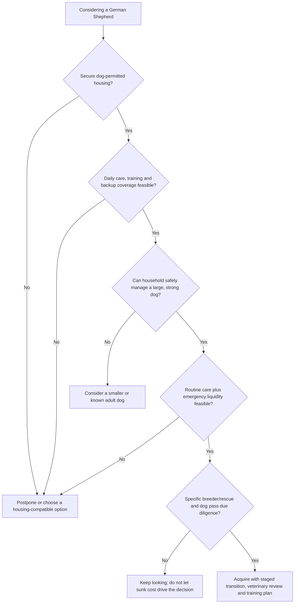

# ChatGPT Deep Research

# German Shepherd Dog: Evidence-Based Guide to Breed, Health, Behaviour, Care, Costs, and Responsible Ownership

**Research completion date: October 1, 2026**  
**Primary practical jurisdiction: Canada, with emphasis on British Columbia and Vancouver/Lower Mainland**  
**Evidence base: global veterinary and behavioural literature, official breed and screening organizations, Canadian/BC/Vancouver government sources, and current local price examples**

## Executive summary

This report follows the attached research brief as the authoritative statement of scope, evidence standards, geography, and required decision tools.  The central finding is that a German Shepherd Dog, or GSD, can be an exceptionally rewarding companion for a household that wants an interactive, trainable, physically substantial dog and is prepared to manage training, exercise, shedding, social behaviour, health uncertainty, housing constraints, and potentially high veterinary costs for roughly a decade or more. It is a poor choice when the decision depends on stereotypes such as automatic loyalty, innate child safety, guaranteed protection, a yard substituting for daily engagement, or the assumption that intelligence makes a dog easy to live with. Behavioural and health variation within the breed is large enough that **choosing the particular dog and its breeding or rearing history matters almost as much as choosing the breed**. That conclusion is **well supported** by population health studies, behavioural research, genetic work, and the limitations of one-time temperament assessments. 

The modern breed was systematized in Germany beginning in 1899 under the Verein für Deutsche Schäferhunde, or SV, with Horand von Grafrath entered as the first dog in its studbook. The FCI still classifies the German Shepherd as a working breed and recognizes two coat varieties. Modern GSD populations encompass companion, show, sport, police, military, search and detection, and other working populations, but labels such as “working line,” “West German,” “DDR,” “Czech,” “American line,” and “old-fashioned” are not equivalent to standardized temperament or health grades. Genomic research does demonstrate differentiation between at least some show and working populations, but that does **not** justify predicting the behaviour of an individual puppy solely from a sales label. 

Behaviourally, the most defensible description is not simply “intelligent and protective.” GSDs have been selected in populations where attentiveness to people, environmental monitoring, trainability and working motivation have mattered, but individual dogs vary in fearfulness, arousal, sociability, frustration tolerance and aggression. A Finnish study of purebred dogs found GSDs among breeds with a relatively high probability of owner-reported aggressive behaviour toward people, while Labrador and Golden Retrievers were at the low end; a guide-dog cohort also found developmental increases in stranger-directed aggression in its GSD population. Neither result means “GSDs are aggressive”: both are population associations affected by genetics, environment, selection and reporting, and neither predicts a specific dog. Research on GSD fearfulness has identified genetic associations as well, reinforcing that behaviour is neither purely “how you raise them” nor genetically predetermined. 

Training method matters. Current American Veterinary Society of Animal Behavior guidance recommends reward-based methods and advises against aversive methods; companion-dog studies have found more stress-related behaviour, cortisol changes and pessimistic cognitive bias in dogs exposed to more aversive training. This does not mean permissiveness: effective management includes preventing rehearsal of unwanted behaviour, reinforcing alternatives, controlling access to rewards, using barriers and leashes, gradually exposing dogs to difficult stimuli, and obtaining veterinary or specialist help when fear, aggression or separation problems exceed routine training. 

The breed carries meaningful health risk, but it is misleading to portray every GSD as medically doomed. In the foundational 2017 UK VetCompass study, which examined 12,146 GSDs within a 2013 primary-care population, common recorded disorders included otitis externa, osteoarthritis, diarrhoea and overweight/obesity; musculoskeletal disorders were prominent contributors to mortality. Median age at death was about 10.3 years in that dataset. A later UK life-table study estimated GSD life expectancy at birth at roughly 10.2 years, while broader contemporary work demonstrates that longevity estimates change according to design, period, population, sex and whether the statistic is life expectancy or median age at death. These are population summaries, not expiration dates for an individual dog. 

The highest-priority breed-related medical issues for prospective owners are orthopaedic disease, including hip/elbow dysplasia and later osteoarthritis; lumbosacral disease; gastric dilatation-volvulus, or GDV; exocrine pancreatic insufficiency; perianal fistulas; chronic gastrointestinal disease in susceptible individuals; and degenerative myelopathy. Degenerative-myelopathy DNA testing is particularly easy to misuse: the SOD1 variant is strongly associated with disease, but penetrance is incomplete, so an A/A “at risk” result does not diagnose clinical DM and a dog can live to old age without developing it. Conversely, hind-limb weakness should never be presumed to be DM without excluding painful orthopaedic, spinal and other neurologic causes. 

Responsible breeder selection therefore requires more than the phrases “DNA tested,” “vet checked,” “champion bloodlines” or “health guaranteed.” For North American GSDs, hips and elbows should be independently verifiable through recognized screening records; the GSD Club of America CHIC program currently requires hip, elbow and temperament results. Crucially, the Orthopedic Foundation for Animals states that a **CHIC number signifies completion and public disclosure of required tests, not that every result was normal**. Germany’s SV adds a more elaborate breeding system incorporating orthopaedic screening, pedigree controls and, in relevant programs, working/conformation requirements; dogs born from January 1, 2025 are subject to stricter SV hip/elbow breeding criteria. Screening reduces information uncertainty—it never guarantees a disease-free puppy. 

For a Vancouver or Lower Mainland owner, housing is a potentially decisive constraint. In British Columbia a landlord may prohibit pets or impose size/type/number restrictions in the tenancy agreement, and strata corporations can impose their own pet bylaws, including weight limits. A permitted pet can trigger a refundable pet-damage deposit of up to one-half month’s rent. In Vancouver, dogs over three months must be licensed; the current standard annual licence is C$68. Dogs generally must be leashed in public outside designated off-leash areas, with Vancouver specifying a leash no longer than 2.5 metres. These facts make it unsafe to acquire a GSD based on informal assurances from a landlord or on the assumption that future rental housing will permit a large dog. 

The financial commitment is also substantial. Current Vancouver examples include veterinary examinations around C$83 at one clinic and C$129 at another, before tax where specified; six-month flea/tick/heartworm products at one veterinary chain are listed at roughly C$180–325 depending on the pet and product; Vancouver group dog-training classes currently run about C$50–60 per class in one local program; and Lower Mainland boarding examples begin around C$68 per night. BC SPCA adoption fees are currently C$420 for an adult dog and C$580 for a puppy, with several initial-care items included. The latest Canadian insurance benchmark for which a public numeric dog premium was verified in this review was NAPHIA's 2024 market data: C$1,070.20 per year for the average accident-and-illness dog policy. A GSD in Vancouver can be materially above or below that average depending on age, postal code and coverage, so it is **not a quote**. 

Using those anchors plus explicitly identified planning assumptions for food, replacement equipment and paid labour, this report estimates a **cost-conscious but welfare-appropriate** cash budget around C$4,000–5,500 in an ordinary adult year, a **typical urban household using some paid support** around C$8,000–12,000, and a **high-support or medically complex** year readily reaching C$15,000–30,000 or more. A major uninsured emergency can sit on top of those numbers. These are constructed planning scenarios, not surveys of what all Vancouver GSD owners spend. A refundable pet deposit and emergency reserve are liquidity requirements and are not counted as recurring expenses.

**Bottom-line ownership decision.** A household is well positioned for a GSD when it has secure dog-permitted housing, enough daily availability for training and companionship, the physical capacity to manage a 25–40 kg dog, a realistic plan for workdays and travel, access to competent veterinary and behavioural support, and sufficient financial resilience for large unexpected bills. A first-time owner can succeed, but “first dog” is less important than willingness to learn, choose an appropriate individual and use professional help early. Conversely, unstable housing, repeated long unsupervised days without a care plan, inability to safely restrain or transport a large dog, unresolved child/pet safety conflicts, or finances that make basic veterinary assessment unaffordable are reasons to postpone or choose differently.

## Methodology, scope, and evidence quality

**Scope and constraints.** The geography is not unspecified: the brief requires a global scientific base with Canadian practical emphasis and specific Vancouver/Lower Mainland analysis. The completion date is October 1, 2026. The intended reader is a prospective owner capable of engaging with uncertainty; no personal household characteristics, acquisition deadline or individual budget were supplied, so this report does not assume one. No separate implementation deadline was requested. Purchase price from a breeder is intentionally not invented because the targeted primary and official sources did not provide a representative Canadian GSD breeder-price distribution. Likewise, personalized insurance premiums were not solicited because the brief expressly prohibits submitting personal information or obtaining binding quotes.

Evidence was prioritized in the following order: original peer-reviewed veterinary or behavioural research; official government and veterinary-specialist guidance; official health-screening databases; official national/international breed standards; and, for actual local prices, providers publishing their own fees. Breed clubs are treated as authoritative about *their rules and programs*, not as independent epidemiological evidence. Commercial insurers are treated as authoritative about their own current policy design, not about competitors or comparative value. 

**Confidence terminology used throughout the report:**

| Rating | Meaning in this report |
|---|---|
| **Well supported** | Convergent primary studies, large observational data, strong genetic association, systematic evidence, or clear current law/rule from the responsible authority. |
| **Moderately supported** | Plausible and backed by relevant research, but limited by retrospective design, specialty populations, modest sample size, indirect transfer to GSDs, or incomplete replication. |
| **Limited evidence** | Mainly small studies, case series, breed-club observation, extrapolation from other large breeds or expert clinical practice. |
| **Unresolved** | Evidence is inconsistent, insufficient for a causal conclusion, or current operational details could not be independently verified. |

A prevalence estimate from an orthopaedic screening database is not treated as population prevalence because owners and breeders self-select which dogs are screened and, in some systems, whether abnormal results are publicly released. OFA itself notes that the absence of a dog from the database does not prove that it was never evaluated; public-disclosure rules differ by result and program. The SV similarly acknowledges that official submitted hip results cannot straightforwardly establish the prevalence in the entire GSD population. 

The same discipline is applied to clinical research. The 2017 VetCompass paper is a study of UK dogs receiving primary veterinary care in **2013**, not a 2017 prevalence survey and not a Canadian cohort. Swedish insurance findings are informative but reflect insured dogs. Referral-hospital and military-working-dog studies are especially vulnerable to referral, occupation and selection effects. 

For behaviour, breed averages are not individual diagnoses. A Finnish questionnaire study, guide-dog cohort or working-dog temperament dataset can establish that behavioural distributions differ, but not that a GSD encountered in a shelter, breeder's home or family setting will behave according to a breed mean. One-time shelter assessments and very early puppy tests have limited predictive power for complex future behaviour; repeated observations and foster-home history generally have more ecological information, while still not eliminating uncertainty. 

The most important evidence-quality lesson for a prospective owner is therefore simple: **strong breed-level evidence should change screening and preparation; it should not be converted into certainty about an individual dog.**

## Breed identity, variation, development, and behaviour

**Origins and terminology.** The breed was organized in Germany in 1899, when the SV was founded and Horand von Grafrath became the first dog in its studbook. The German name *Deutscher Schäferhund* translates directly to German Shepherd Dog. “GSD” is the common English abbreviation. “Alsatian” is a historical English-language name for the same breed rather than a separate breed; modern international registries use German Shepherd Dog/German Shepherd terminology. 

The original project was explicitly functional: to systematize regional German shepherding dogs into a versatile working breed. That history helps explain contemporary use in working and sport contexts, but history should not be romanticized into a claim that every modern GSD needs police work or is naturally suited to protection. The modern population has undergone many generations of selection in different countries and breeding communities. 

**Breed standards are ideals, not health certificates.**

| Organization | Current practical point | What it establishes—and does not establish |
|---|---|---|
| **FCI / German origin standard** | Standard No. 166; males approximately 60–65 cm and 30–40 kg, females about 55–60 cm and 22–32 kg; two coat varieties are recognized. | Defines international conformation/type. It does not prove health, stable temperament or household suitability.  |
| **SV, Germany** | Uses the German/FCI framework together with a much broader breeding and performance system. | SV approval can communicate considerably more than simple registration, but individual health and temperament still require inspection.  |
| **AKC** | U.S. standard height is 24–26 in for males and 22–24 in for females; the AKC public breed profile gives typical weight ranges of 65–90 lb and 50–70 lb. | AKC registration means ancestry was registered under AKC rules; it does not mean a breeder satisfied OFA/CHIC health recommendations.  |
| **CKC** | Canadian materials describe the ideal male near 25 in and present the GSD as a large, active breed. CKC published proposed GSD-standard amendments in August 2026. | Registration and show conformation are separate from health screening. Because the 2026 amendment process was still recently active, competitors/breeders should verify the live CKC standard rather than rely on a cached copy.  |

A **registration certificate** primarily documents registry identity/parentage under that organization's rules. **Conformation success** says judges found the dog competitive against a written morphological standard. A **working title** documents performance in a particular trained activity under that organization's test rules. A **breed survey or breeding approval** may integrate multiple requirements. **Health clearances** address specified conditions. None individually demonstrates “good family dog.” That last question requires observing the actual dog's behaviour, relatives where possible, environment, handling history and household fit. 

**Lines and population labels.** “Working line” and “show line” can correspond to genuine population structure: genomic work in 330 GSDs studying fear/noise sensitivity found working and show-line dogs clustering separately. But labels such as West German, DDR/East German, Czech, American or Canadian are not universal biological categories with fixed behavioural profiles. A pedigree may substantiate ancestry from a particular breeding population; the label alone cannot tell you the dog's sociability, ability to settle, orthopaedic status or stress recovery. This conclusion is **moderately supported**: population differentiation is real, but evidence allowing reliable household-level predictions from the marketing labels is weak. 

The practical implication is to ask for observable and verifiable information instead: What are both parents like around unfamiliar adults and dogs? Do they recover quickly after startling? Can they disengage from play? Are they comfortable resting in the house? What work are they actually selected for? How have prior offspring matured? What health results can be independently verified? A breeder saying “DDR = healthier” or “West German show line = naturally calm” is offering a much stronger causal prediction than the available evidence warrants.

**Colour, coat and structural marketing.** Coat colour is a poor proxy for quality. “Rare,” “giant,” “old-fashioned,” black, sable, blue, liver, white or “panda” descriptions may accurately describe appearance or ancestry, but rarity is not a health credential. A buyer should be especially cautious when colour or extreme size is the primary sales proposition while orthopaedic, temperament and family-history information is secondary. FCI recognizes standard GSD coat varieties, while registry treatment of colours differs; therefore registration eligibility and conformation acceptability should not be confused. 

Likewise, a photograph showing a “straight back” cannot clear a dog for hip dysplasia. Hip screening uses standardized radiography, and lumbosacral research shows a broader principle: radiographic abnormalities and clinical signs do not always correspond neatly. Topline, croup, hind-limb angulation, stance and camera positioning are distinct concepts. Direct high-quality evidence that a single photographed back angle reliably predicts future hip disease was not found in this review; that claim should be considered **unsupported**. 

White Swiss Shepherds should not simply be treated as “white GSDs” for purchasing purposes; similarly, King Shepherd and Shiloh Shepherd labels refer to distinct breeding programs/types rather than FCI-recognized colour varieties of the GSD. In practice, the relevant question is the exact registry, pedigree, screening program and population being offered—not a visual resemblance.

**Growth, adulthood and ageing.** Adult standard size places many GSDs in roughly the 25–40 kg range, with males generally larger. Body weight alone is an incomplete descriptor: body-condition score, muscle condition, frame, age and reproductive status matter. A heavier dog is not automatically a better example of the breed, and deliberately producing “giant” GSDs increases the practical burden of transport, restraint, medication, anaesthesia and mobility support without establishing a health advantage. 

Development is continuous rather than a set of exact deadlines. A useful planning timeline is:

| Life stage | Typical ownership issue | Practical emphasis |
|---|---|---|
| **Young puppy** | Toileting, chewing, biting, sleep disruption, novelty exposure, inability to be left for long periods | Intensive supervision, safe socialization, gentle handling, short training, rest and environmental management. |
| **Later puppy** | Rapid growth, stronger body, increasing exploration | Continue socialization without forced interaction; progressively teach leash skills, recall, settling and cooperative care. |
| **Adolescence** | More strength and independence; social responses can change | Do not interpret temporary inconsistency as “dominance”; increase management and reward reliable behaviour under gradually harder distractions. Guide-dog data show behaviour can meaningfully change between six and twelve months.  |
| **Adult** | Physical capacity may exceed behavioural self-control in poorly trained dogs | Sustain exercise, enrichment and household routines; monitor weight, pain and behaviour changes. |
| **Senior** | Mobility, sensory or cognitive changes; chronic disease | Shorter individualized activity, traction, easier vehicle/home access, pain assessment and caregiver planning. |

Fixed puppy-exercise formulas such as “five minutes per month of age” are not strongly supported by research. A prospective cohort of 501 large-breed puppies—**not GSDs**—found that the *type and context* of activity mattered: frequent stair exposure before three months was associated with increased radiographic hip-dysplasia risk, while outdoor off-leash activity on softer varied terrain was associated with reduced risk. This supports sensible exposure management, not a universal stopwatch formula. 

**Temperament and cognition.** Words such as “intelligent,” “loyal,” “sensitive,” “protective” and “trainable” need operational definitions. A dog may learn a behaviour in five repetitions but still fail to perform it around another dog. A highly motivated dog may be excellent at obedience yet poor at spontaneous relaxation. A dog intensely attached to one handler may be inconveniently distressed when alone. A vigilant dog may provide useful alert barking or become chronically reactive in an apartment corridor. These are different traits, and no popular “intelligence ranking” resolves them.

Research supports meaningful individual behavioural consistency, but only moderately: a meta-analysis estimated overall temporal consistency around *r* = 0.43, with stronger consistency in older dogs and when the same test was repeated. A longitudinal pet-dog study found little predictive correspondence between very early puppy tests and later adult behaviour, and shelter studies likewise show limited ability of a single structured assessment to predict all post-adoption behaviour. Accordingly, a breeder's seven-week puppy test can contribute information, but claims such as “this test guarantees this puppy is child-safe” are not defensible. 

Fear and aggression also require precision. Fear-driven distance-increasing behaviour, frustration on leash, territorial barking, prey/chase behaviour, resource guarding and trained bite work have different motivations and interventions. Calling all of them “protectiveness” obscures risk. In GSDs specifically, genetic studies support susceptibility to fear/noise-related traits, while environmental studies show puppy-raising experiences also predict later fear/aggression outcomes. **Both genes and environment matter.** 

## Living with a German Shepherd: household fit, care, training, and nutrition

**Household suitability.** Square footage is a weak standalone criterion. A well-managed apartment dog with structured walks, enrichment, rest and quiet corridor behaviour can have better welfare than a bored dog left alone in a large yard. For a GSD, however, apartment living magnifies some management problems: barking carries farther, elevators and hallways constrain distance from triggers, an injured 35 kg dog may be difficult to carry, and rental/strata restrictions can abruptly become existential housing problems. Vancouver requires public control/leashing outside designated off-leash areas, so a garden or nearby dog park cannot substitute for reliable management. 

| Scenario | Main challenge | When it can work | When to reconsider |
|---|---|---|---|
| **First-time owner** | Learning dog body language, adolescent management and handling a strong animal simultaneously | Owner chooses a temperamentally suitable individual, uses qualified help early and is comfortable with structured daily training | Choice is driven by “protection” image; owner is unwilling to use management or professional support |
| **Full-time worker** | Toileting and social needs in puppyhood; long isolation; inadequate decompression after work | Flexible work, family coverage, walker/daycare where individually suitable, or adult dog with demonstrated alone-time tolerance | Routine absence exceeds what the particular dog can comfortably handle and no backup exists |
| **Student/renter** | Housing instability, budget, travel, changing schedules | Written pet permission, contingency housing, realistic transport and veterinary finances | Likely moves, pet-prohibited lease/strata, reliance on finding another large-dog rental later |
| **Family with children** | Size, chase/play arousal, food/toy conflicts, visiting children | Adults actively supervise and use gates/separation; dog has suitable observed temperament | Household expects “loyalty” to substitute for supervision |
| **Cats/small pets** | Chase behaviour and predation risk vary by dog | Known history, controlled introductions, protected cat routes and separation capacity | Dog persistently fixates, stalks or cannot disengage; household cannot segregate safely |
| **Multi-dog home** | Dog-directed compatibility, resource competition | Careful matching and gradual introduction | Serious unresolved inter-dog conflict or assumption that breed guarantees compatibility |
| **Active outdoor household** | Risk of equating fitness with endless high-intensity exercise | Hiking, scent work and training are progressively conditioned and dog can also rest | Owner expects a young dog to run long distances before conditioning/maturity |
| **Sport/working handler** | Matching drive, nerve, health and structure to actual work | Breeder selects for the intended discipline and handler accepts a potentially demanding household dog | Choosing maximal drive because it sounds impressive rather than because it serves a real activity |

A large garden is therefore a convenience, not an essential prerequisite; **time, management, stable housing and a dog capable of settling are more important**. Conversely, enthusiasm cannot compensate for an absolute safety or housing problem.

Children require special caution. No breed-level concept of “loyalty” guarantees safety. Young children cannot reliably read canine warning signals and should not be tasked with controlling a large dog. Physical separation—doors, gates, crates/pens used humanely, separate feeding and adult supervision—is more reliable than expecting perfect obedience. Behavioural change accompanied by pain, touch sensitivity or new irritability warrants veterinary assessment because medical discomfort can alter behaviour. Population health and behavioural data make both the physical power of the breed and the existence of individual aggression variation relevant without implying inevitability. 

**Daily activity should combine movement, information gathering, training and recovery.** Walking, sniffing, tracking, scent searches, tug/fetch under control, obedience, hiking and appropriate sport can all be useful. More intensity is not automatically better: repeatedly building extreme arousal without teaching disengagement can create a very fit dog whose household behaviour remains difficult. The objective is not to “exhaust” the dog but to meet physical and behavioural needs while preserving joint health and the ability to settle.

Illustrative—not prescriptive—routines:

| Dog | Weekday example | Weekend variation |
|---|---|---|
| **Young puppy** | Several toilet trips; 2–4 very short training/play sessions; safe novelty exposure; meals used partly for training/enrichment; extensive sleep; grooming/handling practice | Short socialization outing, car practice, calm observation of the world; no endurance exercise |
| **Adolescent** | Morning exploratory walk + training; midday toilet/activity break; evening mixed walk/sniff/training/play; deliberate calm time | Longer low-impact outing or class plus substantial recovery |
| **Typical adult companion** | Morning 30–60 min mixed walk; brief midday break where feasible; evening 45–60 min activity plus short training/enrichment | Hike, tracking/scent session, longer walk or sport, conditioned to the dog |
| **High-activity adult** | Similar base routine plus structured sport/training rather than simply adding uncontrolled running | More demanding work with warm-up, conditioning and recovery |
| **Senior** | Multiple shorter comfortable walks/sniffing opportunities; mobility/pain monitoring; mental enrichment | Accessible outing matched to stamina; avoid turning reduced speed into social deprivation |

The owner-time burden extends beyond those active periods: feeding, cleanup, vacuuming, muddy paws, grooming, transport, training setup, veterinary appointments, waiting for toileting and remaining available while a puppy learns to be alone are real labour. GSD coats also shed substantially, and both standard and longer coats require routine brushing; shaving a normal double coat for convenience is generally not an evidence-based substitute for grooming and heat management.

In Vancouver/Lower Mainland conditions, plans need weather contingencies. During wildfire-smoke advisories the BC SPCA recommends shortening outdoor exposure and replacing strenuous exercise with indoor enrichment; during heat events, outdoor exercise should be moved to cooler periods and dogs showing heatstroke signs require prompt veterinary care. The SPCA reported 237 Lower Mainland/Fraser Valley hot-car animal-protection files in 2025, underscoring that heat events are not merely theoretical in coastal BC. 

Dog parks and daycare are optional tools, not requirements. They are poor choices for dogs that are frightened, easily overaroused, socially selective or conflict-prone. A known walking partner, parallel walks, controlled group training or individual sniffing exercise can provide social/environmental enrichment without requiring chaotic group play.

**Training and socialization.** AVSAB's current position, reaffirmed in 2025, recommends reward-based training and rejects routine use of electronic collars, prong collars, choke-chain corrections and other aversive approaches. That position is consistent with companion-dog research finding poorer welfare indicators among dogs trained with more aversive methods. 

Reward-based training is not the absence of boundaries. A practical GSD program uses:

- environmental management so the dog cannot repeatedly rehearse dangerous or destructive behaviour;
- reinforcement for desired alternatives;
- gradual exposure rather than flooding;
- desensitization and counterconditioning for fear;
- barriers, leashes, long lines and distance for safety;
- veterinary evaluation when behaviour changes could have a medical component.

A trainer should be able to describe methods before taking your dog, permit observation, explain what happens when the dog is wrong, avoid guarantees, disclose equipment, and refer medical or severe behaviour cases rather than claiming to cure everything. A trainer teaches skills; a behaviour consultant may have additional behaviour-specific education; a veterinarian diagnoses medical disease and prescribes medication; a veterinary behaviour specialist is a veterinarian with specialty-level behavioural training. AVSAB's trainer-selection guidance emphasizes method transparency and scientific/welfare considerations rather than allegiance to a particular brand of training. 

**First weeks and months.**

| Time | Puppy pathway | Adult-adoption pathway |
|---|---|---|
| **First week** | Establish sleep, toileting and feeding routine; introduce crate/pen/barriers positively; start name response, recall game, handling and calm reinforcement; limit overwhelming outings | Decompress; preserve predictable routine; observe eating, elimination, handling, noises, visitors and alone-time tolerance without deliberately “testing” limits |
| **First month** | Continue controlled socialization; leash foundations; exchanging objects; bite/chew management; brief safe absences; car travel; grooming/cooperative-care practice | Expand environment gradually; obtain veterinary baseline; begin reinforcement-based foundation work; document triggers/recovery and compatibility rather than forcing social interactions |
| **First three months** | Increase duration/distraction progressively; strengthen settling, recall, safe greetings, muzzle conditioning and veterinary handling; reassess adolescence plan | Build a realistic behaviour profile across contexts; introduce activities suitable to health and temperament; seek specialist help early for fear, aggression or separation distress |

Socialization should be understood as helping a young dog form safe, resilient associations with people, animals, surfaces, noises, transport, handling and environments—not accumulating forced greetings. AVSAB supports appropriately managed early socialization rather than waiting until every juvenile vaccine has been completed, while infectious-disease decisions should reflect the puppy's vaccine history and local veterinary risk. 

Positive basket-muzzle training is a useful life skill even for dogs without an aggression history: an injured or frightened dog may need one for safe care. A well-fitted basket muzzle should allow panting and reinforcement delivery and should never be presented as a substitute for behavioural assessment.

**Nutrition.** WSAVA does not “approve” foods. Its nutrition resources instead encourage evaluation of nutritional expertise, formulation, quality control, research, feeding guidance and manufacturer transparency rather than relying on ingredient-list marketing alone. AAFCO likewise explicitly states that it **does not approve, certify or endorse pet foods**; an AAFCO nutritional-adequacy statement indicates that the diet is formulated to a nutrient profile or substantiated through an accepted feeding protocol, depending on the wording. 

This distinction is particularly important in Canada. CFIA's pet-food authority includes important animal-health/import controls, but CFIA states in its animal-product import policy that the relevant regulations do not provide authority to control the nutritional value or quality of pet food. A Canadian buyer should therefore not infer “government-approved complete nutrition” simply because a product is legally sold. 

For a growing GSD, the key principle is controlled growth with an appropriately complete large-breed growth diet rather than maximizing body weight. Adult-weight charts are descriptive, not targets to reach quickly. Body condition and muscle condition deserve more attention than whether a six-month-old puppy matches an internet weight chart.

Raw feeding has no established universal health advantage sufficient to erase its trade-offs. Reviews identify possible differences in stool, microbiome and metabolic measures, but also bacterial/zoonotic risks and potential nutritional imbalance, particularly in improperly formulated diets. Home-prepared cooked diets can be appropriate when formulated for the individual by suitably qualified veterinary nutrition expertise; simply combining meat, vegetables and supplements by intuition does not ensure completeness. 

“Grain-free” should likewise not be interpreted as intrinsically superior. The FDA investigation into non-hereditary canine dilated cardiomyopathy found a complex association involving many diets, often with pulses/legumes high in the ingredient list, but explicitly states that available adverse-event data do not establish a simple causal relationship and that legumes are not inherently dangerous. The practical lesson is to choose diets for nutritional adequacy and evidence rather than fashion, and to involve a veterinarian when feeding unusual formulations or when cardiac disease is suspected. 

Supplements deserve the same discipline. “Joint support,” probiotics, fish oil and digestive enzymes are categories, not guarantees. In EPI, pancreatic-enzyme treatment is disease-specific veterinary management; that is very different from adding digestive enzymes to every healthy GSD because the breed has an EPI predisposition. Supplements should address a defined purpose, evidence base and dose rather than the marketing claim that the breed “needs” them.

## Health, genetics, preventive care, and ageing

The following matrix prioritizes conditions by ownership relevance rather than merely listing every disease reported in the breed.

| Condition | GSD relevance and evidence | Typical ownership implication | Confidence |
|---|---|---|---|
| **Hip/elbow dysplasia and osteoarthritis** | Orthopaedic disease is a major GSD burden; osteoarthritis was among common disorders in UK primary care. Screening programs across OFA/SV place major emphasis on hips/elbows.  | Verify parental screening; keep dog lean; investigate lameness/pain rather than normalizing a “shepherd gait”; budget for imaging, medication and possibly rehabilitation/surgery. | **Well supported** |
| **Lumbosacral disease** | Young clinically normal GSDs showed more lumbosacral disc degeneration than comparison large breeds in one study; radiographic findings do not always map neatly to symptoms.  | Back pain, reluctance to jump, tail/hind-limb changes or weakness need differential diagnosis. | **Moderately to well supported** |
| **Degenerative myelopathy** | SOD1 association is strong, but penetrance is incomplete and genotype is not clinical diagnosis.  | Use DNA status for informed breeding, not to diagnose weakness or promise a symptom-free life. | **Well supported association; limited individual prediction** |
| **GDV/bloat** | GSDs appear repeatedly among affected deep-chested breeds; military/referral datasets support relevance but do not provide general-pet lifetime risk.  | Unproductive retching, abdominal distension, agitation/weakness or collapse is an emergency; discuss prophylactic gastropexy individually. | **Well supported seriousness/predisposition; uncertain absolute risk** |
| **Exocrine pancreatic insufficiency** | Diagnostic-laboratory and breed studies support GSD predisposition; inheritance is not a simple single recessive pattern.  | Chronic weight loss, large-volume stools or diarrhoea warrants diagnosis rather than empirical supplements. | **Well supported** |
| **Chronic enteropathy** | GSD-specific gastrointestinal susceptibility appears in specialty research, but definitions and populations vary.  | Recurrent diarrhoea has many causes; do not jump directly to EPI, “food allergy” or a breed-specific diet. | **Moderately supported** |
| **Perianal fistulas/anal furunculosis** | GSDs are disproportionately affected; modern work supports immune-mediated biology.  | Painful defecation, licking, odour or draining perianal tracts merit prompt exam; management can be prolonged. | **Well supported** |
| **Otitis/skin disease** | Otitis externa was the most frequent specific disorder in the 2013 UK GSD primary-care population; Swedish insurance data also found excess immune/skin disease.  | Recurrent ear/skin disease can be chronic and costly; investigate underlying allergy/infection rather than repeatedly treating symptoms without diagnosis. | **Well supported** |
| **Pannus / chronic superficial keratitis** | Case series and ophthalmic research identify GSDs as predisposed.  | Eye redness, pigmentation or corneal change warrants veterinary/ophthalmic assessment; ongoing treatment may be needed. | **Moderately supported for breed predisposition** |
| **Overweight/obesity** | Recorded among the common disorders in VetCompass GSDs.  | Maintaining lean body condition is a modifiable priority, particularly with orthopaedic risk. | **Well supported** |

The VetCompass study's value is prioritization. Among 12,146 GSDs receiving UK primary veterinary care in 2013, the most frequently recorded specific disorders included otitis externa, osteoarthritis, diarrhoea and overweight/obesity. That is more useful for routine planning than an unsorted internet list of rare genetic syndromes. 

**Longevity.** The same study reported median age at death around 10.3 years. A later UK life-table analysis estimated life expectancy from birth for GSDs at approximately 10.16 years. These statistics are different: median age at death describes deceased members of a sampled population, whereas life expectancy at birth is derived from age-specific mortality. A 2024 UK analysis of more than half a million dogs showed that size, sex and breed shape longevity distributions and reported a median around 11.9 years for large purebred dogs as a group. None should be interpreted as a prediction that a particular GSD will die at a particular age. 

**Orthopaedic screening.** OFA final hip/elbow evaluations are generally performed at or after 24 months; preliminary evaluations can be recorded earlier. SV uses its own radiographic classification and breeding rules, and OFA publishes approximate cross-system comparison tables, but ratings are not perfectly interchangeable because positioning, scoring and selection systems differ. SV's current program also uses population information and breeding values for hip-dysplasia risk. 

PennHIP addresses hip laxity through a distraction-index approach rather than the same categorical scoring used by OFA. A limitation of this review is that a current primary PennHIP technical manual was not retrieved during the research session, so current minimum-age and reporting details should be verified directly with PennHIP/Antech before interpreting a breeder's claim. That gap is preferable to asserting outdated operational details.

**CHIC and documentation.** For the current U.S. GSD CHIC program, the GSDCA lists hips, elbows and its temperament test as required components. Its broader Health Award of Merit includes additional tests such as cardiac, thyroid and DM testing. OFA is explicit that CHIC identifies dogs that have completed and publicly disclosed the program's required tests; it is **not a seal stating that every result is normal**. 

A reliable verification process is:

1. Obtain the registered names and registration numbers of sire and dam—not just call names.
2. Match permanent identification where documentation provides it.
3. Search the relevant public screening database yourself.
4. Check the test date and age at evaluation.
5. Read the **actual result**, not merely the existence of a CHIC number.
6. Ask for original reports for tests that are not publicly searchable.
7. Compare the breeder's verbal description with the record.
8. Ask about siblings, parents and prior offspring because a normal individual test does not erase family risk.

A dog absent from OFA search results should be treated as **unverified**, not automatically normal or abnormal. 

**Degenerative-myelopathy genetics is a model case in why DNA language matters.** The SOD1:c.118G>A variant showed strong association with histologically confirmed DM, and later research involving tens of thousands of dogs clarified that A/A dogs face much greater risk. Yet incomplete penetrance means not all genetically at-risk dogs become clinically affected. “DNA clear” can therefore mean “does not carry this tested variant”; it does **not** mean “free from inherited disease.” Likewise, breeding strategy should preserve genetic diversity rather than automatically purging every carrier of every recessive variant when safe carrier-to-clear matings and expert population management can avoid affected offspring. 

The SV's use of pedigree restrictions and hip breeding values illustrates why population genetics cannot be reduced to a single coefficient. The SV currently restricts close matings beyond specified pedigree relationships and maintains large datasets for hip breeding-value calculation. COI, genomic diversity, disease variants, family history, fertility, longevity and functional traits answer different questions; no single number defines a “genetically healthy” mating. 

**Spay/neuter timing.** One widely cited UC Davis retrospective study examined 1,257 GSD patient records and found higher recorded joint-disorder rates among some dogs neutered during the first year than among intact comparison dogs. For GSD males, intact dogs had about 6% occurrence of one or more studied joint disorders versus 19% among dogs neutered before six months and 18% at 6–11 months; female patterns also differed by timing. The same study explored selected cancers and reproductive outcomes. This is useful breed-specific evidence, but it is retrospective hospital data, not a randomized trial, and intact/neutered populations may differ in ways the study cannot fully remove. 

Accordingly, the evidence argues against a universal “all GSDs should be neutered at six months” rule, but it also does **not** establish a universally correct alternative age. Sex, accidental-breeding risk, ability to manage an intact animal, reproductive disease, orthopaedic risk, behaviour and the individual medical history should be discussed with the dog's veterinarian.

**Prophylactic gastropexy.** Because GDV can be fatal and GSDs are represented among predisposed breeds, prophylactic gastropexy is a reasonable veterinary discussion, particularly when another abdominal procedure is planned or family/structural risk is concerning. Gastropexy greatly reduces the possibility of volvulus but does not make gastric dilatation impossible. A 2025 evidence review found consistently low recurrence of GDV after gastropexy but rated the overall evidence weak because the underlying studies had methodological limitations. It should therefore be framed as risk reduction, not a guarantee. 

**Preventive framework.** A sensible GSD preventive plan includes regular examinations; individualized core and lifestyle vaccination; parasite prevention based on geography and exposure; routine body- and muscle-condition monitoring; oral/dental assessment; nail and skin/ear care; and attention to changes in gait, appetite, weight, stool, behaviour or exercise tolerance. The exact vaccine and parasite schedule should be set by a BC veterinarian rather than imported unchanged from another climate or from an online generic schedule.

**Emergency escalation reference.**

| Sign | Response |
|---|---|
| Repeated unproductive retching, enlarging/tight abdomen, severe restlessness, weakness/collapse | **Emergency veterinary assessment immediately — possible GDV.**  |
| Severe breathing difficulty, collapse, major trauma, uncontrolled bleeding, prolonged/repeated seizure | **Emergency veterinary assessment.** |
| Heatstroke signs such as extreme panting, heavy drooling, weakness, tremors, incoordination, vomiting or collapse | Move out of heat and **seek veterinary care as soon as possible**; BC SPCA advises cool water rather than ice while transport is arranged.  |
| Sudden inability to stand, rapidly worsening weakness or severe spinal pain | **Urgent/emergency assessment**, particularly because GSD hind-limb dysfunction has multiple potential causes and should not be assumed to be DM.  |
| Recurrent diarrhoea, gradual weight loss, chronic itching/ear disease, intermittent lameness | Prompt routine veterinary work-up rather than breed-based self-diagnosis.  |

This table is escalation guidance, not home-treatment instruction.

**Senior care and end of life.** The physical size of the GSD becomes especially important in later life. Non-slip flooring, rugs, ramps, lower-impact routes, supportive harnesses and vehicle-access planning can preserve independence, but new exercise restrictions or lifting techniques should account for the dog's diagnosis. Musculoskeletal disease's contribution to GSD mortality means pain and mobility should be actively assessed rather than dismissed as “just getting old.” 

Contingency planning should identify who can transport a non-ambulatory 30–40 kg dog, who can provide medication and toileting assistance if the owner is hospitalized, where the dog could stay during evacuation or housing loss, and where veterinary/behaviour records are stored. BC SPCA emergency-preparedness guidance recommends an animal-specific evacuation kit, records, medications and crate/carrier familiarity. 

Quality-of-life decisions should consider comfort, mobility, appetite, sleep, social engagement, toileting, fear/distress and the caregiver's actual ability to provide required care. Palliative treatment, hospice-type support and euthanasia are veterinary conversations rather than failures of ownership. Responsible rehoming can likewise be the welfare-preserving choice when a household can no longer safely meet a dog's needs.

## Acquisition, Canadian costs, housing, insurance, and travel

**Breeder, rescue or adult rehome.** None of the acquisition routes guarantees a healthy, behaviourally easy dog.

A responsibly bred puppy offers the possibility of inspecting parental health records, family history, breeder selection goals and early rearing, but future temperament remains probabilistic. An adult rescue or foster dog may have uncertain ancestry or medical history but can offer something a puppy cannot: direct observation of adult size and, when fostered in a home, real-world information about house training, settling, other animals, handling and time alone. One-time shelter assessments should not be overinterpreted, but longitudinal foster observations can be extremely valuable. 

BC SPCA currently charges C$420 for an adult dog and C$580 for a puppy and includes, as applicable, initial assessment, first standard centre vaccinations, parasite treatment, spay/neuter and microchip/lifetime registry among other inclusions. Buyers should avoid double-counting those items when comparing adoption with another acquisition route. 

**Breeder/rescue interview guide.**

| Question | Satisfactory direction | Incomplete/concerning answer |
|---|---|---|
| “Show me sire and dam hip/elbow records.” | Registered identities and independently searchable results | “Vet checked,” screenshot with no identity, “parents have never limped” |
| “What does the DM result mean?” | Explains genotype as risk/breeding information, not diagnosis | “DM clear means the puppies can never get neurological disease” |
| “Why this pairing?” | Specific health, temperament, structure and population rationale | Colour, size, “rare,” or champion status as the main answer |
| “What are the parents like off the field and in the house?” | Concrete examples of recovery, sociability, settling and environmental response | “All shepherds are protective; they'll know who is bad” |
| “How are puppies raised?” | Varied but controlled exposure, household handling, rest, surfaces/noises, individual observation | Isolation or high-volume production with minimal daily handling |
| “What happens if I cannot keep the dog?” | Written return/rehome support | Seller disclaims all future responsibility |
| “Can I verify registration and testing myself?” | Yes, with full registered names/numbers | Pressure not to contact registries or claims records are “private” |
| “What behaviour history exists?” for an adult | Bite/conflict context, handling, animals/children, time alone, medical and foster notes | “No problems” with no records; or known incidents minimized as “just protection” |

Pressure for an immediate deposit, cryptocurrency/wire-only payment, refusal to identify parents, copied certificates, a puppy that can be shipped immediately with no buyer screening, unusually heavy emphasis on rare colour/giant size and multiple unrelated breeds constantly available are all reasons to slow down. Directory membership can generate a lead; it is not proof of ethical practice.

**Price-source ledger for Vancouver/Lower Mainland.** All dynamic prices below were checked during this research on October 1, 2026 unless the source reports an earlier market year.

| Input | Current source value | Geographic/tax note | Use in model |
|---|---:|---|---|
| Vancouver annual dog licence | **C$68** | Vancouver; City says no tax | Essential.  |
| BC SPCA adult adoption | **C$420** | BC-wide current schedule | Acquisition alternative.  |
| BC SPCA puppy adoption | **C$580** | BC-wide current schedule | Acquisition alternative.  |
| Vancouver clinic wellness/sick exam | **C$83** | Marine & Fraser; taxes excluded | Local price anchor, not market average.  |
| Vancouver Juno exam | **C$129** | Vancouver; prices before taxes | Second local anchor.  |
| Juno flea/tick/heartworm product | **C$180–325 per six months** | Provider price; actual product/weight matters | Parasite-care anchor.  |
| Vancouver group training | **C$60 drop-in; C$330/6 credits** | The Dog School | Training anchor.  |
| Port Moody boarding | **C$68/night for 1–3 nights** | emBARK; plus GST and some surcharges | Lower Mainland boarding anchor.  |
| Canadian accident/illness dog-insurance average | **C$1,070.20/year** | 2024 NAPHIA market data, published 2025; not GSD/Vancouver specific | Insurance sensitivity anchor.  |
| Food | **Scenario assumption, not a market statistic** | Product prices and calorie density vary substantially | Must be replaced with chosen food's actual kcal/kg, feeding amount and current price |
| Breeder puppy | **No representative value found** | Canadian GSD breeder market | Add actual documented seller price; report does not invent one |
| BC pet damage deposit | **Up to ½ month rent** | Refundable if no valid deductions; liquidity, not annual expense | Not included as ownership expenditure.  |

**Illustrative CAD ownership model.** These are budgeting scenarios constructed from the verified anchors above plus explicit assumptions, not observed averages. They exclude the opportunity cost of owner labour and a refundable housing deposit.

The fundamental formula is:

**Annual routine expenditure = Σ(unit price × annual quantity/frequency).**

| Scenario | First year | Ordinary adult year | Senior year | Main assumptions |
|---|---:|---:|---:|---|
| **Cost-conscious, appropriate care** | **~C$5,500–7,500** | **~C$3,800–5,500** | **~C$5,000–8,000** | Owner supplies exercise/grooming; dry complete diet; routine preventive care; modest training/enrichment; insurance near market-average scale or equivalent self-funded risk plan |
| **Typical urban, some paid support** | **~C$10,000–15,000** | **~C$8,000–12,000** | **~C$10,000–16,000** | Higher food/insurance envelope; periodic walker/daycare or sitting; boarding; classes/private support; greater equipment/transport cost |
| **High-support or medically complex** | **~C$15,000–25,000+** | **~C$15,000–25,000+** | **~C$20,000–35,000+** | Frequent paid care, behaviour/rehabilitation support, therapeutic food or chronic treatment, substantial diagnostics/medication; serious years can exceed range |

The largest controllable cash driver is often **paid labour**, not food: a household that walks, trains and grooms the dog itself spends radically less than one buying daily dog walking/daycare and frequent boarding. Reducing paid convenience services can be welfare-neutral when the owner genuinely supplies equivalent care. Skipping veterinary evaluation, buying poor-quality food merely because it is cheapest, avoiding needed behaviour help or failing to maintain parasite prevention where indicated are not equivalent savings.

A central-point constant-2026-dollar sensitivity model illustrates why lifespan matters but should not be converted into one supposedly precise “lifetime cost.” Using first/adult/two-senior-year central assumptions of approximately C$6,200/C$4,250/C$5,750 for the cost-conscious case; C$13,300/C$10,900/C$13,900 for a heavily supported urban case; and C$25,000/C$18,000/C$28,000 for a high-support/medical case gives:

| Ownership horizon from puppyhood | Cost-conscious | Urban paid-support | High-support/medical |
|---:|---:|---:|---:|
| **9 years** | ~C$43,000 | ~C$107,000 | ~C$189,000 |
| **11 years** | ~C$52,000 | ~C$128,000 | ~C$225,000 |
| **13 years** | ~C$60,000 | ~C$150,000 | ~C$261,000 |

These are **sensitivity scenarios**, not expected values. They are intentionally shown in constant 2026 dollars; inflation, investment returns, changing insurance premiums and future veterinary-price inflation are not forecast. For adult adoption, replace the puppy setup/acquisition year with the adult's actual transition cost and model only remaining years.

**Adverse scenarios should be layered separately**, not averaged into annual costs without defensible probabilities. Examples include a large uninsured emergency; bilateral orthopaedic treatment and rehabilitation; chronic gastrointestinal/skin disease; a prolonged behaviour case requiring veterinary work-up and specialist help; owner hospitalization requiring weeks of boarding; or relocation requiring a new pet deposit and higher rent. An emergency reserve is **liquidity**, not an expense until spent.

**Insurance.** Insurance products cannot be compared by premium alone.

Trupanion Canada's current public materials describe reimbursement up to 90% of eligible costs, no annual/lifetime payout cap, coverage of hereditary/congenital conditions when not pre-existing, and exclusion of routine wellness and examination fees. Its deductible structure is condition-based rather than simply an annual pool. 

Fetch Canada's materials describe annual deductibles, selectable 70/80/90% reimbursement and a selectable annual payout limit; unlike Trupanion, Fetch states that eligible sick-visit examination fees are covered. It also advertises hereditary-condition coverage subject to pre-existing-condition and policy terms. 

That difference demonstrates why apparently similar “90% coverage” policies can produce different owner costs.

**Insured owner expenditure = premiums + veterinary payments − reimbursements**, applying the policy's actual deductible, coinsurance, annual limit, exclusions, waiting periods and non-covered exam/routine costs.

Pre-existing symptoms are particularly important for a breed in which chronic lameness, GI signs, allergies or ear disease may emerge gradually. Buying insurance after the first documented symptoms can leave the related condition excluded. No policy comparison should be made from marketing pages alone; the binding policy wording in the buyer's province should control. Premiums also require individualized age/breed/postal-code assumptions, so this report does not fabricate a Vancouver GSD quote. NAPHIA confirms that breed, location and deductible affect pricing. 

**Housing and regulation.** In BC, landlords are permitted to refuse pets and may restrict size, type and number through the tenancy agreement. The pet-damage deposit can be no more than half of one month's rent and only one pet deposit is required regardless of number of permitted pets. Because the money is ordinarily refundable, it belongs in a move-in liquidity calculation, not annual spending. 

Strata rules are separate. A strata can ban pets, impose a dog weight limit, limit number of animals or require leashing/registration on common property. Therefore “my landlord allows dogs” does not prove the strata permits a GSD. Certified guide/service dogs receive statutory protections, and BC government guidance also notes that Human Rights Code accommodation can extend beyond the certification framework in appropriate disability cases. Buying an internet “service dog certificate” or merely training toward assistance work does not itself create ordinary public-access rights. 

Vancouver requires annual licensing for dogs over three months. The standard licence is C$68, while a dog classified under the city's aggressive-dog system is subject to a C$222 licence and additional control requirements. The city's ordinary public-space rule requires dogs to remain under control and leashed, except in designated off-leash areas; Vancouver specifies a maximum leash length of 2.5 m. 

BC's Community Charter separately defines a “dangerous dog” by serious injury/killing or reasonable grounds to believe the dog is likely to seriously injure or kill a person; that framework is behaviour/consequence based, not a declaration that GSDs as a breed are dangerous. 

Neighbouring municipalities do not have identical fee structures. Surrey, for example, currently differentiates licence fees by reproductive status and has separate fees for guard/aggressive/vicious/dangerous classifications. A move within the Lower Mainland therefore requires rechecking the destination municipality rather than assuming Vancouver rules travel with the owner. 

**Travel.** As of October 1, 2026, dogs entering the United States after having been only in dog-rabies-free or low-risk countries such as Canada during the prior six months require a CDC Dog Import Form receipt, must appear healthy, must be at least six months old and must have a microchip detectable by a universal scanner. The form can currently cover multiple entries from the same country for six months. Dogs with recent high-risk-country history face additional requirements. 

For the return to Canada, CFIA specifically reminds travellers that Canadian import requirements still apply, including applicable rabies documentation. Airline carriage rules, crate sizes and seasonal embargoes are carrier-specific and change more rapidly than the underlying border rules, so they should be checked for the exact itinerary immediately before booking. 

The practical implication for a GSD is significant: a large flight-approved crate is bulky, not every vehicle can carry it, boarding may be easier than air travel, and a dog with reactivity or medical needs can sharply narrow care options. Travel planning therefore belongs in the acquisition decision rather than being left until the first trip.

## Decision framework, recommendations, and research appendices

**Essential prerequisites.** A prospective owner does not need to be a professional trainer, own a detached house or participate in dog sport. They do need stable permission to keep a large dog; realistic daily availability; the ability to physically control and transport the dog; willingness to use gates, leashes and other management rather than relying on obedience alone; a veterinary and emergency-care plan; and sufficient liquidity or insurance to avoid predictable delays in essential care.

**Manageable challenges** include heavy shedding, muddy paws, adolescent regression, alert barking, paid training, routine boarding costs, apartment living where explicitly permitted, and being a first-time owner. They become manageable through planning rather than by pretending they do not exist.

**Reasons to postpone or choose differently** include unstable or ambiguous housing; a household member who cannot safely coexist with a large dog; an expectation that young children can supervise the dog; predictable long absences with no care arrangement; severe financial fragility; wanting a dog principally to intimidate strangers; and an inability or unwillingness to obtain professional help if behaviour deteriorates.

The distinction between the two decisions is critical:

> **“Is a German Shepherd appropriate for my household?”** is a breed/lifestyle decision.  
> **“Is this German Shepherd appropriate for my household?”** is a specific-dog, source, health and behaviour decision.

A “yes” to the first never guarantees a “yes” to the second.

**Comparison with plausible alternatives.**

| Option | Relative decision advantage | Trade-off |
|---|---|---|
| **German Shepherd** | High potential for interactive training and diverse activities; substantial working heritage | Large/strong, substantial shedding; meaningful orthopaedic/GI risks; some populations/individuals have challenging vigilance, fear or aggression |
| **Labrador Retriever** | In the Finnish purebred behavioural study, Labradors were among breeds with the lowest probability of human-directed aggression; often a relevant alternative when the goal is trainability/activity without seeking guarding traits.  | Still large, energetic and capable of destructive adolescence; not a health-free substitute |
| **Golden Retriever** | Also at the low end of human-directed aggression in that study; strong candidate where social companion temperament is more important than vigilance.  | Significant grooming and breed-specific health concerns of its own; individual assessment remains necessary |
| **Known adult mixed-breed dog** | Adult size and at least some established behaviour can be observed directly; foster history may answer questions a puppy cannot | Genetic/medical history may be incomplete; breed mix itself does not guarantee better health or behaviour |

A Belgian Malinois or similarly intense working shepherd-type dog is sometimes suggested as a GSD alternative based on appearance or working reputation, but it is generally a poor *default* recommendation for someone already uncertain about the time/arousal demands of a GSD. A different breed should be chosen because its likely trait distribution better fits the household—not because it is fashionable or superficially similar.

**Claim versus evidence.**

| Claim | Evidence-based conclusion | What the owner should do instead |
|---|---|---|
| “All German Shepherds are aggressive.” | **False.** Breed-associated differences exist, but individual variation is substantial and aggression has multiple causes.  | Evaluate the particular dog, relatives/history and environment. |
| “They are loyal, so they are naturally safe with children.” | **Unsupported.** Loyalty is not a safety mechanism. | Supervise actively and use physical separation. |
| “Working lines are always healthier.” | **Unsupported.** Population structure exists, but a line label is not a health clearance.  | Verify the actual parents' screening and family history. |
| “Show lines are always calmer.” | **Unsupported.** | Ask for observed behaviour and recovery/settling traits. |
| “A straight back proves healthy hips.” | **False.** Hip status requires appropriate clinical/radiographic assessment.  | Verify screening and assess the individual clinically. |
| “CHIC means all tests passed.” | **False.** OFA explicitly says CHIC means required testing/public disclosure, not all-normal results.  | Open each underlying result. |
| “DNA clear means disease-free.” | **False.** A DNA test addresses the tested variant; DM itself demonstrates incomplete penetrance and diagnostic complexity.  | Interpret variant, inheritance and phenotype separately. |
| “A garden replaces walks.” | **Misleading.** It cannot reproduce exploratory movement, varied environments or training/social interaction. | Treat yard access as convenience, not the activity program. |
| “Intelligence makes training easy.” | **Misleading.** Learning speed, distraction control, frustration tolerance and settling are separate. | Train reinforcement history and environment-specific reliability. |
| “More exercise fixes every behaviour problem.” | **False.** Fear, separation distress, pain and conflict need cause-specific treatment. | Diagnose the problem; balance exercise with training and rest. |
| “Raw is naturally superior.” | **Not established.** Potential benefits are incompletely demonstrated, while nutritional/pathogen risks are documented.  | Judge completeness, formulation, safety and individual response. |
| “Grain-free is healthier.” | **Unsupported as a general rule.** DCM research makes simplistic diet marketing especially inappropriate.  | Choose for nutritional evidence rather than ingredient fashion. |
| “Six months is the correct neuter age for every GSD.” | **Not supported.** Breed/sex-specific retrospective evidence argues for individualized timing.  | Discuss the specific dog and management context with a veterinarian. |
| “Dominance explains pulling, barking or aggression.” | **Usually an unhelpful oversimplification.** AVSAB specifically cautions against dominance-based training explanations.  | Identify motivation, reinforcement history, fear, frustration and medical factors. |

**Questions to resolve before paying a deposit or adoption fee.** These are more consequential than coat colour or sex preference: Is large-dog housing secure in writing? What happens if the owner must move? How many consecutive hours will the dog routinely be alone? Who provides care when the owner is sick or travelling? Can the household lift or otherwise evacuate an injured 30–40 kg dog? Is there a plan for children/visitors? What is the plan if the dog cannot live with cats or another dog? What specific emergency expenditure could the household cover tomorrow? Are parental health results independently verifiable? What evidence exists about parental/adult temperament? Is the seller/rescue candid about uncertainty? Can the dog be returned safely if the match fails?

**Questions for the veterinarian after acquisition.** Ask for an individualized vaccine/parasite schedule for BC; baseline body- and muscle-condition targets; growth and exercise guidance; interpretation of hereditary screening records; signs of orthopaedic or lumbosacral pain; whether and when neutering is appropriate for this particular dog; whether GDV risk justifies a gastropexy discussion; nutrition review; ear/skin/GI warning patterns; emergency-hospital options; and a plan for mobility monitoring as the dog ages. Breed evidence should inform these conversations, not replace examination.

**Condensed evidence ledger.**

| Major conclusion | Evidence/source type | Important limitation | Ownership implication |
|---|---|---|---|
| GSD health burden includes meaningful musculoskeletal, ear, GI and weight-related disease | Large UK primary-care cohort, 12,146 GSDs  | UK, 2013 data; veterinary-care population | Screen where possible and budget for chronic as well as emergency disease |
| Typical population longevity is roughly around a decade, but metric matters | VetCompass mortality/life-table studies  | Geography/time period; censored life-table vs death cohort | Plan financially for multiple plausible 9–13+ year horizons |
| Behaviour varies by breed and individual; GSD aggression/fear traits cannot be reduced to stereotype | Finnish survey, guide-dog cohort, GSD genetics  | Questionnaire/selected populations | Select parents/individuals on observable behaviour, not labels |
| Very early temperament tests have limited predictive precision | Longitudinal puppy and shelter studies  | Different populations/protocols | Use repeated observation and history |
| Aversive-heavy training carries welfare costs | AVSAB guidance plus companion-dog studies  | Mostly observational/quasi-experimental rather than lifetime RCTs | Prefer reward-based training and management |
| DM genotype is risk information, not diagnosis | Genetic association and penetrance studies  | Age-dependent incomplete penetrance | Do not diagnose hind-limb weakness from DNA alone |
| CHIC does not mean all-normal | OFA program rule  | Program requirements can change | Read every underlying test result |
| Early neutering can be associated with greater GSD joint-disease occurrence | Retrospective UC Davis records  | Non-randomized hospital population, confounding | Individualize timing |
| Canadian housing can exclude/restrict a GSD even when pets are generally discussed | BC tenancy/strata rules  | Building-specific rules vary | Obtain written permission and read strata bylaws first |
| Ownership cost is highly sensitive to paid labour and medical events | Current Vancouver service prices + Canadian insurance benchmark  | Scenario model, not owner survey | Model personal schedule and emergency liquidity before acquiring |

**Most important unresolved or date-sensitive findings.**

The largest evidence gaps are Canadian GSD-specific disease prevalence; representative Vancouver GSD lifetime cost data; a representative responsible-breeder puppy-price distribution; reliable quantified behavioural differences among commercial “line” labels; and direct evidence linking a simple photographed topline measure with specific orthopaedic disease. Those should remain **unresolved** rather than filled with foreign or anecdotal numbers.

The most date-sensitive items are Vancouver/municipal licence fees and animal-control bylaws; rental/strata law; insurer wording and premiums; adoption, veterinary, training and boarding prices; CFIA/CDC travel requirements; CKC breed-standard amendments; and health-program eligibility rules. They should be rechecked when a real purchase, move, policy renewal or trip is imminent. Current regulatory and price observations in this report were accessed October 1, 2026. 

**Final recommendation.** For a prospective owner who has secure housing, realistic daily time, appropriate physical handling capacity, a financial plan for routine and catastrophic care, and interest in training a highly interactive large dog, the German Shepherd is a defensible choice. The evidence supports being selective rather than fearful: screen breeding sources rigorously, choose for stable observed behaviour rather than maximal “drive” or “protection,” regard orthopaedic/GI/neurological risk as something to manage rather than assume, train with welfare-compatible methods, maintain lean condition, and create contingency plans before they are needed.

For a household missing one of the hard prerequisites—especially housing security, safe handling, child/animal separation capability or basic emergency-care liquidity—the evidence supports postponement or selection of a more manageable individual dog. Fostering or adopting an adult with a well-documented home history can materially reduce some uncertainties. The responsible decision is not “find a way to own a GSD”; it is **choose the dog, timing and acquisition route that the household can safely sustain for that dog's whole life**.

**Cited-source bibliography.** The following are the principal sources supporting the report; citations open the referenced source.

**Breed standards, history and screening:** Fédération Cynologique Internationale, *German Shepherd Dog, Standard No. 166*.  Verein für Deutsche Schäferhunde, official breed history and breeding resources.  American Kennel Club, *German Shepherd Dog*.  Canadian Kennel Club, German Shepherd breed and breed-standard resources, including 2026 proposed amendments.  Orthopedic Foundation for Animals, *CHIC Programs* and international hip-rating comparison.  German Shepherd Dog Club of America, current CHIC and Health Award requirements. 

**Population health and longevity:** O'Neill et al., *Demography and disorders of German Shepherd Dogs under primary veterinary care in the UK* (2017; 2013 study population).  Swedish insurance study of morbidity/mortality in German Shepherd Dogs.  Teng et al./VetCompass life-table work on canine life expectancy.  McMillan et al., 2024 UK dog longevity analysis. 

**Neurology, orthopaedics and gastrointestinal disease:** Awano et al., 2009 SOD1/degenerative-myelopathy association study.  Zeng et al., 2014 DM genotype/risk work.  Review of DM genetic-test penetrance and interpretation.  GSD lumbosacral studies.  GSD exocrine-pancreatic-insufficiency research.  Perianal-fistula work from the University of Pennsylvania.  GDV literature and 2025 gastropexy evidence review.  Krontveit et al., prospective large-breed puppy exercise/hip-dysplasia study.  Hart et al., 2020 breed-specific neutering outcomes. 

**Behaviour and training:** American Veterinary Society of Animal Behavior, current position statements on humane training, socialization, dominance and trainer selection.  Vieira de Castro et al., *Does training method matter?*  Casey et al., aversive training and cognitive bias.  Mikkola et al., purebred-dog aggressive-behaviour study.  Guide-dog adolescent environment/behaviour study including GSDs.  GSD fearfulness genomic research.  Dog personality-consistency meta-analysis and longitudinal puppy-test research.  Shelter assessment/post-adoption study. 

**Nutrition:** World Small Animal Veterinary Association, *Global Nutrition Guidelines and Toolkit*.  Association of American Feed Control Officials, pet-food FAQ and nutritional-adequacy guidance.  Canadian Food Inspection Agency, pet-food import/regulatory policy.  FDA, canine diet-associated/non-hereditary DCM investigation and Q&A.  Reviews of raw-meat-based diets and microbiological/nutritional risks. 

**British Columbia, Vancouver and current costs:** Province of British Columbia, pets and tenancy.  Province of British Columbia, strata pet bylaws and guide/service-dog rights.  BC *Residential Tenancy Act*.  BC *Community Charter* dangerous-dog provisions.  City of Vancouver, dog licensing, animal-service fees, responsible ownership and off-leash rules.  BC SPCA adoption fees and environmental/emergency guidance.  Vancouver veterinary price examples from Marine & Fraser Veterinary Clinic and Juno Veterinary.  Vancouver/Lower Mainland training and boarding examples.  NAPHIA Canadian pet-insurance industry data.  Trupanion Canada and Fetch Canada current coverage explanations.  U.S. CDC 2026 dog-import requirements and CFIA Canada/U.S. travel guidance. 