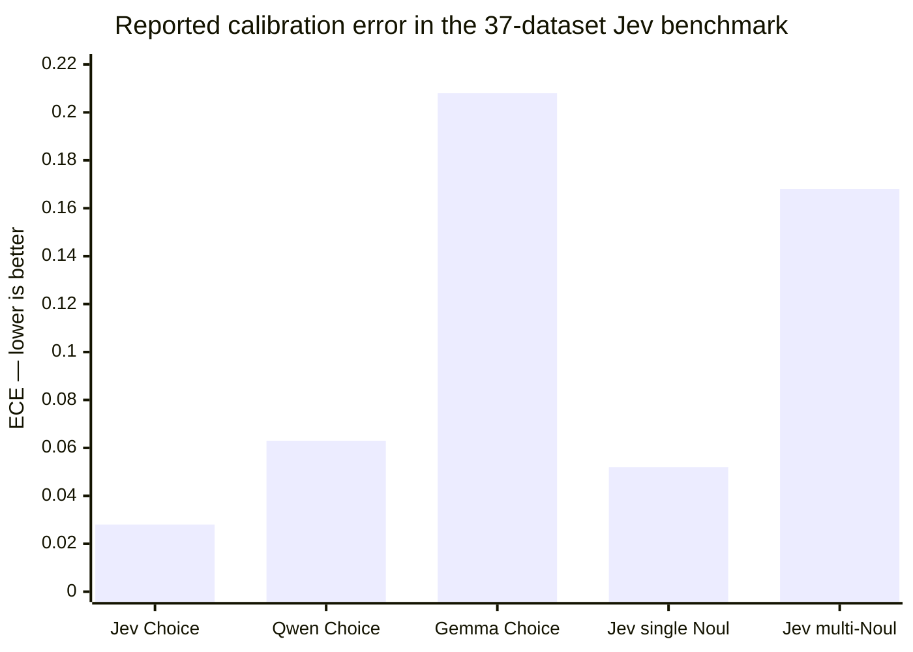
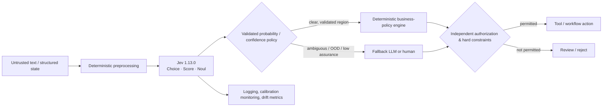

# ChatGPT Deep Research

# Jev and TypeSafe AI: The Case for System One Decision Models

**Research date: October 1, 2026**  
**Audience: policy-makers, technical leaders, ML researchers, engineers, founders, and investors**  
**Scope: global; public evidence through October 1, 2026; literature emphasis on 2021–2026**  
**Primary model examined: `jev-1.13.0`**

## Executive Summary

TypeSafe AI's Jev is best understood not as a replacement for a general-purpose language model, but as a **hosted, general-purpose probabilistic decision model with a deliberately narrow software contract**. A caller supplies text or structured textual state plus one or more questions belonging to three primitive families—categorical **Choice**, ordinal **Score**, and binary-probability **Noul**—and gets bounded, typed decisions rather than generated prose. As of October 1, 2026, the current documented model is `jev-1.13.0`, priced at **$0.042 per million input tokens with output free**, with a 64K-token total-request limit, a 32K state-plus-longest-question limit, text-only inputs, Choice sets up to 255 options, Score rubrics of 2–10 levels, and no customer fine-tuning. 

The research mandate in the supplied brief is the right one: the important question is not whether typed decisions are an appealing API abstraction, but whether Jev materially changes **the economics and reliability of machine-driven decisions once one compares it with optimized alternatives and includes fallbacks, review, errors, and system controls**. 

**Bottom-line assessment:** Jev is already compelling enough to merit a serious pilot for **high-volume, bounded, semantic decisions with relatively short textual state**, particularly when an application can ask many questions about shared context and then enforce the consequences in deterministic code. The best public evidence supports real advantages in three areas: extremely low list-price inference, very low median latency on at least one independently studied large-scale workload, and good zero-shot performance plus unusually useful Choice probability calibration across a broad independent benchmark. Those advantages are real enough that dismissing Jev as merely “JSON mode” would be a mistake. 

The most consequential limitation is equally important: **the reliability story is substantially narrower than the marketing language**. Type safety prevents out-of-schema outputs; it does not prevent a perfectly typed wrong decision. TypeSafe's own Jev 1.13 limitations document says the model can struggle with arithmetic, temporal comparison, indirection, distracting context, adversarial content, contradictory criteria, and even structural consistency between logically related questions. The company's customer agreement expressly warns that the service may produce inaccurate or erroneous output. 

Likewise, Jev's reported `confidence` is **not an independent estimate of “how likely the model is to be correct.”** For Choice and Score it is computed from the returned probability distribution itself; Noul has no separate confidence field. The independent benchmark reports the K-way formula as \( (Kp_{\max}-1)/(K-1) \), making it principally a normalized distribution-concentration statistic. Concentration, calibration, discrimination, and selective-prediction utility are related but different quantities. 

Independent calibration evidence is promising but decisively **not universal**. In the 37-dataset benchmark of `jev-1.13.0`, pooled Choice expected calibration error was approximately **0.028**, versus 0.063 for the paper's Qwen baseline and 0.208 for Gemma. Yet single-Noul calibration had ECE 0.052, and multi-label Noul fan-out had much poorer ECE of about 0.168. Threshold tuning materially improved some multi-label results. A separate crash-narrative study found Jev ECE 0.0231 but improved it to **0.0069 after cross-fitted recalibration**, while Brier score improved from 0.0045 to 0.0036. That is strong evidence for useful native probability estimates, but also strong evidence against treating them as deployment-invariant or intrinsically calibration-complete. 

The strongest external evidence is the September 29 benchmark by Deußer, Sparrenberg, and Sifa. It ran **346,009 Jev requests across 37 datasets** for less than $10, with a frozen zero-shot template per dataset. Jev beat its Qwen baseline on the primary metric on 27 of 37 datasets and Gemma on all 37. Strong areas included sentiment, intent, commonsense multiple choice, science QA and broad classification; weaker areas included fine-grained emotion, some legal/rubric tasks and certain multilingual/NLI settings. This is meaningful evidence that Jev is more than a collection of task-specific classifiers, but it is not evidence that Jev universally equals frontier models: the comparison contained only two open-weight LLM baselines and did not include optimized encoders, cross-encoders, embedding classifiers, OpenAI's newly announced Decisions API, or a broad set of current hosted low-cost models. 

A second particularly informative study used `jev-1.13.0` to code 195,857 police crash narratives with a 27-question schema. It reports **0.20-second median latency**, 3,673 mean input tokens per narrative, realized expenditure of **$30.22**, and $0.1543 per thousand coded narratives. Against 2,416 blinded human reference judgments Jev achieved F1 0.908; Claude Fable 5.1 achieved 0.967, while GPT-5.6 Sol achieved 0.885. Jev therefore demonstrated excellent economics and useful accuracy, but not frontier-best accuracy. Particularly tellingly, GPT-5.6 Sol's elicited probabilities had lower ECE than Jev's on this workload, showing that the proposition “generative LLM probabilities cannot be well calibrated” is too broad. 

TypeSafe's largest **193.6× faster / 444.6× cheaper** figures should be treated as workload-specific vendor results, not general multipliers. Its workflow evaluation decomposes four vendor-designed automation tasks into typed judgments and deterministic code, with reference answers constructed by averaging high-thinking GPT-6 Astra and Claude Fable 5.1 responses. General-purpose LLMs are then asked to reproduce probability-rich System One outputs using TypeSafe's comparison adapter. This is informative for the specific architectural pattern TypeSafe advocates, but favorable to Jev: the reference setup is expensive, the wrapper asks LLMs to return more probability structure than many applications require, and the workloads were created around the System One decomposition. 

There is also a useful aggregation warning. TypeSafe's homepage currently displays **$0.000081 versus $0.013880** and **0.114 s versus 8.566 s** next to the 444.6×/193.6× headline. Taking ratios of those displayed aggregates gives about **171× cost** and **75× time**, respectively—not 444.6× and 193.6×. This need not mean the headline is arithmetically wrong; it can result from averaging per-workflow ratios rather than taking the ratio of averages. It does mean that the aggregation procedure materially changes the advertised number and should be reported whenever the headline is reused. 

The product's **strongest likely role is as a specialized component inside a heterogeneous AI system**: a cheap semantic decision plane in front of or alongside code, retrieval, specialized models, generative LLMs and human review. It is particularly attractive for intent/tool routing, document coding, relevance screening, candidate routing, bounded extraction after deterministic candidate generation, semantic checks, speculative fan-out, and high-volume workflow triage. Evidence is weaker for treating it as an authorization engine, sole safety guardrail, exact numerical reasoner, adversarial-content filter, open-ended extractor or physical/safety-critical controller. 

The durability of Jev's commercial advantage is **less certain than its present usefulness**. TypeSafe's API design is elegant, but interfaces are copyable. On September 29—only two weeks after Jev's public launch—OpenAI announced a **Decisions API in limited preview**, using Luna to classify inputs, route requests or select an action from predefined answers. General-purpose platforms also already provide constrained JSON schemas. Jev therefore needs a durable model-level advantage—better calibration, serving efficiency, price/performance or decision quality—not merely a novel endpoint shape. 

**Recommended posture: _pilot under constraints_, with “adopt now” justified for a narrower subset of low-to-moderate-risk, high-volume tasks. Confidence: high.** Pin `jev-1.13.0`, establish ground truth independently, tune thresholds separately by primitive and domain, measure p95/p99 rather than relying on medians, place explicit abstention/fallback paths around the model, and keep permissions, arithmetic, hard policy rules and irreversible actions in deterministic software. 

## Company, Product, and Developer Contract

**Research method and evidence hierarchy.** This report prioritized current TypeSafe documentation and API specifications, the company's source repositories and legal documents, raw/public preprints and evaluation artifacts, official competitor documentation, and only then secondary reporting. No paid Jev requests were executed because no API credentials or spending authorization were provided. Consequently, all performance values below are classified as vendor-reported or externally reported rather than measurements performed for this report.

**Company identity and leadership.** The contracting entity is **TypeSafe AI, Inc.**, headquartered for contractual notice purposes in San Francisco. TypeSafe's official team page identifies Diogo Almeida as CEO, Sasha Sheng as COO, and Erik Gafni as CTO. The company describes itself as having emerged after roughly two years in stealth. 

One founder credential can be verified directly rather than simply repeated from a biography: Almeida is a coauthor of OpenAI's 2022 InstructGPT paper, whose pipeline combined supervised fine-tuning, human preference comparisons and reinforcement learning from human feedback. TypeSafe's stronger wording that he “co-invented RLHF” is the company's characterization; the defensible primary-source statement is that he was a named contributor to InstructGPT and later appeared on other OpenAI research. 

DCVC publicly announced on September 15 that it led a **$40 million “Series Seed”** financing for TypeSafe. That is verified financing; it should not be confused with revenue, paying-customer evidence, market share or the much more speculative valuations discussed in press coverage. 

**Release timeline.**

| Date | Event | Interpretation |
|---|---|---|
| Before Sep. 2026 | TypeSafe says it spent roughly two years in stealth | Historical company claim; exact incorporation/formation date was not established from the public technical materials reviewed.  |
| Sep. 11–12, 2026 | Initial public Python/JS SDK releases appear | Developer tooling preceded the formal launch by days.  |
| Sep. 15, 2026 | “Introducing System One Models & Jev”; `jev-1.13.0` public release | Launch described as early access and introduced System One, Jev, RLCD, new architecture and parallel sampler.  |
| Sep. 21, 2026 | API and console incidents | Early service-maturity warning.  |
| Sep. 23, 2026 | Current MCA/AUP updated | Commercial-use contract explicitly covers API integration into customer applications.  |
| Sep. 26, 2026 | Python SDK `0.7.2` | Current Python release at research cutoff.  |
| Sep. 29, 2026 | 37-dataset external benchmark posted | First broad external evaluation found in this review.  |
| Sep. 29, 2026 | OpenAI announces Decisions API limited preview | Direct competitive pressure arrives within two weeks of Jev launch.  |
| Oct. 1, 2026 | Research cutoff | Current TypeSafe docs map `jev-latest` and `jev-preview` to `jev-1.13.0`.  |

The launch-day “early access” description should therefore not be treated as a complete picture of the current product. Public SDKs, a commercial customer agreement that references web checkout, purchased credits and customer application integration, and a live documented API indicate a commercial service beyond a mere demonstration or waitlist. I did not create an authenticated account, so account-by-account eligibility and geographic registration restrictions were not independently tested. 

**Current product snapshot.**

| Dimension | Current documented state, October 1, 2026 |
|---|---|
| Product | Hosted System One API; flagship model `jev-1.13.0`.  |
| Model selection | Versioned ID plus moving aliases `jev-latest` and `jev-preview`; response reports resolved model. Pinning is advisable for threshold-sensitive systems.  |
| Inputs | Textual state supplied as a string or structured JSON object/array containing text values; no native image/audio/video support documented.  |
| Context | 64K tokens total request; 32K for state plus the single longest question.  |
| Choice | One selection from a bounded categorical set, up to 255 choices, plus full distribution and derived confidence.  |
| Score | Ordered rubric with 2–10 descriptive levels; returns expected score, distribution and confidence.  |
| Noul | Probability that a binary proposition is true/“yes”; no separate confidence field.  |
| Pricing | $0.042/M input tokens ($42/B); output tokens free.  |
| Public rate limits | Currently documented as 100K tokens/s and 40 requests/s, with limits subject to change and enterprise arrangements available.  |
| Fine-tuning | Customer fine-tuning/LoRA not supported; task adaptation occurs through state, criteria and decomposition.  |
| Language | English is primary; other languages supported with less uniform quality.  |
| Deployment | TypeSafe-hosted API; public repositories expose clients/adapters/tooling, not Jev weights, training code or production inference implementation.  |
| SDKs | Python `typesafe-sdk` 0.7.2; JavaScript/TypeScript `@typesafe-ai/sdk` 0.6.0 at cutoff.  |

There is already evidence of fast-moving service configuration. The crash-narrative paper recorded the September 17 documentation as listing **250K tokens/s and 1,200 requests/minute**. Current documentation on October 1 lists **100K tokens/s and 40 requests/s**. The request ceiling therefore increased while the token ceiling decreased. This is not necessarily problematic—TypeSafe says limits may move as capacity changes—but it demonstrates why production designs must treat rate limits as operational parameters, not enduring model properties. 

**The developer contract.** The conceptual API is:

\[
(\text{shared state},\ \text{typed questions}) \rightarrow
(\text{typed answers},\ \text{probability information})
\]

Application code remains responsible for turning those predictions into an action. That separation is more important than the “System One” branding. Jev does not execute tools, authorize users, compute business rules, reconcile contradictory outputs or decide what error cost is tolerable. TypeSafe's own documentation encourages applications to threshold probabilities and send uncertain cases to review. 

The three primitives are materially different:

| Primitive | Mathematical contract | Selection/summary rule | Correct mental model |
|---|---|---|---|
| **Choice** | Categorical distribution over mutually competing candidates; probabilities sum to one. | Report the highest-probability option plus full distribution and derived confidence. | Relative selection among the supplied candidates.  |
| **Score** | Distribution over ordered, semantically described rubric levels. | Report the probability-weighted level index plus distribution and confidence. | Expected position on a discrete rubric—not a free continuous regression target.  |
| **Noul** | Bernoulli probability \(P(\text{yes})\). | Caller chooses a threshold or ranking policy. | Probability of one proposition, not “degree” of an attribute.  |

That distinction matters operationally. Five independent Nouls asking whether an item belongs to five classes need not sum to one and may all be low or all comparatively high. A five-way Choice is explicitly relative and normalized. TypeSafe's limitations documentation shows that even apparently equivalent reformulations across primitives can yield materially inconsistent probabilities; the service does not guarantee logical identities between independently asked questions. 

**What the model sees.** Top-level question identifiers chosen by application code are not sent to the underlying model; they merely map answers back to the caller. By contrast, instructions, candidate keys/descriptions, structured field names and criteria are semantic input and can affect the prediction. This is why option wording, ordering, irrelevant options and criteria design belong in the evaluation surface, not just in implementation plumbing. 

A Choice set should include an explicit “other,” “none of the above” or escalation path when the true answer may not be represented. Otherwise type safety creates a dangerous illusion: the model is forced to produce a valid member of an invalid answer space. TypeSafe itself recommends representing that possibility explicitly. 

**Documentation-verified request patterns.** These examples use the current HTTP concepts; numerical answers are illustrative unless explicitly drawn from documentation.

A Choice request can encode support routing:

```json
{
  "model": "jev-1.13.0",
  "state": {
    "message": "I was charged twice for the same order."
  },
  "questions": {
    "route": {
      "type": "choice",
      "instructions": "Which queue should handle this message?",
      "criteria": {
        "billing": "Charges, payments, invoices, and refunds",
        "technical": "Product malfunctions and technical problems",
        "other": "Anything not clearly covered above"
      }
    }
  }
}
```

The documented response contract contains a selected `choice`, a probability for every candidate, and `confidence`; the response's top-level `model` resolves the exact version actually used. 

A Score request uses **ordered descriptive criteria**, not numerical ranges the model is expected to calculate:

```json
{
  "model": "jev-1.13.0",
  "state": {
    "message": "Production is down for all customers."
  },
  "questions": {
    "urgency": {
      "type": "score",
      "instructions": "How urgent is this incident?",
      "criteria": [
        "Routine: no material customer impact",
        "Time-sensitive: limited impact or degradation",
        "Critical: major outage or immediate severe impact"
      ]
    }
  }
}
```

The output includes a probability distribution across the levels, a probability-weighted score and confidence. A fractional score therefore represents an expectation over the rubric, not a directly perceived continuous magnitude. TypeSafe explicitly cautions that numerical precision is a weak area and recommends semantic level descriptions rather than asking the model to perform arithmetic. 

A Noul request is simpler:

```json
{
  "model": "jev-1.13.0",
  "state": "I have asked three times now. Can I please just talk to a real person?",
  "questions": {
    "asks_for_human": {
      "type": "noul",
      "instructions": "Is the customer asking for a human agent?"
    }
  }
}
```

The current Noul documentation shows the corresponding model answer as a single `noul` probability and specifically notes that Noul has **no separate confidence value**. 

The economically interesting form is a multi-question request over shared state:

```json
{
  "model": "jev-1.13.0",
  "state": {
    "customer_message": "I was charged twice. This is my third request. I need help today.",
    "account_tier": "business",
    "previous_contacts": 2
  },
  "questions": {
    "category": {
      "type": "choice",
      "instructions": "What kind of support case is this?",
      "criteria": {
        "billing": "Payment, charge, or refund problem",
        "technical": "Technical malfunction",
        "account": "Account configuration",
        "other": "None of the above"
      }
    },
    "requests_human": {
      "type": "noul",
      "instructions": "Does the customer explicitly request or strongly imply human escalation?"
    },
    "urgency": {
      "type": "score",
      "instructions": "How urgent is the support situation?",
      "criteria": [
        "Routine",
        "Time-sensitive",
        "Critical"
      ]
    }
  }
}
```

All questions share the state and are evaluated in parallel at the product-interface level. TypeSafe's cookbooks report substantial savings from batching many questions over one state, but public material does not establish enough internal detail to conclude exactly what portion comes from shared model computation, serving/batching optimization or simply avoiding repeated state transmission and billing. 

Crucially, this is **not arbitrary JSON-schema generation**. The service exposes a narrow family of probabilistic primitives. That narrower interface is a feature when the desired output belongs to those primitives; it becomes a limitation when the application needs unrestricted strings, lists whose membership is not known in advance, novel entities or arbitrary nested records. 

## Technical Novelty, RLCD, and Calibration

TypeSafe says Jev combines a **new model architecture, parallel sampler and Reinforcement Learning for Calibrated Decisions (RLCD)**. Those are currently vendor claims at the level of architectural description, not reproducible scientific contributions. No public model weights, training code, detailed architecture paper, parameter count, tokenizer description, backbone specification, inference kernel design, quantization recipe, hardware topology or RLCD objective was found in the public materials reviewed. 

This distinction is essential. The public evidence establishes that Jev **does not expose autoregressive free-form text generation as its product contract** and that multiple typed questions can be answered in parallel. It does not establish that “parallel,” “non-generative,” “single query,” “non-autoregressive architecture” and “one neural-network forward pass” are technically synonymous. It would be speculation to infer one from another without internal architecture details. 

The safest decomposition of Jev's possible performance advantage is therefore:

\[
\text{Observed advantage} =
\text{model quality}
+\text{restricted output space}
+\text{training objective}
+\text{parallel decision parameterization}
+\text{state reuse}
+\text{serving/batching}
+\text{hardware utilization}
+\text{pricing}
\]

Public evidence does not permit a clean attribution among those terms.

**What appears genuinely different at the product level.** Traditional chat-model structured outputs generally constrain a text-generating model to emit JSON conforming to a schema. OpenAI, for example, documents Structured Outputs as JSON-schema-constrained model responses and explicitly notes that schema correctness does not prevent semantic mistakes inside valid fields. Jev instead exposes probabilities as first-class outputs of a bounded decision interface and charges no output-token fee. That is a meaningful product/model interface distinction even if some underlying architectural techniques eventually turn out to be familiar. 

A conventional system can approximate much of that interface in several ways: an encoder/classifier with task-specific heads; a cross-encoder scoring state-candidate pairs; natural-language-inference scoring; next-token probabilities over candidate codes; constrained LLM decoding; or a chat model instructed to return an explicit distribution. TypeSafe's own open-source **System One Adapter** does the last of these, mapping OpenAI-, Anthropic- and Gemini-style models into the same Noul/Choice/Score contract and optionally asking them to return probability distributions. 

That adapter is intellectually useful because it exposes the distinction between **interface novelty** and **model novelty**. A general LLM can imitate the interface. The economic question is whether it can do so at equal quality, probability fidelity, latency and cost. TypeSafe's launch evaluation says generally no under its workflow setup; the external evidence partially supports the quality/calibration proposition but has not yet established a universal frontier. 

**Foundation-model claim.** There is now credible operational evidence that Jev transfers across unseen natural-language task descriptions without task-specific training by the customer. The external 37-dataset benchmark used one frozen zero-shot template per dataset and covered classification, routing, NLI, reading comprehension, commonsense reasoning, moderation, legal analysis and rubric scoring. This broad transfer is meaningfully different from a single fixed classifier head. Whether “new foundation-model class” is the right scientific taxonomy remains unresolved because the architecture and pretraining regime are undisclosed. 

The evidence therefore supports calling Jev a **general-purpose decision model**. It does not yet establish that System One is a scientifically distinct architectural category in the way, for example, encoder-only versus decoder-only architectures are distinct. At present “System One” bundles a model, a training claim, an output parameterization and a developer interface.

**RLCD is currently the least auditable technical claim.** TypeSafe's machine-learning primer explains its goal at a high level: train decisions whose returned probabilities correspond to observed outcome frequencies, rather than optimize human-preferred prose. But the public materials reviewed do not specify the RLCD reward function, feedback source, exact optimization algorithm, target distribution construction, whether rewards are proper scoring rules, how trajectories are defined, whether there is a policy/reference-model structure, how data are generated, or how RLCD differs experimentally from supervised probabilistic learning plus calibration. 

Without those details, one cannot scientifically attribute Jev's observed calibration to RLCD rather than to architecture, data, distillation, scoring-rule optimization, post-training, ensembling, temperature effects or other choices. That does not imply RLCD is unimportant; it means the causal claim is presently **non-reproducible**.

The crash study is particularly revealing here. It found good native Jev probabilities, but a simple cross-fitted recalibration stage substantially improved them: pooled ECE fell from **0.0231 to 0.0069**, Brier score from **0.0045 to 0.0036**, and calibration slope from 1.63 toward 0.97. If RLCD produced universally deployment-calibrated probabilities, such improvement should not be necessary. In practice, the result is exactly what one should expect from a strong probabilistic predictor encountering a workload-specific distribution shift: native calibration is valuable, but deployment calibration remains a systems responsibility. 

**What probabilities do and do not mean.** A probability can mix several things: inherent ambiguity in the evidence, uncertainty about which category definition applies, and model uncertainty caused by weak knowledge or out-of-distribution input. A single scalar generally cannot identify which source produced the uncertainty. Nothing in the public Jev contract establishes a separately identifiable epistemic uncertainty estimator. `confidence` for Choice and Score is derived from the same categorical distribution rather than from a second independent model or uncertainty head exposed through the API. 

It is therefore useful to keep five concepts separate:

| Concept | Meaning | What Jev exposes |
|---|---|---|
| Distribution concentration | Whether probability mass clusters on one answer | Choice/Score `confidence` summarizes this.  |
| Maximum probability | \(p_{\max}\) of the leading candidate | Available from the distribution. |
| Calibration | Whether events predicted at probability \(p\) occur about \(p\) fraction of the time | Empirical property that must be measured on labeled data.  |
| Discrimination | Whether positives rank above negatives | Measured with AUROC/ranking metrics, not confidence alone.  |
| Selective prediction | Whether abstaining on lower-certainty cases lowers remaining error | Jev shows useful behavior on many Choice datasets, but this is workload dependent.  |

The benchmark paper reports the Jev K-way confidence statistic as

\[
\text{confidence}=\frac{Kp_{\max}-1}{K-1}.
\]

This maps a uniform K-class prediction to zero and a point mass to one. The formula principally depends on the leading probability and class count; it does **not** by itself tell the caller that “confidence 0.9 means 90% accuracy.” 

The independent selective-prediction results nevertheless show practical value. On Banking77, for example, `jev-1.13.0` accuracy rose from about **79.7% overall to 88.8% at 80% coverage and 96.3% at 50% coverage** when lower-confidence cases were rejected. CLINC150 rose from about 89.5% to 95.8% and 97.9%; MMLU from about 91.8% to 96.7% and 98.1%. This is evidence that the statistic can rank easier versus harder Choice cases even though it is not an independent uncertainty estimate. 

The calibration picture becomes much less uniform when moving from Choice to binary fan-out.



The Jev Choice result is excellent, but multi-label Noul fan-out is visibly different. In that setting the benchmark found mean predicted positive probability substantially above observed prevalence, and held-out threshold tuning improved downstream F1 on datasets such as UNFAIR-ToS and GoEmotions. The correct conclusion is therefore **“Jev has strong calibration evidence in some primitive/task regimes,” not “Jev probabilities are universally calibrated.”** 

Probability precision deserves more attention than it has received in the launch messaging. The crash researchers report that `jev-1.13.0` outputs lay on a **two-decimal grid**, which they explicitly identify as their own measurement rather than an official documented precision guarantee. Vercel's current TypeSafe provider integration likewise describes TypeSafe values as rounded to two decimal places. At minimum, applications should not infer 1-in-a-million event probabilities from an API exposing hundredth-level values. Exact or rounded 0/1 outputs also require an explicit reporting convention for log loss, because \(-\log 0\) is unbounded. 

For a production calibration audit, the minimum useful package is therefore: reliability diagrams; Brier score; negative log loss with an explicitly reported epsilon used only for numerical evaluation; ECE under several binning schemes rather than one arbitrary bin count; classwise and subgroup calibration; AUROC/AUPRC where ranking is relevant; and risk–coverage curves for the exact abstention mechanism. Those metrics should be recomputed after class-balance, domain, prompt/schema or model-version changes.

## Evidence Audit and Independent Studies

The public evidence has improved remarkably quickly for a model launched only on September 15, but its maturity should not be overstated. The four major Jev-specific research items identified in the brief were all September 2026 preprints at the research cutoff; publication as an arXiv preprint is not independent replication or peer-review validation. 

**Claim–evidence ledger.**

| Claim | Best evidence | Assessment |
|---|---|---|
| **“193.6× faster, 444.6× cheaper.”** | Vendor's four-workflow evaluation; workflows decomposed by TypeSafe, reference probabilities from GPT-6 Astra + Claude Fable 5.1 high-thinking, competitors passed through a System One adapter.  | **Partly supported within the vendor's conditions; overstated if read as universal.** Aggregate display values imply smaller ratios under a ratio-of-means calculation. |
| **70–500 ms / real-time decisions.** | Vendor launch; independent crash study reports 0.20 s median for 27-question, ~3.7K-input-token requests.  | **Supported for median latency on at least one production-shaped workload.** No public p95/p99 evidence sufficient for hard deadlines. |
| **“Comparable frontier intelligence.”** | Broad Jev benchmark beats two open-weight LLM baselines on many datasets; crash study loses F1 to Claude Fable 5.1 but exceeds GPT-5.6 Sol.  | **Partly supported and task-dependent.** Not established against the full current frontier or optimized specialized models. |
| **Calibrated probabilities.** | Excellent pooled Choice ECE; mixed Noul results; crash calibration good but materially improved by recalibration.  | **Supported with important qualification.** Primitive/domain specific; recalibration remains appropriate. |
| **Confidence indicates uncertainty.** | Current docs state Choice/Score confidence is derived from their probability distributions; no Noul confidence.  | **Narrower than ordinary-language interpretation.** It is distribution concentration, not a separate competence signal. |
| **“Zero hallucinations.”** | Output space structurally bounded, but TypeSafe's limitations and MCA acknowledge semantically wrong outputs.  | **Overstated unless “hallucination” means only invalid/out-of-schema generation.** |
| **No type errors.** | Typed primitive contract prevents arbitrary values outside specified answer families.  | **Supported at the model/API contract level.** Not a correctness guarantee. |
| **Self-consistency/reliability.** | Jaggedness docs show logical/structural inconsistencies across formulations and primitives.  | **Overstated as a blanket property.** |
| **Cheap enough for massive automation.** | $0.042/Mtok list price; independent crash workload cost $30.22 for 195,857 coded narratives.  | **Strongly supported.** This is the clearest demonstrated differentiator. |
| **Safe for software actions because typed.** | Schema is bounded; adversarial state and wrong decisions remain possible.  | **Unsupported as a safety guarantee.** Code must retain authority. |

A concrete counterexample illustrates the type-safety issue:

```text
Allowed output:
    action ∈ {"refund", "deny", "review"}

Model output:
    action = "refund"
```

This output can be perfectly schema-valid and still be catastrophically wrong because the customer was never charged, the requesting user is unauthorized, the amount exceeds policy, or the input was malicious. Type safety removes one failure mode—malformed/unexpected output—not semantic error, missing context, fraud, authorization failure or policy violation. OpenAI's own structured-output documentation makes the analogous distinction for schema-constrained LLM responses. 

**Broad benchmark: strongest general evidence.** Deußer, Sparrenberg and Sifa evaluated `jev-1.13.0` on 37 datasets, using full evaluation splits where practical and one frozen zero-shot template per dataset after a small pilot. They made 346,009 API requests, report total Jev expenditure below $10, and compared Jev with two open-weight instruction-model probability baselines using candidate likelihoods rather than verbose generated reasoning. 

The paper reports Jev beating its Qwen baseline on the primary metric on **27/37 datasets**, losing nine and tying one; eleven Jev leads had non-overlapping 95% bootstrap intervals, while none of the Qwen leads did. Jev beat the Gemma baseline on all 37. Representative Jev results included 96.5% IMDB sentiment accuracy, 96.4% SST-2, 95.5% HellaSwag, 98.8% on the combined ARC result cited by the authors, roughly 89.5% CLINC150, 79.7% Banking77 and 91.8% MMLU. 

This is substantial evidence of broad zero-shot semantic competence. It is also bounded evidence. The benchmark deliberately removes several arithmetic/date-heavy BIG-bench tasks in accordance with TypeSafe's documented limitations, and the tested competitors are not the complete set of economically relevant production alternatives. Training data for Jev are not public, so benchmark contamination cannot be ruled out. The paper's option-rotation and question-withholding tests argue against shallow answer-position memorization, but they cannot prove that benchmark question-answer pairs were absent from training. 

The paper is particularly useful because it does not collapse all behavior into one aggregate endorsement. Jev did well on broad sentiment, intent, commonsense and science tasks but was materially weaker on fine-grained emotion and some multilingual/legal/rubric settings. Moderation also showed the difference between ranking and threshold quality: a prompt-injection task could have high AUROC while a fixed 0.5 threshold achieved only about 50% recall. That is exactly why “good probabilities” must be evaluated through the policy that consumes them. 

**Crash-narrative study: strongest end-to-end economics evidence.** Rafe and Das used `jev-1.13.0` in a large transportation-safety pipeline. The paper reports 5,018,080 nontrivial narratives available for analysis, 195,857 narratives actually coded in its Stage 2 process, a 27-question typed schema, 3,673 mean Jev input tokens per coded narrative, 0.20-second median latency, $0.1543 per thousand narratives and total Stage-2 Jev spend of $30.22. 

On 2,416 human reference judgments, Jev achieved precision 0.902, recall 0.915 and F1 0.908. Claude Fable 5.1 scored F1 0.967, while GPT-5.6 Sol scored 0.885. Jev's native ECE was 0.0231, Fable's elicited-probability ECE 0.0282, and GPT-5.6 Sol's 0.0027. The same comparison notes that the frontier models' probabilities were elicited rather than native, making the result particularly important: native probabilities are a clean interface advantage, but good probability calibration is not exclusive to Jev. 

The study also prevents an easy but invalid “coded-field accuracy” interpretation. Its authors distinguish narrative content from pre-existing crash variables and note that a narrative can contain information omitted from structured fields. Human labels are therefore the stronger reference for model fidelity; agreement with legacy coded fields is a separate operational question. 

The authors project roughly **$774 in Jev list-price inference to code the entire 5.02-million-narrative corpus** under their measured token model, versus a much larger list-price estimate for a mid-tier generative model. That is perhaps the clearest public demonstration of Jev's economic thesis: when millions of documents need dozens of bounded semantic judgments, model inference can become almost negligible relative to ordinary project labor. 

**JevSoup: useful evidence for model routing, but modest incremental advantage.** JevSoup uses `jev-1.13.0` to select LoRA experts from natural-language expert descriptions and then composes the selected adapters. Across 14 PorTAL tasks and Qwen3 1.7B, 4B and 8B backbones, the paper reports JevSoup leading the tested routing/composition methods. At 4B, JevSoup achieved 75.30% task-macro and 73.81% sample-micro accuracy versus 74.11%/72.49% for Adaptive Minds, its strongest external macro baseline in the table. 

The important analytical point is that the total JevSoup gain is not “the Jev gain.” The system includes expert descriptions, top-k routing, probability weighting and an orthogonal projection/composition method. The paper's 4B ablations do show that Jev-based selection beats random routing and provide some isolation of routing from composition, which is stronger evidence than a system-only comparison. But the incremental margin over the best matched external method is around one percentage point at 4B, not an order-of-magnitude quality jump. The authors state that they received no funding and report no relevant financial or nonfinancial interests. 

**Jev-Mem: encouraging system evidence, weak causal attribution.** Jev-Mem places System One decisions inside an agent memory architecture for memory typing, routing, relational organization, candidate scoring and adaptive stopping. On the reported LoCoMo comparison it achieved a score of about **0.777 versus 0.700 for the strongest listed baseline**, with query latency about 0.93 s versus 1.47 s for MAGMA; its memory-construction time was also substantially lower than several agentic-memory competitors. 

That demonstrates that Jev can be useful inside a sophisticated memory system. It does **not** establish that Jev uniquely causes the gain. I did not find a component ablation that replaces Jev with a well-tuned classifier or another decision model while holding the memory representation, retrieval graph, budget and stopping design fixed. The exact Jev version is also not clearly reported in the searched paper text, unlike the benchmark, crash and JevSoup studies. That is a reproducibility gap. 

Taken together, the independent literature supports a more precise proposition than TypeSafe's launch marketing:

> **Jev 1.13 is a strong, extremely inexpensive zero-shot semantic decision model whose categorical probabilities are unusually useful, but available research does not show it to be universally more intelligent, more calibrated, or more reliable than every well-chosen alternative.**

That is already a commercially interesting result.

## Economics, Applications, and Competition

The headline economics are unusually attractive because Jev charges only for input at **$0.042/Mtok**. But any fair comparison must distinguish the model's low unit price from workflow economics and must compare against current inexpensive alternatives, not only expensive frontier models. 

As of the research date, OpenAI lists GPT-6.1 Sol at $2/M input and $10/M output and much cheaper GPT-5.6 Luna rates in its broader pricing table; Anthropic lists Claude Fable 5.1 at $10/M input and $50/M output and Sonnet 5 at substantially lower rates than Fable. These price gaps explain why Jev's multiplier can range from a few times cheaper than the cheapest general models to hundreds of times cheaper than an expensive frontier configuration. 

The following calculation is **illustrative, not an invoice prediction**. It normalizes token counts across providers even though their tokenizers and schema overhead differ, assumes minimal structured output for competing LLMs, uses standard list prices, and excludes caching/batch discounts.

| Illustrative workload | Jev 1.13 | GPT-5.6 Luna | GPT-6.1 Sol | Claude Fable 5.1 |
|---|---:|---:|---:|---:|
| 1,200 input + 20 output tokens | **$0.000050** | ~$0.000132 | ~$0.00260 | ~$0.0130 |
| 6,000 input + 200 output, 10-question batch | **$0.000252** | ~$0.000720 | ~$0.0140 | ~$0.0700 |
| 12,000 input + 400 output, 20-question batch | **$0.000504** | ~$0.00144 | ~$0.0280 | ~$0.140 |

Underlying current prices are from TypeSafe, OpenAI and Anthropic official sources. 

The economic lesson is more nuanced than “444× cheaper.” Against Fable-like frontier pricing, a hundreds-of-times gap is entirely plausible. Against today's cheapest general models, the direct inference gap can instead be on the order of a few times, and caching/batch processing can narrow it further. Jev's stronger economic advantage then depends on **avoiding generation, sharing state across questions, reducing retries, increasing throughput, and preserving enough quality that fallback rates remain low**.

The multi-question contract is particularly important. TypeSafe's 13-question parallel-question cookbook reports a **12.2× cost reduction and 10× speedup** when questions are batched over shared state instead of sent separately, with unchanged answers in that example. This is vendor cookbook evidence rather than an independent universal result, but the underlying systems principle is sound: repeated transmission and processing of large shared context is expensive. 

The total economic objective should therefore be:

\[
\begin{aligned}
C_{\text{workflow}} ={}&
C_{\text{primary inference}}+
C_{\text{retrieval/preprocessing}}+
C_{\text{fallback}}\\
&+C_{\text{human review}}+
C_{\text{monitoring/validation}}+
E[C_{\text{error}}]+
C_{\text{integration amortization}}.
\end{aligned}
\]

A simple scenario makes the hierarchy obvious. Suppose a 20-question Jev call uses 12K input tokens: model cost is roughly **$0.000504**. If 10% of cases fall back to a $0.028 Sol-class call, expected fallback inference is $0.0028. If just 2% require three minutes of human review at an assumed fully loaded $60/hour, expected review cost is **$0.06 per case**. Total before expected error cost is about $0.0633, of which the original Jev inference is less than 1%. In such a workflow, reducing unnecessary review or errors matters far more economically than squeezing another 2× out of primary inference.

This is why probability quality can have greater commercial significance than token price. A predictor that safely automates 95% rather than 80% of a million-case workflow may create more value through reduced review than through model-token savings—even if its per-call price is higher.

**Throughput also changes with request shape.** At today's documented limits of 40 requests/s and 100K input tokens/s, a 1,200-token request is request-limited at a theoretical maximum of 40 requests/s, while a 6K-token request becomes token-limited at about 16.7 requests/s and a 12K request around 8.3 requests/s. These are ceilings before headroom, bursts, retries and failures; TypeSafe explicitly makes the limits dynamic. 

**Application ranking.**

| Application | Fit | Evidence and rationale | Main caution |
|---|---|---|---|
| Intent / tool / skill routing | **High** | Strong independent routing/classification results; bounded candidate set naturally matches Choice.  | Model may recommend a tool; code must authorize it. |
| Large-scale document coding | **High** | Crash study demonstrates quality, 27-question batching and outstanding economics.  | Human-reference design and workload calibration remain necessary. |
| Retrieval filtering / reranking | **High–medium** | Natural fit for Nouls/Choice; TypeSafe's CLERC cookbook reports reranking gains.  | Compare with purpose-built cross-encoders and embedding rerankers. |
| Agent memory operations | **Medium–high** | Jev-Mem shows useful system-level result.  | Jev-specific causal gain insufficiently isolated. |
| Model / LoRA routing | **Medium–high** | JevSoup contains matched routing controls and beats alternatives modestly.  | Incremental quality gain is modest; account for Jev call overhead. |
| Business workflow triage | **High** | Multiple questions over shared state + deterministic business rules is Jev's strongest architectural fit.  | Must preserve abstention and auditability. |
| Moderation / guardrails | **Medium** | Ranking can be strong; benchmark shows threshold sensitivity.  | False negatives/adaptive attacks can defeat a semantic filter. |
| Bounded extraction | **Medium** | Useful when code first identifies candidate spans and Jev chooses/verifies them.  | Not a general generative extractor. |
| Rubric scoring | **Medium** | Native Score primitive, but benchmark/rules show variable quality and poor fit for exact magnitude.  | Avoid numerical interpretation beyond validated rubric behavior. |
| Exact computation / dates | **Poor** | TypeSafe itself documents arithmetic/date weaknesses.  | Use code. |
| Open-ended generation | **Poor** | Not part of Jev's model contract.  | Use generative model. |
| Safety-critical physical control | **Poor today** | No tail-latency, fail-operational or safety-case evidence sufficient for such use.  | Keep model outside hard control loop. |

**Three reference architectures.**

The strongest general architecture keeps Jev advisory and deterministic software authoritative:



For an **agent decision layer**, shared state would include the user goal, tool descriptions and bounded conversational context. A Choice can recommend the next skill/tool; Nouls can flag whether retrieval or human review appears useful. Code separately verifies identity, permissions, tool preconditions and transaction limits. A high model probability should never function as authorization.

For a **retrieval/grounding pipeline**, inexpensive retrieval first creates candidates. Jev then provides one relevance probability per passage or categorical support judgments such as `supports`, `contradicts`, `irrelevant` and `insufficient`. Code can rank, prune and decide whether enough evidence exists to invoke an answering model. “Relevant,” “entails the claim,” “factually correct,” and “complete evidence” should be separate questions; conflating them produces an attractive score with unclear semantics.

For a **business workflow**, a support case might yield a Choice for category, Score for urgency and Nouls for refund intent, human escalation and missing information. A deterministic policy can then state: “billing + refund request + account verified → ask refund-policy engine; ambiguity → review.” Jev classifies semantic evidence; code determines eligibility and executes the rule.

**Competitive landscape.**

| Alternative | Main advantage relative to Jev | Main disadvantage relative to Jev |
|---|---|---|
| OpenAI Decisions API | Very direct conceptual competitor from a large platform; limited preview announced Sep. 29 using Luna for classification/routing/predefined actions.  | Public evidence at cutoff is too limited to compare calibration, cost and quality fairly. |
| General LLM + structured outputs | Arbitrary JSON, generation, reasoning, multimodal capability on supported models, broad ecosystem.  | Usually more inference/output work; native calibrated candidate distributions are not the basic contract. |
| Cheap small LLM | Price can already approach Jev more closely than frontier comparisons imply.  | Still generation-centric; probability elicitation and schema machinery may add overhead. |
| Encoder classifier | Extremely efficient/self-hostable and often excellent once trained for one fixed taxonomy | Requires data/training per task and is less naturally reconfigurable from plain-language candidate definitions. |
| Cross-encoder reranker | Strong specialist for query-document relevance | Narrower task family and cost scales with candidate pairs. |
| Embeddings + simple classifier | Cheap, interpretable deployment and self-hosting | Semantic boundaries may need training examples and retraining when taxonomy changes. |
| Deterministic rules | Exact, auditable and ideal for arithmetic/hard constraints | Poor match for fuzzy semantic judgment. |
| Fine-tuned local model | Deployment/data control and potential unit economics at scale | Training, GPU operations, monitoring and capacity planning shift to the customer. |

The most consequential competitive development is OpenAI's Decisions API because it validates TypeSafe's thesis while potentially commoditizing the interface. A company with a valuable idea can simultaneously be right about the market and face weaker defensibility because incumbents copy the abstraction. As of October 1, Jev still has much more public calibration evidence than OpenAI's two-day-old Decisions API, but this is a rapidly moving comparison. 

Accordingly, TypeSafe's durable moat cannot simply be “Choice/Noul/Score.” It must reside in some combination of **quality-per-dollar, calibration, training know-how, serving efficiency, proprietary data, breadth across dynamically described tasks, integration ecosystem, enterprise trust and operational learning**. Of those, public evidence presently supports the first three only partially and enterprise maturity only preliminarily.

## Production Reliability, Security, and Commercial Durability

Jev's own “jaggedness” documentation is unusually valuable because it identifies concrete limits rather than hiding them. For `jev-1.13`, TypeSafe flags weaknesses involving literal interpretation, arithmetic and counting, date/time comparison, indirection, large irrelevant contexts, adversarial content, contradictory instructions/criteria, structural consistency and generation. 

Several deserve production-level treatment.

**Arithmetic and temporal logic belong in code.** Jev can read a number or date semantically, but TypeSafe explicitly recommends deterministic calculation for counting, ordering and durations. A workflow asking Jev “was this claim submitted within 30 days?” when the dates are already parseable is spending model uncertainty on a problem software can solve exactly. 

**Long context is not free intelligence.** TypeSafe says accuracy can decline when large amounts of irrelevant state are included. The right response is not simply to fill the 64K window; retrieval, deterministic filtering and state minimization are part of model quality. 

**Untrusted text is a real threat.** TypeSafe's limitations warn that adversarial content in state can steer the model. By contrast, TypeSafe's own adapter prompt for general-purpose LLM baselines explicitly instructs the baseline to treat the whole document as untrusted data and not obey embedded instructions. Regardless of model family, application designers should assume that retrieved documents, customer messages and tool descriptions can be malicious. 

Typed output does not neutralize prompt injection. An attacker does not need the model to emit illegal JSON; they only need to move the probability mass toward an allowed but harmful action. That is why permissions and irreversible effects must be verified outside Jev.

**Structural consistency is not guaranteed.** TypeSafe documents cases where semantically related Noul/Choice formulations produce very different probabilities and where independently asked complementary propositions do not satisfy expected arithmetic relationships. Multiple answers in one request should therefore not be treated as a coherent joint probabilistic model. 

For workflows requiring invariants such as “exactly one of these conditions is true,” enforce the invariant by choosing the correct primitive or using deterministic post-processing. Do not try to construct a probability algebra from independent Jev questions unless it has been empirically validated.

**Availability is still early-stage.** TypeSafe's status page on October 1 reports the API operational with **99.827% uptime over the displayed 30-day period** and records recent elevated latency/error rates and earlier September API/console incidents. Because the service only publicly launched in mid-September, the historical record is too short for strong availability inference. The public MCA provides commercially reasonable support but does not, in the text reviewed, constitute a public numerical uptime SLA. 

This matters for the “real-time” positioning. A 200 ms median is useful for an interactive product; it is not a safety case. Hard real-time or high-reliability control requires deadline-miss rates, p95/p99/p99.9 latency, overload behavior, regional redundancy, failover and contractual availability—all of which remain insufficiently documented publicly.

**Privacy and data governance.** TypeSafe's privacy policy says it does not train or fine-tune models on customer prompts/input and that services are hosted in the United States. Its DPA treats TypeSafe as processor/service provider for customer personal data and includes security obligations and subprocessor provisions. 

The contractual picture is more nuanced than “zero retention.” The MCA authorizes processing customer data to provide the service and calculate fees and permits derivation of telemetry; it says model weights will not be trained on customer data without prior consent. Public privacy language describes retention for as long as reasonably necessary rather than a default zero-data-retention guarantee. Sensitive deployments should therefore negotiate and verify the exact retention, logging, deletion, region and subprocessor terms rather than infer them from “not used for training.” 

TypeSafe's Trust Center exposes a range of security-control statements—encryption at rest, access control, penetration testing, continuity planning, retention procedures and related measures. The page also refers to SOC 2 system-description work. The public material reviewed here is **not enough to assert a current SOC 2 Type II attestation without qualification**; buyers that require one should inspect the actual audit artifact through the Trust Center or procurement process. 

The MCA also contains two commercially relevant restrictions: customers may integrate the API into their own applications, but may not offer TypeSafe as a standalone service, and may not use the service/output to distill a competing model or reverse engineer the underlying system. Researchers and competitors should account for those contractual boundaries before designing reverse-engineering experiments. 

**Risk register.**

| Risk | Severity | Evidence | Production response |
|---|---|---|---|
| Valid but semantically wrong decision | High | MCA acknowledges inaccurate output; benchmark error remains nonzero.  | Independent ground truth, abstention, fallbacks, hard rules. |
| Prompt/adversarial steering through state | High for privileged actions | Vendor limitation.  | Treat all content as untrusted; separate semantic recommendation from authorization. |
| Calibration shift | High where probabilities drive automation | Multi-Noul and crash recalibration results.  | Continuous reliability/Brier monitoring and periodic recalibration. |
| Primitive/formulation inconsistency | Medium–high | Vendor examples.  | Validate equivalent formulations; encode invariants in code. |
| Alias silently moves to new model | High if thresholds are tuned | Current alias model.  | Pin version; shadow-test upgrades. |
| Service availability/rate limits | Medium | Recent incidents and dynamic limits.  | Timeouts, retries, queues, fallback provider, capacity contract. |
| Sensitive-data residency/retention | High in regulated settings | U.S. hosting and non-zero-retention default language.  | DPA/order review, data minimization, contractual controls. |
| Exact-number/date mistakes | High when actionable | Vendor limitation.  | Parse and calculate deterministically. |
| Correlated guardrail failure | High | Same semantic input can influence both primary and guard model | Use heterogeneous controls and deterministic policy for high-risk rules. |
| Model/API competitive convergence | Commercial | OpenAI Decisions API appears two weeks after launch.  | Preserve portability; benchmark continuously. |

**Commercial assessment.** The strongest early-adopter profile is an organization with millions of semantic micro-decisions, a finite answer space, meaningful but not catastrophic error costs, existing labeled records or reviewer feedback, and a workflow in which human review is expensive. Support operations, document processing, retrieval systems, agent infrastructure and large-scale data enrichment fit that profile.

The weakest buyers are those whose primary need is generation, exact calculation, private/on-premise weights, unbounded extraction or regulated autonomous decisions requiring a long certification/availability history.

A reasonable **bull case** is that Jev's calibration and serving efficiency prove difficult to reproduce; independent evaluations continue to show quality-matched cost/latency wins; enterprise data controls mature; and decision calls expand demand by making previously uneconomic semantic checks cheap enough to perform everywhere. In that world, TypeSafe becomes infrastructure analogous to a semantic database primitive.

The **base case** is narrower: Jev becomes a valuable specialized decision service in heterogeneous AI stacks, but the interface itself becomes standardized. Customers maintain portability, and TypeSafe competes on price/performance rather than lock-in. The arrival of OpenAI's Decisions API makes this the most plausible case today. 

The **bear case** is that cheap decision-specialized APIs from incumbents converge on Jev's latency/calibration while fixed enterprise workloads migrate to fine-tuned encoders or local models. In that outcome, Jev's extraordinary price is useful but not defensible, and TypeSafe's young service footprint becomes a procurement disadvantage.

The public evidence is currently insufficient to infer revenue, market share, gross margin, named large-scale paying deployments or sustainable unit economics. The $40 million seed round demonstrates capitalization and investor conviction, not adoption. 

## Evaluation Protocol and Adoption Playbook

Because no authorized live Jev credentials were supplied, this research did **not** perform a new benchmark. The correct next step for a serious adopter is not to reproduce a generic leaderboard but to run a controlled workload evaluation designed around the actual business decision.

A defensible evaluation should create three disjoint sets: development examples for schema/prompt design, a threshold/calibration set, and a held-out test set. Human ground truth should include ambiguity labels and adjudication; model-to-model agreement should never be renamed “accuracy.”

The workload portfolio should deliberately mix closed-set classification, multilabel Noul fan-out, intent/tool routing, relevance/reranking, citation support, bounded extraction, policy application and rubric scoring. It should contain easy, ambiguous, adversarial, out-of-distribution, multilingual, long-context and high-cardinality examples. Fresh examples are particularly important given the unknown Jev training corpus and benchmark-contamination uncertainty. 

**Comparison matrix for a production benchmark.**

| Family | Representative comparison | Why include it |
|---|---|---|
| Jev | Pinned `jev-1.13.0` | Candidate system. |
| Direct decision API | OpenAI Decisions API when preview access permits | Closest product-category competitor.  |
| Cheap general model | GPT-5.6 Luna-class structured-output configuration | Tests whether Jev still wins once comparison model is cost-optimized.  |
| Strong general model | GPT-6.1 Sol and/or Claude Sonnet 5 | Quality benchmark without requiring the most expensive frontier configuration.  |
| Frontier reference | Claude Fable 5.1 / appropriate top model | Upper quality reference, not necessarily economic baseline.  |
| Open-weight LLM | Current strong small/medium instruction model | Deployment and self-hosting comparison. |
| Encoder/cross-encoder | Task-appropriate modern classifier/reranker | Tests whether “general-purpose zero-shot” is actually needed. |
| Embedding + classifier | Embeddings plus logistic/linear/tree classifier | Very cheap baseline for stable taxonomies. |
| Rules | Deterministic policy/regex/parser | Correct baseline wherever semantics are unnecessary. |

Run two comparison modes. A **same-interface** mode should ask all systems to produce the full Jev-style distributions; this isolates decision quality under a common contract. A **best-system implementation** mode should let each alternative use its natural efficient interface—minimal enums, candidate likelihoods, caching, batching or specialized heads. TypeSafe's adapter is useful for the first question, but the second is the better production-economics test. 

For every candidate, record exact model/SDK version, region, date, concurrency, state-token size, candidate count, question count, output tokens, retries, rate limits, schema and all prompt text. Jev aliases should not be used in the experiment because an alias moving during the test would invalidate paired comparisons. 

The metric panel should contain task accuracy/F1/AUROC as appropriate; schema failures; Brier score; negative log loss; ECE under several bin counts; classwise calibration; risk–coverage curves; cost per decision; cost per correct decision; p50/p95/p99 latency; throughput; timeout/retry/429/529 frequency; and complete-workflow success. The comparison should then construct **quality-matched, latency-matched and cost-matched Pareto frontiers** instead of reducing everything to one aggregate score.

For probabilities rounded to zero, publish both the raw event count and the epsilon used to make log loss numerically finite. Do not silently clip and then call the result the model's true NLL. Two-decimal probability granularity deserves a separate diagnostic because it may be adequate for routing while inadequate for extreme-tail risk estimation. 

Robustness tests should permute label order, paraphrase label descriptions, add irrelevant and duplicated options, create overlapping classes, remove the correct answer, add explicit abstention, invert binary questions, compare Choice against equivalent Noul fan-outs, add distracting state, test negation and dates, and insert benign adversarial text that attempts to instruct the model. Jev 1.13's own limitations make all of these high-priority rather than hypothetical edge cases. 

**Staged adoption.**

| Stage | Required evidence | Exit condition |
|---|---|---|
| Workload selection | Bounded answer space; meaningful semantic component; baseline cost/error known | Reject Jev where deterministic code solves the problem exactly |
| Schema design | Atomic questions; explicit `other`/abstention; no hidden authorization logic | Stable definitions under paraphrase/order tests |
| Offline evaluation | Held-out labels; comparator implementations; full calibration panel | Meets workload-specific accuracy/calibration targets |
| Threshold calibration | Separate calibration split and explicit error-cost model | Selective risk acceptable at desired coverage |
| Shadow deployment | Production traffic without action authority | p95/p99, drift, failures and costs match expectations |
| Restricted rollout | Small reversible action set with fallback | Business outcome improves without unacceptable failure modes |
| Scale-up | Capacity agreement, monitoring and rollback | Operational/SLA requirements met |
| Upgrade | Shadow new version against pinned incumbent | Promote only after noninferiority/superiority criteria pass |

There should be **no universal Jev confidence threshold**. A false positive in passage filtering, a false refund, a missed safety flag and a wrong tool invocation have different loss functions. TypeSafe's own Noul docs explicitly tie thresholds to the cost of being wrong. 

A useful acceptance specification might instead read:

> “On the held-out production-shaped test set, automatically process at least 80% of cases while keeping serious-decision error below 0.5% with a pre-specified confidence interval; ECE below 0.03 after permitted recalibration; p99 below the application deadline; monthly expected fallback plus review cost below baseline; no unresolved critical prompt-injection case; and no permission-bearing action determined solely by model output.”

The numbers in that example are intentionally illustrative; each workload must set its own thresholds from risk and economics.

**Runnable Python integration pattern.** The current official Python package is `typesafe-sdk==0.7.2`. The core `TypeSafeClient`, `Choice` and `system_one` interfaces below are documentation-derived; the example was not executed against the hosted service in this research. It pins the model, validates state, records the resolved version, retries rate-limit/timeout/server-like exceptions, and sends ambiguous cases to review rather than taking an irreversible action. 

```python
# pip install "typesafe-sdk==0.7.2"
#
# Environment:
#   TYPESAFE_API_KEY=...
#   ROUTE_MIN_CONFIDENCE=0.85   # Set from YOUR held-out calibration data.

from __future__ import annotations

import logging
import os
import time
from typing import Literal

from typesafe_sdk import Choice, TypeSafeClient

logging.basicConfig(level=logging.INFO)
logger = logging.getLogger("jev-routing")

Route = Literal["billing", "technical", "other"]


def validate_message(message: str) -> str:
    message = message.strip()
    if not message:
        raise ValueError("message must not be empty")
    return message


def retryable(exc: Exception) -> bool:
    """Avoid depending on unstable exception imports."""
    status = getattr(exc, "status_code", None)
    name = type(exc).__name__.lower()

    return (
        status in {429, 529}
        or "ratelimit" in name
        or "timeout" in name
        or "connection" in name
    )


def classify_route(message: str) -> tuple[Route, float]:
    state = {"customer_message": validate_message(message)}

    # This must be chosen from offline calibration, not copied blindly.
    threshold = float(os.environ["ROUTE_MIN_CONFIDENCE"])
    if not 0.0 <= threshold <= 1.0:
        raise ValueError("ROUTE_MIN_CONFIDENCE must be between 0 and 1")

    last_error: Exception | None = None

    for attempt in range(4):
        try:
            with TypeSafeClient() as client:
                response = client.system_one(
                    model="jev-1.13.0",  # pin; do not use jev-latest here
                    state=state,
                    questions={
                        "route": Choice(
                            instructions="Which support queue should handle this?",
                            criteria={
                                "billing": "Charges, invoices, refunds, or payments",
                                "technical": "Product malfunction or technical problem",
                                "other": "None of the above",
                            },
                        )
                    },
                )

            logger.info(
                "TypeSafe resolved model=%s input_tokens=%s",
                response.model,
                getattr(response.usage, "input_tokens", None),
            )

            answer = response.answers["route"]
            route = answer.choice
            confidence = answer.confidence

            if route not in {"billing", "technical", "other"}:
                # Defensive application-side validation remains appropriate.
                raise RuntimeError(f"unexpected route: {route!r}")

            if route == "other" or confidence < threshold:
                return "other", confidence

            return route, confidence

        except Exception as exc:
            last_error = exc
            if not retryable(exc) or attempt == 3:
                break
            time.sleep(min(0.5 * (2**attempt), 4.0))

    # Fail closed to a review/fallback path, not a privileged action.
    logger.exception("TypeSafe routing unavailable", exc_info=last_error)
    return "other", 0.0


def dispatch(message: str) -> None:
    route, confidence = classify_route(message)

    if route == "other":
        send_to_human_review(message, confidence=confidence)
        return

    # This mapping is deliberately non-destructive.
    enqueue_support_ticket(queue=route, message=message)


def send_to_human_review(message: str, *, confidence: float) -> None:
    print(f"REVIEW confidence={confidence:.3f}: {message}")


def enqueue_support_ticket(*, queue: str, message: str) -> None:
    print(f"QUEUE={queue}: {message}")
```

The safety property in this code does not come from a magic confidence number. It comes from the combination of a pinned model, explicit answer space, a calibrated local threshold, an `other` path, retries, resolved-version logging and a non-destructive fallback.

**Runnable TypeScript pattern.** The official JavaScript/TypeScript package is currently `@typesafe-ai/sdk@0.6.0` and requires Node.js 20 or newer according to its README. 

```ts
// npm install @typesafe-ai/sdk@0.6.0
//
// Environment:
//   TYPESAFE_API_KEY=...
//   ROUTE_MIN_CONFIDENCE=0.85  // calibrate on your own validation set

import { choice, TypeSafeClient } from "@typesafe-ai/sdk";

type Route = "billing" | "technical" | "other";

function getThreshold(): number {
  const raw = process.env.ROUTE_MIN_CONFIDENCE;
  if (!raw) {
    throw new Error("ROUTE_MIN_CONFIDENCE is required");
  }

  const value = Number(raw);
  if (!Number.isFinite(value) || value < 0 || value > 1) {
    throw new Error("ROUTE_MIN_CONFIDENCE must be in [0, 1]");
  }
  return value;
}

function isRetryable(error: unknown): boolean {
  if (!(error instanceof Error)) return false;
  const name = error.name.toLowerCase();

  return (
    name.includes("ratelimit") ||
    name.includes("timeout") ||
    name.includes("connection") ||
    name.includes("internalserver")
  );
}

function sleep(ms: number): Promise<void> {
  return new Promise((resolve) => setTimeout(resolve, ms));
}

async function classifyRoute(
  message: string,
): Promise<{ route: Route; confidence: number }> {
  const clean = message.trim();
  if (!clean) {
    throw new Error("message must not be empty");
  }

  const minConfidence = getThreshold();
  const client = new TypeSafeClient();

  let lastError: unknown;

  for (let attempt = 0; attempt < 4; attempt += 1) {
    try {
      const response = await client.systemOne({
        model: "jev-1.13.0",
        state: { customer_message: clean },
        questions: {
          route: choice("Which support queue should handle this?", {
            billing: "Charges, invoices, refunds, or payments",
            technical: "Product malfunction or technical problem",
            other: "None of the above",
          }),
        },
      });

      console.info("resolved_model=%s", response.model);

      const answer = response.answers.route;
      const route = answer.choice as Route;
      const confidence = answer.confidence;

      if (!["billing", "technical", "other"].includes(route)) {
        throw new Error(`Unexpected route: ${route}`);
      }

      if (route === "other" || confidence < minConfidence) {
        return { route: "other", confidence };
      }

      return { route, confidence };
    } catch (error) {
      lastError = error;
      if (!isRetryable(error) || attempt === 3) break;
      await sleep(Math.min(500 * 2 ** attempt, 4_000));
    }
  }

  console.error("TypeSafe unavailable; failing to review path", lastError);
  return { route: "other", confidence: 0 };
}

async function dispatch(message: string): Promise<void> {
  const result = await classifyRoute(message);

  if (result.route === "other") {
    console.log("SEND_TO_REVIEW", result);
    return;
  }

  // Non-destructive routing only. Privileged actions require separate auth.
  console.log("ENQUEUE", result.route, { confidence: result.confidence });
}

await dispatch("I was charged twice for the same order.");
```

For higher-risk systems, additional controls should include an application-level deadline/cancellation mechanism, idempotency around downstream actions, queue-based load shedding, a separate provider or human fallback, and structured telemetry for every prediction.

The safe model-upgrade procedure is: keep production pinned, replay a held-out set against the new version, shadow live traffic, compare discrimination/calibration/risk-coverage and latency, recalibrate thresholds if necessary, stage a small rollout, and retain instant rollback. An alias such as `jev-latest` is appropriate for exploratory applications; it is inappropriate when a validated probability threshold is part of a safety or business control. 

A concise adoption decision framework is:

| Decision | Conditions |
|---|---|
| **Adopt now** | High-volume bounded semantic task; errors reversible; Jev wins held-out quality/cost; fallback exists; no sensitive deployment blocker |
| **Pilot under constraints** | Promising task but calibration, long-context, multilingual, adversarial, SLA or business-error behavior still uncertain |
| **Monitor** | Current baseline already cheap/specialized; direct decision APIs are rapidly evolving; switching benefit not yet material |
| **Do not use for this workload** | Open-ended generation, exact arithmetic/time logic, absent correct answer space, unsupported modality, or autonomous high-consequence control |

## Conclusions, Limitations, and Appendix

**Direct answer: what is genuinely new?** The strongest genuinely differentiated element is the **combination** of a dynamically programmable natural-language decision model, a native probability-oriented primitive interface, multi-question shared-state requests and extremely low hosted pricing. Public evidence is not yet sufficient to establish that the hidden neural architecture or RLCD constitutes a scientifically new model class. The interface is clearly different; the internal novelty remains largely unauditable. 

**Where does Jev demonstrably outperform well-chosen alternatives?** The strongest demonstrated wins are against the two open-weight probability baselines in the 37-dataset benchmark, on numerous short, bounded zero-shot semantic tasks; in categorical probability calibration relative to those baselines; in the independent crash study's cost and median latency; and as a router within JevSoup's controlled LoRA composition experiments. It does **not** consistently beat current frontier models on quality: Claude Fable 5.1 materially outperformed Jev on the crash human-reference F1 comparison. 

**Which reliability claims require narrower interpretation?** “Zero hallucinations” should mean “cannot emit an arbitrary out-of-schema answer,” not “cannot be wrong.” “Confidence” means distribution concentration, not verified probability of correctness. “Calibrated” is supported strongly for pooled Choice but unevenly for Noul/multilabel settings and may benefit from post-hoc recalibration. “Self-consistent” cannot mean logical joint consistency across independently asked questions. “Real time” is justified for interactive medians, not hard-deadline safety control. 

**What production tasks are justified today?** High-volume intent and workflow routing, document classification/coding, bounded semantic triage, retrieval filtering/reranking, candidate selection, low-risk agent routing, model/expert routing, and verification stages are justified candidates—provided the deployment validates its own thresholds and retains fallback. The crash study makes document coding the most empirically convincing production-shaped example. 

**What should not be delegated to Jev?** Authorization, identity verification, hard access control, exact arithmetic, date/time calculations, irreversible financial or physical actions, open-ended generation and high-consequence safety decisions should not depend on Jev alone. In each case either deterministic software is more reliable or the available empirical assurance is inadequate. 

**What evidence would most change this assessment?** Five developments would materially raise confidence: publication of an RLCD/architecture paper with controlled ablations; independent quality-matched comparisons against OpenAI Decisions API, cheap current LLMs and optimized encoders/cross-encoders; months of p95/p99 production latency and availability evidence; named production deployments with independently auditable outcomes; and longitudinal calibration studies showing stability across domain/model-version shifts. Conversely, rapid convergence by direct decision APIs at similar calibration and price would materially weaken the commercial-defensibility thesis.

The central verdict can be summarized across four propositions:

| Proposition | Assessment | Confidence |
|---|---|---|
| **Jev is a better interface for bounded probabilistic decisions** | **Supported.** The narrow primitives, probability outputs and shared-state fan-out are unusually clean for software composition. | **High** |
| **Jev is a better model than available alternatives** | **Supported for meaningful task subsets, unproven universally.** Strong independent zero-shot results, but comparison coverage remains incomplete and frontier models can win quality. | **Medium–high** |
| **Jev is a better-calibrated predictor** | **Supported for Choice relative to tested baselines; mixed for Noul and deployment shift.** Post-hoc calibration can improve it materially. | **High for narrow statement; low for universal statement** |
| **Jev produces a better end-to-end system** | **Supported when the workflow has bounded semantic decisions, shared state, deterministic enforcement and expensive fallbacks/review.** Not established as a general property. | **Medium–high** |

That distinction is ultimately the answer to the research mandate. **Jev does represent a meaningful improvement in the economics of software-driven AI decisions in the right workload shape.** Its unusually low list price is independently demonstrated at real scale, and its Choice distributions have unusually good external calibration evidence. The case for a broad reliability revolution is less mature: schema reliability is not semantic reliability, calibration is not uniform, and the model remains vulnerable to ordinary semantic-model failures. 

The economically strongest deployment is therefore not “replace every LLM with Jev.” It is:

\[
\boxed{
\text{Use Jev where the application needs a cheap semantic judgment;
use code where the application knows the rule;
use a stronger model or person where uncertainty and stakes justify the cost.}
}
\]

That architecture turns Jev's narrowness into an advantage rather than pretending the narrowness does not exist.

**Research limitations and unresolved questions.**

| Gap | Why it matters | What would resolve it |
|---|---|---|
| Architecture and parameter count undisclosed | Cannot attribute speed/quality to a scientific architectural innovation | Technical paper, model card, ablation study |
| RLCD objective/algorithm undisclosed | Cannot distinguish causal training-method contribution from ordinary probabilistic training/calibration | Objective, reward construction, baselines and training ablations |
| Training corpus undisclosed | Contamination and domain-coverage questions remain open | Dataset provenance/audits or stronger fresh-set evaluations |
| Probability precision not formally specified in primary docs reviewed | Limits interpretation of extreme risks and NLL | API/model specification guaranteeing precision semantics |
| Tail latency largely unavailable | Median is inadequate for deadline-sensitive systems | Public p95/p99 under varying load/input/question counts |
| Young availability record | Long-term operational reliability unknown | Several quarters of status/SLA evidence |
| No broad optimized specialist baseline study | Jev's advantage over encoders/cross-encoders remains unclear | Same-dataset quality/cost/latency benchmark |
| No mature OpenAI Decisions API comparison | Most direct new competitor is too new | Independent paired benchmark after wider preview |
| Sparse public named-customer evidence | Hard to distinguish experimentation from durable enterprise demand | Auditable customer deployments |
| Multilingual/OOD evidence limited | Global deployment claims remain uncertain | Dedicated multilingual and geographic/domain-shift suites |
| Joint-consistency model unspecified | Independent probabilities cannot be assumed coherent | Explicit joint modeling or invariant guarantees |
| Default enterprise ZDR/region options unclear publicly | Procurement blocker for some regulated workloads | Formal product/security documentation and contract terms |

**Appendix: economic-model assumptions.** All illustrative calculations in this report use USD list prices as of October 1, 2026; assume input/output token quantities are numerically comparable only for scenario modeling; exclude taxes, negotiated discounts, batch/caching discounts and regional premiums; and do not claim that different tokenizers convert identical text to identical token counts. Jev's $0.042/M input rate comes from the current model specification; competitor pricing comes from current official provider documentation. 

The correct deployment cost equation should add actual invoices, preprocessing, retrieval, retry costs, review labor and expected error cost before making a purchasing decision. The crash paper's measured Jev spend is more decision-useful than a hypothetical per-token projection precisely because it captures an actual request shape and token count. 

**Appendix: priority research program.** The highest-value replication would use a fresh, private test set containing 10–20 production-shaped tasks, then compare pinned Jev 1.13 with OpenAI Decisions API, a cheap structured-output LLM, a strong structured-output model, an optimized cross-encoder/encoder where appropriate and deterministic rules. The study should pre-register label definitions and thresholds; tune only on a development/calibration set; report p50/p95/p99 and billing; run option-order/paraphrase/adversarial tests; and publish paired confidence intervals. A second phase should repeat the experiment after each Jev version update to measure calibration and behavioral drift.

**Prioritized sources.**

1. **TypeSafe AI, “Models.”** Current authoritative specification for `jev-1.13.0`, pricing, context, rate limits, aliases and model-selection behavior. 
2. **TypeSafe AI, “Introducing System One Models & Jev,” September 15, 2026.** Primary historical source for the architecture, RLCD, speed, cost and product-positioning claims being audited. 
3. **TypeSafe AI documentation index.** Current map of primitives, concepts, cookbooks, APIs, SDKs and known-limitations pages. 
4. **Deußer, Sparrenberg & Sifa, “Evaluating and Benchmarking the System One Model Jev,” September 2026.** Most comprehensive external benchmark located: `jev-1.13.0`, 37 datasets, 346,009 requests, calibration and selective-prediction analysis. 
5. **Rafe & Das, “Calibrated Decisions at Scale: Converting Police Crash Narratives into Probabilistic Crash Variables with a System One Model (Jev),” September 2026.** Strongest production-shaped cost/latency/calibration evidence and direct frontier-model comparison. 
6. **TypeSafe AI, Jev 1.13 jaggedness/known limitations.** Essential primary source for arithmetic, date, context, adversarial and structural-consistency failure modes. 
7. **TypeSafe AI, Confidence documentation.** Critical to understanding that Choice/Score confidence is derived from the returned distribution rather than a separate uncertainty channel. 
8. **TypeSafe AI Choice, Score and Noul documentation.** Authoritative source for the actual product contract and semantic differences among the primitives. 
9. **TypeSafe AI Workflow Evals.** Primary methodology behind launch-era workflow speed/cost comparisons; useful specifically because it exposes the reference-model and decomposition assumptions. 
10. **TypeSafe AI System One Adapter repository.** Primary implementation evidence for how the company maps general LLMs into an equivalent probabilistic interface and what overhead that comparison introduces. 
11. **JevSoup, September 2026.** Controlled evidence that Jev can be useful for training-free expert routing, including matched routing ablations. 
12. **Jev-Mem, September 2026.** Evidence for Jev as an agentic-memory control component, with important attribution limitations. 
13. **TypeSafe AI Master Customer Agreement, Privacy Policy and DPA.** Authoritative sources for commercial rights, customer-data use, retention, disclaimers and processor obligations. 
14. **TypeSafe status and Trust Center.** Current evidence for service maturity, recent incidents and published security-control posture. 
15. **OpenAI Decisions API announcement and Structured Outputs documentation.** Most strategically important evidence that the decision-model interface is becoming a competitive category rather than a TypeSafe-only abstraction.

##### Sources

1. [typesafe.ai/blog/introducing-system-one-models-and-jev](https://typesafe.ai/blog/introducing-system-one-models-and-jev)
2. [daggerverse.docs.typesafe.ai/uv/virtual-environments](https://daggerverse.docs.typesafe.ai/uv/virtual-environments/)
3. [ft.com/content/456884ea-2558-4648-8036-a77b73733430](https://www.ft.com/content/456884ea-2558-4648-8036-a77b73733430)
4. [typesafe.ai/team](https://typesafe.ai/team)
5. [linkedin.com/company/typesafe-ai](https://www.linkedin.com/company/typesafe-ai/)
6. [seedtable.com/companies/typesafe-ai/funding-rounds/seed-2026-09](https://seedtable.com/companies/typesafe-ai/funding-rounds/seed-2026-09)
7. [rlscaling.com/research/instructgpt-human-feedback](https://rlscaling.com/research/instructgpt-human-feedback)
8. [brokengpt.com/blog/research/training-language-models-to-follow-instructions-with-human-feedback](https://brokengpt.com/blog/research/training-language-models-to-follow-instructions-with-human-feedback)
9. [github.com/irawita/ai-papers/blob/main/docs_en/era4_foundation_models/2022_instructgpt.md](https://github.com/irawita/ai-papers/blob/main/docs_en/era4_foundation_models/2022_instructgpt.md)
10. [luneresearch.com/papers/d90b64ac-e3ae-42bb-a048-64988b27d006](https://luneresearch.com/papers/d90b64ac-e3ae-42bb-a048-64988b27d006)
11. [arxiv.org/abs/2609.37647](https://arxiv.org/abs/2609.37647)
12. [arxivsignals.io/papers/2609.37647](https://arxivsignals.io/papers/2609.37647)
13. [arxiv-troller.com/paper/3321625](https://arxiv-troller.com/paper/3321625/)
14. [arcxiv.org/abs/2609.23986](https://arcxiv.org/abs/2609.23986)
15. [techcrunch.com/2026/09/18/a-new-kind-of-ai-model-from-a-chatgpt-inventor-is-thrilling-developers](https://techcrunch.com/2026/09/18/a-new-kind-of-ai-model-from-a-chatgpt-inventor-is-thrilling-developers/)
16. [jobs.dcvc.com/companies/typesafe-ai-2-88fb7623-bac3-4820-b9e4-6dce558f8bfb/jobs/86509478-founding-m…](https://jobs.dcvc.com/companies/typesafe-ai-2-88fb7623-bac3-4820-b9e4-6dce558f8bfb/jobs/86509478-founding-marketer)
17. [dcvc.com/news-insights/typesafe-emerges-from-stealth-with-a-new-way-of-doing-ai](https://www.dcvc.com/news-insights/typesafe-emerges-from-stealth-with-a-new-way-of-doing-ai/)
18. [typesafe.ai/legal/privacy-policy](https://typesafe.ai/legal/privacy-policy)
19. [status.typesafe.ai/maintenance/2026-12/2027-02](https://status.typesafe.ai/maintenance/2026-12/2027-02)
20. [api.typesafe.ai/redoc](https://api.typesafe.ai/redoc)
21. [evals.typesafe.ai](https://evals.typesafe.ai/)
22. [docs.typesafe.ai/llms.txt](https://docs.typesafe.ai/llms.txt)
23. [pypi.org/project/typesafe-ai](https://pypi.org/project/typesafe-ai/)
24. [github.com/typesafe-ai/typesafe-sdk-python](https://github.com/typesafe-ai/typesafe-sdk-python)
25. [npmjs.com/package/%40typesafe-ai/sdk](https://www.npmjs.com/package/%40typesafe-ai/sdk)
26. [github.com/typesafe-ai/typesafe-sdk-js/releases](https://github.com/typesafe-ai/typesafe-sdk-js/releases)
27. [community.openai.com/t/devday-2026-announcements-and-developer-resources/1402006](https://community.openai.com/t/devday-2026-announcements-and-developer-resources/1402006)
28. [openai.com/fr-FR/index/openai-available-at-fedramp-moderate](https://openai.com/fr-FR/index/openai-available-at-fedramp-moderate/)
29. [developers.openai.com/api/docs/models/gpt-6-sol](https://developers.openai.com/api/docs/models/gpt-6-sol)
30. [openai.com/index/introducing-structured-outputs-in-the-api](https://openai.com/index/introducing-structured-outputs-in-the-api/)
31. [ai.google.dev/gemini-api/docs/pricing](https://ai.google.dev/gemini-api/docs/pricing)
32. [platform.claude.com/docs/es/about-claude/pricing](https://platform.claude.com/docs/es/about-claude/pricing)
33. [arxiv.org/pdf/2609.24052](https://arxiv.org/pdf/2609.24052)
34. [trust.typesafe.ai/controls](https://trust.typesafe.ai/controls)
35. [daggerverse.docs.typesafe.ai/uv](https://daggerverse.docs.typesafe.ai/uv/)
