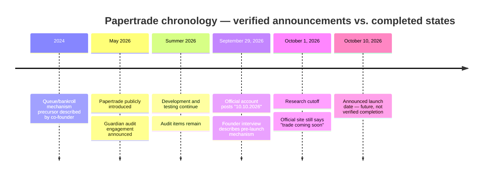
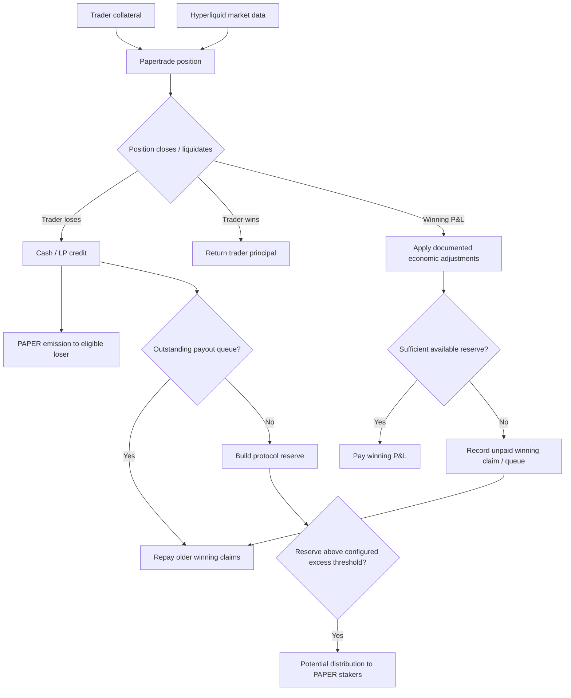

# Papertrade — Full Documentation Review, Investment Memo, and Prioritized Action Plan

## Executive investment memo

**Research cutoff: October 1, 2026. Recommendation: DEFER capital deployment. Proceed only with diligence and observation.**

Papertrade is a pre-launch synthetic perpetual-derivatives protocol being built on Hyperliquid’s HyperEVM. Its public proposition is unusually aggressive: leverage up to 1,000×, “0 market impact,” “100% user owned,” and fully on-chain operation. The official website, retrieved on October 1, still says “trade coming soon.” citeturn16view1 The project’s September 29 announcement displayed “10.10.2026,” which contemporaneous reporting interpreted as an October 10, 2026 launch date; that date is still nine days in the future at this report’s cutoff and therefore cannot be treated as evidence of a completed launch. citeturn23search12turn21search3turn21search4

The investment conclusion is consequently clearer than the protocol conclusion. **Papertrade may contain a genuinely interesting mechanism, but no Papertrade investment is sufficiently underwritable or demonstrably executable today.** The correct current exposure is the option value of waiting. Buying PAPER, staking PAPER, intentionally incurring losses to earn PAPER, or attempting to interact with pre-launch/test contracts should all be deferred. Direct LP investment is not a verified available route.

That conclusion is not merely because Papertrade is pre-launch. Three deeper diligence blockers remain.

First, the primary documentation could not be fully reviewed in this research environment. The official documentation URL loaded only its navigation shell rather than substantive pages; the project whitepaper, *Martin Galer*, could not be retrieved in a form that allowed the required rendered-page inspection. As a result, the complete documentation corpus, mathematical definitions, exact current issuance curve, queue specification, staking rules, legal terms, and deployed configuration could not be independently reconciled against one another. Secondary summaries consistently report an initial rate of 100 PAPER per dollar of eligible LP gain below a $2 million threshold, with declining issuance above it, and an LP-surplus threshold around $5 million, but these remain **documented-but-unverified parameters**, not verified live configuration. citeturn16view0turn16view2 The attached research mandate correctly treats those figures as leads rather than conclusions. fileciteturn0file0

Second, implementation security is not cleared. Papertrade publicly said it had engaged Guardian Audits; an auditor’s portfolio independently lists Papertrade as a HyperEVM perpetual exchange with **1 critical, 4 high, 11 medium, and 11 low findings, with the report still “pending.”** citeturn20search1 A more recent project update mirrored from the official account said the frontend/UX/servers were largely complete but “a few audit items” remained. citeturn23search12 Until the final audited commit, deployed bytecode, remediation status of the critical/high findings, administrative controls, multisig/timelock configuration, and official contract addresses are published and reconciled, this is a capital-blocking uncertainty. A block explorer does show contracts named “PaperTrade” and “PAPER,” but I found no authenticated project cross-link proving that any particular explorer token is the investable PAPER described in project materials; it would be unsafe to infer authenticity from ticker/name alone. The project itself has warned that people discovered a mainnet testing deployment, that early deposits had no bonus and merely locked funds in a testing contract, and that scam sites existed. citeturn23search12

Third, the mechanism substitutes one class of market risk for another rather than eliminating counterparty economics. In the proposed design, traders transact synthetically against a protocol bankroll rather than necessarily matching against another trader. Trader losses replenish that bankroll; profitable traders drain it. If a realized winner is owed more than available reserves, the excess winning P&L becomes a queued obligation to be repaid by later economic inflows. Co-founder blurr illustrated the design with a $6 million winning claim against a $5 million bankroll: roughly $5 million can be paid and $1 million becomes debt. He explicitly acknowledged that sufficiently large debt could break the system. citeturn15view1 The important distinction is that a queued claim is not equivalent to cash.

This makes the fundamental underwriting identity simple:

\[
\text{future queue repayment} \leq \text{future net cash contributed by losing flow and other genuine cash inflows}.
\]

Issuing PAPER does not itself create dollars. If new trading stops while a payout queue exists, token issuance cannot repay that queue unless somebody contributes external value in exchange for the token or some other recapitalization channel exists. The queue therefore **converts immediate settlement failure into duration, participation, and confidence risk**. It can make an underfunded system operationally continuous without making every claim economically liquid.

That distinction is especially important because Papertrade is deliberately likely to change its trader mix. The project proposes no conventional funding charge, synthetic execution referenced to Hyperliquid prices, and very high leverage. A founder interview describes direct reading of Hyperliquid market information through HyperEVM, restrictions to initially suitable assets such as BTC and ETH, transaction scheduling that prioritizes liquidations over closes over opens, and an asymmetric profit-impact/haircut function intended to make tiny winning moves less attractive. citeturn16view3turn15view0turn15view2 Hyperliquid officially documents read precompiles giving HyperEVM contracts access to current HyperCore state, including oracle information, and states that those values match the latest HyperCore state when the EVM block is constructed. citeturn17search0 But that does not independently prove Papertrade’s exact claimed BBO data path, freshness logic, transaction-ordering implementation, or deployed safeguards.

The strongest available quantitative evidence is an independent open-source simulation replaying a reported 3.6 million historical high-leverage Hyperliquid trades through a modeled Papertrade system. Its shipped parameters assume 1,000× leverage, a $5 million LP cap, 100 PAPER per dollar below $2 million, a declining issuance function above that threshold, FIFO queued winnings, and an asymmetric profit haircut. Across 608 scenario combinations, the model reports all simulations ending solvent, 81.2% never entering debt, a maximum observed debt of about $61,974 resolved within the same modeled day, and a five-day path to the $5 million cap in its full-flow/day-zero case. citeturn16view2

Those results are encouraging as a mechanism demonstration but weak as an investment forecast. The model itself acknowledges the principal problem: it replays trader behavior observed under Hyperliquid’s original rules while transforming those trades to a 1,000× Papertrade environment, even though traders would behave differently under different leverage, fees, liquidation probabilities, rewards, and settlement certainty. citeturn16view2 Its full-flow scenario transforms the sample so drastically that modeled liquidation rates rise to roughly 80% for BTC and 91% for ETH. citeturn16view2 That is not a minor counterfactual. It means the modeled cash engine is partly generated by imposing a very different payoff system on behavior selected under another venue. The model is useful stress-test code, not proof that real Papertrade users will donate comparable losses.

The central demand question is therefore the one specified in the mandate: **would enough users still choose Papertrade if PAPER rewards were worth zero?** There is not yet empirical evidence that they would. High leverage, no conventional funding, deterministic synthetic entry/exit semantics, and potential agent integrations could be genuine product advantages. Conversely, skilled or latency-sensitive traders may disproportionately select into a venue offering attractive execution while casual losing traders withdraw once token subsidies cease. If winning flow selects into the venue more aggressively than losing flow, the bankroll and payout queue become negatively selected.

PAPER potentially gives the mechanism its bootstrap loop. Secondary documentation summaries and the independent model describe issuance to losing traders as reserves grow and cash distributions to stakers. Co-founder comments similarly characterize PAPER as owning the protocol’s commission stream and participating in LP surplus above an adjustable threshold around $5 million. citeturn16view0turn15view2 Economically, this means a losing trader may be interpreted as **purchasing PAPER with trading losses**, not “earning yield.” If the initial rate really is 100 PAPER per $1 of eligible loss, the simple gross acquisition basis is one cent per PAPER:

\[
\$1 / 100 = \$0.01\text{ per PAPER}.
\]

That is only a nominal basis. The economic cost is higher after any commissions, hedging friction, liquidation losses, gas, failed execution, adverse token price movement, inability to sell immediately, dilution, and the risk that PAPER has little or no realizable market value. Co-founder comments also indicate PAPER was not intended to be tradable on day one, further weakening any assumption that loss-based issuance creates an immediately arbitrageable token floor. citeturn15view3

The independent simulator illustrates why dilution is as important as acquisition price. Under its published full-flow case it produces approximately 8.63 billion PAPER and $248.1 million of cumulative staker fees, with a large fraction of token creation concentrated early; lower-flow scenarios produce different supplies and fee pools. citeturn16view2 These are model outputs, not forecasts. But they show why a “fair launch” can still produce highly unequal economics: an early holder can capture a disproportionate share of distributions before later issuance dilutes ownership, even with no formal team allocation.

“100% user owned” should therefore not be read as equivalent to equity ownership or decentralized control. The official homepage uses that phrase, while founder comments describe the ability to suspend markets/restrict openings under some conditions and reliance on relayers/internal scheduling to manage transaction ordering. citeturn16view1turn15view0 No accessible legal document establishes that PAPER represents ownership of a company, and no operating entity, corporate capitalization, governance constitution, or enforceable off-chain shareholder right was verified. The defensible description is narrower: **PAPER is intended to be a code-mediated economic participation token whose precise production rights still require verification.**

Valuation therefore should begin from cash distributions, not narrative FDV. Let \(D\) be annual distributable cash, \(S\) forward-diluted supply over the investment horizon, \(s\) the fraction of tokens staked and entitled to distributions, \(y\) the investor’s required cash yield, and \(P\) token price. A first-pass ceiling is:

\[
P_{\max}=\frac{D}{y\,s\,S}.
\]

For illustration only, if forward supply were 5 billion PAPER, 50% were staked, and an investor required a 50% cash yield because of protocol, legal, liquidity, and dilution risk, a one-cent PAPER price requires **$12.5 million of sustainable annual cash distributions**; five cents requires $62.5 million; ten cents requires $125 million; and 25 cents requires $312.5 million. These are reverse-underwriting conditions, not price targets. No current verified PAPER market, current supply, or sustainable production distribution run rate was established, so assigning a present fair value would manufacture precision.

The strongest bull case is that Papertrade discovers a durable market for extremely capital-efficient synthetic exposure, uses Hyperliquid as a transparent price substrate without taking external order-book inventory, converts otherwise private market-maker economics into a user-owned bankroll, and uses loss-linked emissions to solve cold-start capitalization. If organic losing flow persists after token subsidies normalize, queues remain negligible, the audit is clean, distribution rights are immutable, and dilution declines fast enough, PAPER could become a valuable claim on cash flows.

The strongest bear case is reflexive. High leverage attracts sophisticated opportunistic flow; clustered winners deplete reserves; queued claims undermine confidence; losing users stop participating; PAPER price falls; lower token value weakens the incentive to tolerate losses; new reserve inflows decline; the queue ages; and a mechanism designed around future losing flow loses precisely the flow required to recover. Security, legal, or administrative-control concerns can trigger the same cycle. The most dangerous state is therefore not an ordinary bad trading day; it is **a queue combined with falling token value and falling participation**.

**Investment committee decision by exposure route**

| Exposure | Current decision | Rationale | Reopen only when |
|---|---|---|---|
| Buy PAPER | **Defer** | No authenticated executable official market established; token not intended to trade immediately at launch according to co-founder comments. citeturn15view3 | Official token address, transferable supply, genuine liquidity, rights, forward dilution and valuation verified |
| Stake PAPER | **Defer** | Distribution design is plausible but production staking contract, lockup, claim rules and controls remain unverified. | Audited staking contract plus observed cash distributions and exit mechanics |
| Earn PAPER through normal trading | **Watch** | Token emissions may offset some genuine trading losses, but rewards cannot be valued without market/liquidity and dilution data. | Live issuance formula and market value demonstrably support positive all-in economics for the relevant trader |
| Deliberately lose to acquire PAPER | **Pass** | A loss is expenditure; economics are inferior to a purchase unless realizable PAPER value exceeds all-in acquisition cost. | Only reconsider as an abstract acquisition comparison after legal, liquidity and valuation gates; no manipulative extraction strategy |
| Direct LP deposit | **Unavailable / pass** | Available descriptions say LP capital is self-bootstrapped rather than directly deposited by investors. citeturn16view0 | Official product changes create an authenticated LP instrument |
| Wait and observe | **Proceed** | Preserves capital and captures large information option value during launch, audit publication and first real stress periods. | Continue until participation gates below are passed |

**Confidence:** medium-high in the current **defer** recommendation; medium in the economic reconstruction; low-to-medium in exact production tokenomics because the complete primary documentation, whitepaper and deployed configuration could not be independently reviewed.

The immediate decision gates are uncompromising: authenticate every production contract through official cross-links; obtain the final audit and prove remediation of the reported critical/high findings; establish the operating entity, terms and jurisdictional eligibility; reconcile the exact issuance and queue formulas with deployed code; observe genuine mainnet settlement including at least one period of reserve stress; establish PAPER’s real transferable liquidity; and value the token against forward dilution and cash distributions rather than headline trading volume. Until those are satisfied, **mechanism novelty is not an investment thesis**.

## Mandate, methodology, evidence base, and documentation coverage

The mandate is to separate **protocol viability**, **investment attractiveness**, and **timing/implementation**, then convert the analysis into an investment memo and explicit decision plan rather than merely summarize project documentation. The brief also explicitly leaves investor budget, risk tolerance, holding period, legal eligibility, and jurisdiction unspecified; recommendations below therefore remain conditional rather than personalized. fileciteturn0file0

**Research questions.** The work focused on seven questions: What exactly is Papertrade and how does it differ from Hyperliquid itself? What makes a winning trader’s claim payable, and when can that claim become delayed? Who contributes the economic cash ultimately received by profitable traders and PAPER stakers? What exactly does PAPER confer, how is it issued, and how rapidly can ownership dilute? Which investment routes actually exist? Are implementation, security and legal prerequisites sufficiently known to put capital at risk? Finally, what operating performance would justify a given PAPER valuation?

**Methodology and evidence hierarchy.** Evidence was ranked, in descending order, as deployed and authenticated implementation; official project documentation/current configuration; official infrastructure documentation; published security reports; original quantitative research with reproducible code/data; direct contributor statements; and secondary reporting. Search snippets and third-party summaries were treated as discovery aids rather than proof. The evidence status labels used throughout are:

| Label | Meaning in this report |
|---|---|
| **Verified implementation** | Authenticated deployed code or chain state directly demonstrates the fact |
| **Documented but unverified** | Project documentation or direct project statement describes it, but deployed implementation was not independently authenticated |
| **Announced/planned** | A future milestone or intended behavior |
| **Independently observed** | Third-party data/code/reporting directly observes or models the item |
| **Analytical inference** | Conclusion derived from verified/documented facts |
| **Model assumption** | Explicit numerical assumption, not observed production fact |
| **Unknown/conflicting** | Evidence is inaccessible, incomplete or inconsistent |

No material Papertrade claim reached the strongest “verified implementation” standard because official production deployment addresses could not be authenticated before the research cutoff. That does not imply no contracts exist; it means the investable deployment could not be safely distinguished from test or lookalike deployments.

**Documentation coverage limitation.** A basic retrieval of `https://docs.papertrade.xyz/` returned only a documentation/navigation shell in this environment, while the official homepage was accessible and showed the four headline claims plus “trade coming soon.” citeturn16view1 The whitepaper PDF at the URL specified in the brief could not be retrieved successfully for the required rendered-page analysis. Because formulas, diagrams and references in a PDF should not be reconstructed from secondary descriptions, this report **does not claim a complete whitepaper review**. The audit report also remains unpublished according to the auditor portfolio. citeturn20search1

Accordingly, the denominator of individual nested documentation pages is unknown and a legitimate “percentage reviewed” cannot be calculated. Claiming complete documentation coverage would be false.

**Documentation coverage ledger**

| Document / artifact | Version and retrieval | Coverage | Substance | Investment relevance | Verification / open issue |
|---|---|---|---|---|---|
| Papertrade official website, `https://papertrade.xyz/` | Retrieved Oct. 1, 2026 | **Fully reviewed as rendered** | 1,000× leverage, zero market impact, 100% user owned, fully onchain on Hyperliquid; trading/mobile/agent “coming soon.” citeturn16view1 | Establishes marketing claims and pre-launch state | Claims are not proof of implementation |
| Papertrade Docs index, `https://docs.papertrade.xyz/` | Retrieved Oct. 1, 2026 | **Partially reviewed** | Retrieval exposed navigation shell rather than page corpus | Supposed source of definitive economics | Page count, current parameters and legal/risk pages could not be enumerated |
| PAPER/tokenomics pages within docs | Current version/date unavailable | **Indirectly reviewed only** | Secondary indexed summaries describe zero initial supply, loss-linked issuance, 100 PAPER/$ below $2m, declining tail, staking and $5m excess mechanism. citeturn16view0 | Central to dilution and valuation | Must be reconciled to deployed contracts before investment |
| *Martin Galer* whitepaper, `https://docs.papertrade.xyz/martingaler-whitepaper.pdf` | Version/date unavailable | **Inaccessible for direct rendered review** | Brief describes payout queues, token incentives and a Solvency Ratio Invariant. fileciteturn0file0 | Supposed theoretical foundation for solvency argument | Formulas, simulation assumptions, citations and applicability cannot be independently audited here |
| Official project X account/post | Sep. 29, 2026 launch post | **Primary post not directly retrievable; independently mirrored** | “10.10.2026”; project also warns against scam sites and premature test-contract deposits. citeturn23search12 | Determines timing and source authentication | Oct. 10 is an announcement, not completed launch |
| Founder interview, Thread Guy × blurr | Sep. 29, 2026 | **Substantively reviewed via caption transcript** | Queue, reserve, pricing, transaction ordering, fees, emissions, administrative actions, token launch. citeturn16view3turn15view0turn15view1turn15view2turn15view3 | Best available direct description of late-stage design | Contributor memory was explicitly uncertain on some exact parameters; code/docs must prevail |
| Guardian audit | Commissioned in 2026 | **Report unavailable** | An auditor portfolio reports 1 critical, 4 high, 11 medium, 11 low; report pending. citeturn20search1 | Capital-blocking security evidence | Finding details, commit hash and remediations unavailable |
| Independent Paper LP simulator | Public GitHub, retrieved Oct. 1 | **README/config/results reviewed** | Replays 3.6m claimed historical trades, 608 scenarios, implements queue/emission/impact model. citeturn16view2 | Best quantitative evidence available | Not official implementation; underlying external dataset was not independently authenticated |
| Hyperliquid documentation | Current pages retrieved Oct. 1 | **Relevant architecture pages reviewed** | HyperEVM precompiles, interaction timing, dual blocks, native perp funding/fees/liquidations. citeturn17search0turn17search5turn17search8turn17search9turn17search19 | Verifies infrastructure Papertrade depends upon | Does not verify Papertrade-specific logic |
| GMX documentation | Current pages retrieved Oct. 1 | **Relevant comparison pages reviewed** | Pool-backed perps, up to 100× leverage, fees, funding/borrowing, price impact and solvency protections. citeturn24search2turn24search4turn24search16 | Competitive benchmark | Separate protocol; no inference of Papertrade behavior |
| Regulatory materials | Current/historical official sources | **Relevant policy reviewed** | U.S. CFTC and Canadian CSA positions/enforcement regarding leveraged crypto/derivative platforms. citeturn24search0turn24search3 | Legal access gating | Not a legal classification of Papertrade |

**Chronology.** Co-founder blurr describes the conceptual predecessor as a queue-based casino/bankroll mechanism developed around summer 2024; Papertrade was publicly introduced in 2026, Guardian Audits was engaged during launch preparation, and late-summer project communications still described remaining audit work. On September 29 the official account announced “10.10.2026.” As of October 1, the official site still says trading is coming soon. citeturn16view3turn23search12turn16view1



**Project identity and team.** Papertrade should not be confused with Hyperliquid’s native perpetual exchange. Hyperliquid is the underlying blockchain/trading infrastructure; HyperEVM applications are independent applications for which Hyperliquid directs users to the relevant project team. citeturn17search1 Papertrade intends to maintain synthetic positions in its own HyperEVM contracts while using Hyperliquid market information as a pricing input. The project is publicly associated with Jez (`@izebel_eth`) and blurr, with blurr speaking as co-founder in the September interview. citeturn16view3

The founders’ legal identities, operating entity, capitalization, employment arrangements, development budget and exact infrastructure financing were **not established from authoritative accessible materials**. Publicly verifiable information establishes crypto-native experience and a long collaboration, but not enough to underwrite key-person risk or legal recourse to the standard expected for an institutional investment. No assumption is made that “no token team allocation” means the development company has no owners, compensation, contractual rights or other financial interests.

**Literature review.** No peer-reviewed Papertrade-specific academic study was identified in the accessible corpus. The whitepaper is a project mechanism paper rather than independently established academic validation and could not be inspected directly. The principal empirical literature is instead the open-source independent simulator. Industry literature consists of Papertrade’s own statements, direct founder interviews, Hyperliquid infrastructure documentation and comparable protocol documentation. The relevant policy literature is regulatory guidance/enforcement concerning leveraged crypto derivatives.

| Evidence class | Principal evidence | Strength | Principal limitation |
|---|---|---|---|
| Project theory | *Martin Galer* whitepaper | Potentially central | Direct PDF analysis unavailable |
| Project implementation description | Official site + co-founder interview | Current and direct | Statements ≠ deployed code; contributor uncertain on several exact numerical parameters |
| Quantitative/empirical | PaperTrade-Simulations | Open code, explicit assumptions, 608 runs. citeturn16view2 | Historical behavior transplanted into materially different payoff system |
| Infrastructure | Hyperliquid official docs | Authoritative on HyperCore/HyperEVM | Cannot prove Papertrade configuration |
| Security | Auditor portfolio | Independently reports issue counts | Report/remediation pending. citeturn20search1 |
| Industry comparator | GMX official docs | Mature pool-backed perp architecture | Different incentive and settlement design |
| Policy | CFTC and CSA | Authoritative jurisdictional signals | Fact-specific law; does not itself classify Papertrade |

The result is an evidence base sufficient to identify the major economic risks and decision gates, but **not sufficient to authenticate production economics**.

## Protocol mechanics, market structure, solvency, and whitepaper applicability

**Plain-English reconstruction.** Papertrade is best thought of as a synthetic wagering/derivatives engine sitting next to Hyperliquid rather than a second order book. Instead of finding an opposing Papertrade trader for every position, the protocol creates an internal leveraged claim whose mark/settlement value references external Hyperliquid market information. The protocol bankroll is the economic counterparty. Losing positions contribute cash to it; winning positions withdraw cash from it. PAPER issuance rewards the losing activity that capitalizes the bankroll, while PAPER staking is intended to capture some protocol economic surplus. citeturn16view0turn16view3

The intended cash-flow relationship is:



This diagram synthesizes the founder’s description and secondary documentation; exact fee ordering, queue priority and reserve/distribution ordering remain to be verified against deployed code. citeturn16view0turn16view3turn15view1turn15view2

**Pricing and execution.** Papertrade’s public claim of “0 market impact” must be decomposed. Co-founder descriptions say the protocol reads Hyperliquid BBO information and synthetically assigns entry/exit prices rather than sending the Papertrade trader’s full notional into the Hyperliquid order book. citeturn16view3turn15view2 Hyperliquid officially provides HyperEVM read precompiles for current HyperCore state, including oracle prices, whose values are synchronized to the latest HyperCore state at construction of the EVM block. citeturn17search0

However, the exact Papertrade production data path remains unverified. The accessible Hyperliquid documentation cited here establishes oracle/state precompiles but does not by itself establish that Papertrade’s stated BBO midpoint is the exact deployed read value, how bid/ask freshness is checked, or what happens at every abnormal market state. Therefore:

| Marketing statement | Falsifiable interpretation | Current finding |
|---|---|---|
| **“1000x leverage”** | Production contracts must permit a 1,000× position under specified collateral/market limits | **Documented/planned**, independently modeled; deployment not verified. citeturn16view1turn16view2 |
| **“0 market impact”** | A Papertrade order does not itself walk an underlying order book to generate its synthetic fill | Plausible design; **does not mean zero economic haircut** |
| **“0 slippage”** | Fill formula is deterministic relative to a reference price rather than order-book depth | Documented in founder description; exact timing/freshness unverified. citeturn15view2 |
| **“No funding”** | No periodic long-to-short/short-to-long funding transfer in the Papertrade position | Directly described by co-founder; production verification pending. citeturn15view1 |
| **“100% user owned”** | Must define whether users own token cash flows, governance, contracts or operating entity | **Overbroad as currently evidenced**; project still describes privileged market controls. citeturn16view1turn15view0 |
| **“Fully onchain”** | Position/collateral/settlement state should be enforceable by contracts without discretionary off-chain accounting | Core design appears onchain, but relayers/schedulers/frontends remain operational dependencies. citeturn15view0 |

“Zero market impact” and “zero economic friction” are especially different concepts. The independent simulator implements an asymmetric profit-retention curve under which profitable closes are haircut according to move size and position-related parameters; its modeled BTC/ETH winner retention on a 1% move is around 88%. citeturn16view2 Co-founder comments separately describe a roughly 1% commission applied to profits and losses. citeturn15view2 Until deployed code establishes exact sequencing, these should not be added mechanically, but they establish that Papertrade is **not economically costless merely because it avoids conventional slippage and funding**.

By comparison, Hyperliquid native perpetuals use an order book and charge trading fees according to volume; funding payments occur hourly and are peer-to-peer, with rates based on the perp/spot relationship. citeturn17search8turn17search11 A trader choosing Papertrade therefore exchanges conventional funding/order-book execution for a synthetic payoff rule, very high liquidation sensitivity, and potentially delayed winning settlement.

**Transaction timing and operational execution.** HyperEVM has its own block-production characteristics and ordering relative to HyperCore; Hyperliquid documents that Core/EVM interactions have defined sequencing, and its current dual-block architecture has fast and slow EVM blocks for different gas regimes. citeturn17search5turn17search9 Co-founder comments describe Papertrade using relayers/internal scheduling with priority roughly liquidations first, closes second and opens third, partly to avoid a launch-time gas war. He also described the possibility of restricting new openings or freezing market values under problematic oracle/chain conditions while preserving a close path. citeturn15view0

That creates three separate execution risks:

1. **Reference-price risk:** a synthetic price can be stale relative to the market between user intent, inclusion and contract processing.
2. **Priority risk:** liquidation/close/open scheduling changes who obtains scarce blockspace and at what state.
3. **operator/relayer risk:** even if users can call contracts directly, a preferred relayer path can influence practical execution quality without literally taking custody.

These are not necessarily defects; any high-frequency onchain venue needs execution ordering. They must nevertheless be included in the economic definition of “zero slippage.”

**Leverage and liquidation.** At exactly 1,000×, initial margin is only 0.1% of notional before buffers and charges. Thus movements measured in approximately ten basis points can consume initial collateral absent favorable mechanics. The independent model ships with a separate bust buffer and, after converting historical BTC/ETH max-leverage trades into 1,000× Papertrade positions, reports liquidation rates of 80.05% for BTC and 91.49% for ETH. citeturn16view2 Those figures are model outputs, not forecasts, but they demonstrate how extreme the convexity becomes.

The protocol may benefit economically from frequent liquidations if those losses recapitalize reserves, but that is not automatically sustainable product demand. A venue whose bankroll economics require extremely high trader loss rates must continually answer why traders voluntarily remain.

**Fee and friction reconstruction.** Current evidence implies at least four economic frictions:

| Friction | Evidence | Underwriting treatment |
|---|---|---|
| Winning-P&L haircut / asymmetric impact | Founder discussion; independent modeled formula. citeturn15view2turn16view2 | Reduce realizable trader P&L |
| Commission on wins/losses | Co-founder describes ~1% commission on profits and losses. citeturn15view2 | Treat as cash transfer, not “zero fees” |
| Gas/relayer costs | HyperEVM execution plus project relayer architecture. citeturn15view0turn17search0 | Include in trading and reward-acquisition basis |
| Settlement delay | Queue when reserves are inadequate. citeturn15view1 | Discount claims for time, uncertainty and opportunity cost |

The precise allocation between stakers, frontend/operating expenses and reserves is not yet production-verified. The independent simulator assumes 1% to stakers and 1% to the frontend for each LP credit before the cap, with the balance filling reserves and most post-cap credits moving to stakers. citeturn16view2 This is useful for reproducing that model but must not be represented as authenticated production accounting.

**Solvency requires multiple definitions.** Papertrade should be analyzed with at least five separate metrics:

\[
\text{Cash coverage}=
\frac{\text{immediately available reserve cash}}
{\text{currently payable realized claims}}
\]

\[
\text{Queue burden}=
\frac{\text{unpaid realized winning P\&L}}
{\text{reserve target or normalized daily net inflow}}
\]

\[
\text{Economic equity}=
\text{reserve assets}
-\text{realized unpaid claims}
-\text{appropriately valued open-position liabilities}
\]

\[
\text{Liquidity solvency}=
\text{ability to pay currently due claims on time}
\]

\[
\text{going-concern solvency}=
\text{ability to satisfy all obligations under plausible future flow}.
\]

A contract can continue operating while liquidity-solvency has failed. A queue can make the protocol technically live while users hold unpaid claims. Neither continued block production nor a recorded claim proves timely recoverability.

**Queue analysis.** The founder description clearly establishes the economic premise that profits beyond available bankroll become debt repaid from later losing flow. citeturn15view1 The independent simulator models FIFO servicing. citeturn16view2 The exact production rules for head-of-line blocking, partial payments, claim transferability, cancellation/forfeiture, keeper dependence, administrative intervention and gas-bounded queue processing remain unknown.

The no-new-participation scenario is decisive. Let \(Q_t\) be unpaid winnings and \(C_t\) future net cash available to service them:

\[
Q_{t+1}=\max(0,Q_t-C_t)+N_t
\]

where \(N_t\) is newly created unpaid winning P&L. With \(C_t=0\) and no external recapitalization, an existing positive queue cannot decline. If \(N_t>0\), it grows.

For an illustrative $1 million queue:

| Future net cash actually available to queue | Mechanical minimum repayment time, ignoring new claims |
|---:|---:|
| $250,000/day | 4 days |
| $100,000/day | 10 days |
| $25,000/day | 40 days |
| $5,000/day | 200 days |
| $0/day | **Never from operating flow** |

This is not a forecast. It demonstrates why expected eventual repayment cannot be equated with an investable settlement horizon.

**Worked accounting examples.**

**Profitable close, adequately funded.** Suppose a user’s segregated principal is $10,000 and the final adjusted winning-P&L claim after all verified production charges eventually proves to be $2,000. If $2,000 of unencumbered reserve cash is available, the principal should return to the trader and the $2,000 claim can be paid from reserve. The reserve falls $2,000. The trader’s gain and LP loss are the same economic transfer; it cannot simultaneously be counted as a second source of protocol revenue.

**Underfunded winner.** The founder’s own illustrative case is approximately a $6 million profit claim against a $5 million bankroll: $5 million can be paid and $1 million becomes debt/queue. citeturn15view1 That $1 million is not current cash.

**Losing close and token issuance.** If, and only if, production rules confirm a $1,000 eligible loss basis and a flat 100 PAPER/$ rate, the arithmetic issuance is 100,000 PAPER. The nominal loss basis is $0.01/PAPER. Whether the eligible base is gross loss, post-commission LP credit, liquidation proceeds or another variable must be verified before using this calculation.

**Queue recovery.** If the $1 million queue subsequently receives $250,000 per day of *net* eligible cash after higher-priority charges and no new winners join the queue, it can clear mechanically after four days. A token mint associated with those losses does not alter the conservation identity unless somebody injects cash for the minted token.

**Threshold crossing.** Founder comments describe an adjustable reserve level near $5 million and the ability to distribute excess to stakers. citeturn15view2 If a reserve were $4,999,500 and another $1,000 of net loss cash arrived, the economic questions are whether $500 fills the cap and $500 becomes distributable, whether commissions are removed first, whether existing unpaid claims supersede the reserve target, and whether the excess sweep is automatic or manually triggered. Those ordering rules remain unverified and are investment-material.

**Partial close and liquidation.** Production sequencing between partial realization, commissions, token issuance and queue liability was not established. These examples therefore cannot be reconciled responsibly without the inaccessible documentation/deployed code. That is a diligence blocker rather than a detail to interpolate.

**Applicability of the *Martin Galer* argument.** The brief describes the whitepaper as a general mechanism for asynchronous speculation games involving payout queues, token incentives and a Solvency Ratio Invariant. fileciteturn0file0 Because the PDF itself could not be inspected, this research cannot certify the stated invariant, reproduce its simulations, check rounding or payout conventions, or validate whether cited research supports the claims attributed to it.

Even assuming the invariant is mathematically correct for the whitepaper model, four logical limits remain:

- A state invariant can prevent certain invalid accounting transitions; it cannot create external cash.
- A payout queue redistributes *timing* of insolvency risk from the protocol to winning traders.
- A token reward can incentivize recapitalizing losses only while token value is sufficiently credible and liquid.
- Production perpetuals with margin, external market prices, liquidation, correlated positions and strategic traders are richer than a generic asynchronous wager.

The demonstrated innovation is therefore **a mechanism for socializing/deferring bankroll requirements and selling future protocol economics to participants who generate reserve cash**. What remains unresolved is whether enough voluntary losing economic flow exists at equilibrium, whether queues clear on an investable horizon in adverse states, and whether token-market confidence survives precisely when recapitalization is most needed.

## PAPER tokenomics, empirical evidence, investable exposure, and valuation

**Economic rights.** Available summaries describe PAPER as an ERC-20-like token beginning with zero supply and no conventional premine/team/VC allocation, minted when eligible trader losses or liquidations increase the protocol LP, with stakers receiving a share of protocol economics and potentially surplus LP value above a reserve threshold. citeturn16view0 Co-founder comments similarly describe the token as owning the commissions generated by the house/protocol, subject to operating/gas allocations, and describe a surplus mechanism above an adjustable threshold around $5 million. citeturn15view2

Those are **economic design claims**, not equivalent to legal equity. No accessible evidence grants PAPER holders ownership of an operating company, creditor rights against founders, fiduciary protection, or a legal claim on off-chain assets.

Holding and staking must also be separated. Current evidence suggests the intended cash-flow claim is tied substantially to staking, rather than merely possessing an unstaked token. Exact lockups, unstaking delays, reward accounting, claim cadence, slash/loss-sharing exposure and emergency powers are not verified.

**Issuance curve.** The independent simulator implements the following model, which it states reflects the Papertrade specification:

\[
r(H)=100\left(\frac{120\,000\,000}{120\,000\,000+H}\right)^2,
\]

after an initial flat regime of 100 PAPER per dollar while the LP is below a $2 million threshold. Here \(H\) is modeled as a strict high-water mark for tail-region gains. citeturn16view2

Under that specific model, ignoring re-entry into the flat region, marginal issuance evolves as follows:

| Tail-region HWM \(H\) | Marginal PAPER per $1 |
|---:|---:|
| $0 | 100.00 |
| $10m | 85.21 |
| $50m | 49.83 |
| $120m | 25.00 |
| $240m | 11.11 |
| $480m | 4.00 |

The cumulative tail issuance under this mathematical function integrates to:

\[
M(H)=100(120m)\frac{H}{120m+H}.
\]

This approaches 12 billion PAPER as \(H\to\infty\), before the initial flat-zone issuance. **That is not a statement that PAPER has a 12.2 billion maximum supply.** Founder comments indicate the bankroll may fall back below the $2 million region and that further issuance can occur; the exact path-dependent ratchet behavior requires deployed-code verification. citeturn15view3 If repeated flat-zone recapitalizations re-enable high-rate minting, total supply may have no economically meaningful fixed ceiling.

That point matters more than a conventional “FDV.” A token with state-dependent endogenous issuance should be valued against **forward supply scenarios**, not a nominal maximum that may not exist.

**Path-dependence test that must be resolved.** Suppose reserves grow through $2 million, continue to $5 million, pay a large winner and fall to $1 million, then later recover. At least four implementations are conceivable:

1. emission fully resets to 100 PAPER/$ while below $2 million and starts a fresh tail;
2. flat rate returns below $2 million, but prior tail HWM resumes after recovery;
3. emission never resets because a cumulative HWM permanently ratchets the whole curve;
4. issuance uses a different tracked-LP/cumulative-gain variable altogether.

The independent model appears closest to a high-water-mark interpretation, while founder remarks imply high flat issuance can recur when the bankroll again needs recapitalization. citeturn16view2turn15view3 **This is one of the highest-priority code-verification questions because it determines long-run dilution.**

**Fair launch versus effective concentration.** Even if there are no formal insider allocations, economically privileged positions can emerge from:

- being among the earliest users when emissions are largest;
- understanding exact launch mechanics before the broader market;
- having greater capital to absorb intentional or incidental losses;
- operating low-latency infrastructure around launch;
- staking immediately while supply remains small;
- obtaining superior exit liquidity.

The independent simulation illustrates the concentration mechanism. Its full-flow scenario produces 8.63 billion PAPER and $248.1 million cumulative staker fees, while a substantial share of lifetime supply and fee generation arrives early. citeturn16view2 This does not prove actual insider concentration, but it demonstrates why equal formal allocation is not equivalent to equal economic opportunity.

**Quantitative evidence review.** The independent repository says it replays 3.6 million historical max-leverage BTC/ETH trades, originally around 40× BTC and 25× ETH, through a 1,000× Papertrade model; it sweeps four flow rates, 38 launch days, two ADL settings and two emission models for 608 scenarios. citeturn16view2

Its headline results at shipped parameters are:

| Measure | Reported independent result | Underwriting interpretation |
|---|---:|---|
| Scenarios ending solvent | 100% of 608 | Encouraging finite-sample result, **not proof** |
| Scenarios never taking debt | 81.2% | Queue occurs in a material minority |
| Maximum observed debt | ~$61,974 | Small in tested paths; tail regimes remain untested |
| Longest modeled debt resolution | Same modeled day for headline max | Highly dependent on continued historical-flow replay |
| Time to $5m cap, full flow/day 0 | 5 days | Illustrates fast bootstrap under transplanted flow |
| Final PAPER supply, full flow | 8.63bn | Material dilution |
| Cumulative staker fees, full flow | $248.1m | Model output dependent on fee/flow assumptions |
| BTC liquidation rate | 80.05% | Historical behavior has been radically transformed |
| ETH liquidation rate | 91.49% | Same |
| Winner retention on 1% move | ~88.6% BTC / 88.3% ETH | “Zero slippage” does not imply full gross P&L retention |

Source: independent PaperTrade-Simulations repository. citeturn16view2

The most important methodological weakness is acknowledged by the author: users observed on Hyperliquid would not necessarily behave the same way under Papertrade’s 1,000× payoff, impact curve and incentives. citeturn16view2 Furthermore, reduced-flow scenarios are generated by uniformly sampling trades, which preserves a size distribution but not trader-identity correlation. citeturn16view2 Skilled traders and losing traders are not interchangeable random observations.

The evidence therefore supports a narrower proposition: **given the historical flow transformed according to these assumptions, the simulated reserve frequently fills and tested queues resolve.** It does not establish that real Papertrade equilibrium produces the same flow, nor that a stop-in-new-participation state is safe.

**Stateful underwriting model.** A production model should track at least:

\[
R_t=\text{unencumbered reserve cash}
\]

\[
Q_t=\text{realized but unpaid winning claims}
\]

\[
U_t=\text{net open-position liability under stress marks}
\]

\[
S_t=\text{PAPER outstanding}
\]

\[
S_t^{stake}=\text{PAPER staked}
\]

\[
D_t=\text{cash distributed to stakers}
\]

\[
C_t=\text{segregated trader collateral}.
\]

A minimum accounting identity is:

\[
\Delta(\text{system cash})
=
\text{external deposits}
-\text{withdrawals}
-\text{paid trading profits}
+\text{realized trading losses}
-\text{external operating outflows}.
\]

Token minting does **not** belong on the cash-generation side.

A reproducible scenario engine can use:

```python
for event in events:
    mark_open_positions(event.price)

    if event.type == "losing_close":
        cash_credit = eligible_cash_loss(event)
        fees = allocate_verified_fees(cash_credit)

        # Queue priority must be taken from deployed code.
        queue_payment = min(queue, net_cash_available(cash_credit, fees))
        queue -= queue_payment

        reserve += residual_after_queue(cash_credit, fees, queue_payment)
        paper_supply += mint_function(
            eligible_loss_basis=verified_loss_basis(event),
            tracked_lp=verified_tracked_lp_state(),
            high_watermark=verified_high_watermark(),
        )

    elif event.type == "winning_close":
        claim = adjusted_profit_using_deployed_formula(event)
        payment = min(reserve, claim)
        reserve -= payment
        queue += claim - payment

    assert reserve >= 0
    assert paper_supply >= 0
    assert conservation_identity_holds()
```

This should be run against authenticated production event data only after the exact waterfall is known.

**Required interacting scenarios**

| Scenario | Primary variable stressed | Expected diagnostic |
|---|---|---|
| Credible operating case | Organic flow and balanced skill | Distribution capacity and dilution |
| Weak adoption | Low loss inflow | Time to bankroll target, token utility |
| Rapid growth | High OI before reserve maturation | Tail claim / reserve mismatch |
| Skilled-trader adverse selection | Winner share and winner size ↑ | Queue growth |
| Clustered large winners | Correlation ↑ | Maximum cash deficit and queue age |
| PAPER price collapse | Reward value ↓ | Whether losing flow remains |
| Prolonged market stress | volatility/correlation ↑ | Liquidation and oracle stress |
| Reserve depletion | \(R\to0\) | Settlement continuity |
| Infrastructure interruption | stale/no price updates | Close/liquidation fairness |
| Complete stop in new activity | future loss cash \(=0\) | **Any existing queue becomes unrecoverable from operating flow** |

The last scenario is structurally the most revealing and should be mandatory in any future Papertrade simulation.

**Exposure map.**

| Route | Asset/claim acquired | Return source | Main capital risk | Liquidity | Recommendation |
|---|---|---|---|---|---|
| Secondary PAPER purchase | Token; exact rights subject to staking/config | Resale + potential staking distributions | Token→0, dilution, contract/legal risk | **No authenticated executable official market established** | **Defer** |
| PAPER staking | Economic participation in distributions | Protocol commissions + possible reserve surplus | Same token risks plus staking illiquidity/control | Unknown | **Defer** |
| Earn PAPER through ordinary trading losses | Token issued against eligible economic loss | PAPER resale/staking value | Trading loss may exceed token value | Token liquidity unknown | **Watch after launch** |
| Deliberate loss-based acquisition | Same PAPER | Difference between realizable token value and all-in loss cost | Can lose 100% of expenditure with illiquid token | Poor/unknown | **Pass** |
| Direct protocol LP | Claim on reserve | N/A under presently described mechanism | Route appears unavailable | N/A | **Unavailable** |
| Private allocation | Unknown | Unknown | Unsupported route | N/A | **Unavailable** |
| Wait | Cash/opportunity reserve | Information option value | Opportunity cost if launch succeeds immediately | High | **Proceed now** |

**Acquisition economics.** Under the claimed initial 100 PAPER/$ loss rate, gross loss cost is one cent/PAPER. That number is useful only as a reverse comparison:

\[
C_{\text{all-in}}
=
\frac{
L+F+G+H+E
}{
N_{\text{PAPER}}
}
\]

where \(L\) is genuine trading loss, \(F\) fees/commissions, \(G\) gas/relayer expense, \(H\) hedge cost and \(E\) expected execution/settlement losses.

A rational investor should never call the resulting PAPER “free rewards.” If a transferable secondary PAPER can later be purchased below all-in protocol acquisition cost, buying is economically preferable to manufacturing losses—subject to liquidity and legal constraints.

**Valuation framework.** With no verified market, valuation should be conditional. For staking:

\[
\text{Cash yield}
=
\frac{D}{P\cdot S\cdot s}.
\]

Rearranged:

\[
P_{\max}
=
\frac{D}{y\,S\,s}.
\]

An illustrative reverse-valuation matrix, assuming **5 billion forward PAPER and 50% staking participation**, is:

| PAPER entry price | Annual distributions needed for 30% cash-yield hurdle | 50% hurdle | 100% hurdle |
|---:|---:|---:|---:|
| $0.01 | $7.5m | $12.5m | $25m |
| $0.05 | $37.5m | $62.5m | $125m |
| $0.10 | $75m | $125m | $250m |
| $0.25 | $187.5m | $312.5m | $625m |

These are **illustrative assumptions**, deliberately not a target price. If forward supply is 10 billion rather than 5 billion, every required distribution figure doubles. If 100% of supply stakes rather than 50%, the required protocol distribution also doubles for the same token price/yield. Conversely, a smaller staked denominator increases distribution per staked token but is likely endogenous because high yields attract more staking.

A second, more conservative method is to value only distributions already observed in cash over a rolling production window and apply no terminal value to speculative resale:

\[
V_0
=
\sum_{t=1}^T
\frac{\mathbb{E}[d_t]}
{(1+k)^t}
\]

with dilution explicitly entering \(d_t\), rather than hiding token-supply risk inside the discount rate.

**Candidate valuation conditions for participation.** For an investor seeking cash-flow underwriting rather than momentum speculation, PAPER should not be purchased until:

- a forward-supply model can be generated from real emissions;
- at least several weeks of distributions demonstrate what is actually distributable after reserves and queued claims;
- payout queues remain acceptably small and short-lived under real volatile episodes;
- the entry price implies a cash yield commensurate with total-loss, liquidity and legal risk;
- expected dilution does not consume most of the cash yield; and
- proposed position size can be exited through actual bid liquidity without dominating the market.

This framework makes “waiting” a legitimate competing investment: pre-launch buyers are being asked to price uncertainties that post-launch buyers can observe.

## Security, operational resilience, product demand, competition, and legal access

**Security finding: investment blocked pending audit resolution.** The strongest independent security signal is not reassuring: CrypticDefense’s audit portfolio describes Papertrade as a queue-based HyperEVM perpetual exchange and records 1 critical, 4 high, 11 medium and 11 low findings, with the report pending. citeturn20search1 Without the report, those counts do not tell us whether the issues affected custody, accounting, queue processing, oracle use, minting, access control or something else, nor whether they have been fixed. They do establish that “an audit occurred” cannot be treated as a clean bill of health.

**Security findings matrix**

| Issue | Severity for investment | Evidence/status | Plausible consequence | Required mitigation | Blocks capital? |
|---|---|---|---|---|---|
| Published audit absent; reported critical/high findings | **Critical** | Independent auditor portfolio; report pending. citeturn20search1 | Unknown, potentially loss of funds/system integrity | Final report, commit hash, remediation evidence, deployed-code match | **Yes** |
| Authentic production deployment not established | **Critical** | Pre-launch; project itself warned about testing deployments/scams. citeturn23search12 | Funds sent to wrong/test/scam contract | Official signed/cross-linked deployment manifest | **Yes** |
| Mint/upgrade/admin authority unknown | **Critical/High** | No authenticated production control map | Unauthorized dilution or rule changes | Owner addresses, multisig threshold, timelock, immutable limits | **Yes** |
| Market suspension/oracle restriction capability | **High** | Co-founder describes ability to stop openings/restrict market state. citeturn15view0 | Asymmetric ability to enter/exit during stress | Exact access control and close-guarantee testing | **Yes until understood** |
| Stale-price / infrastructure interruption | **High** | Explicitly discussed by co-founder; HyperEVM timing is separate from HyperCore. citeturn15view0turn17search5 | Exploitable stale closes/liquidations | Freshness bounds, circuit breakers, stress tests | **Yes if unresolved** |
| Relayer/scheduler dependence | **High/Medium** | Project uses ordering logic according to founder. citeturn15view0 | Censorship, degraded execution, centralization | Direct-call fallback, transparent scheduling rules, telemetry | Conditional |
| Queue denial of service/head-of-line behavior | **High** | Exact production implementation unavailable | Older claims blocked, unbounded gas, indefinite waits | Bounded processing, partial-payment proofs, test vectors | **Yes until verified** |
| Accounting precision at 1000× | **High** | Extreme leverage magnifies rounding/timing | Incorrect liquidation or P&L | Formal/unit/fuzz testing and audit evidence | **Yes until audit** |
| Staking/distribution ordering | **High** | Exact deployed waterfall unknown | Stakers paid while liabilities remain | Onchain priority invariant | **Yes** |

**Control map.** One important nuance is that “user-owned” and “no team token allocation” do not eliminate privileged protocol capabilities. Founder comments contemplate market restrictions during abnormal conditions and an internal transaction scheduler/relayer path. citeturn15view0 Until addresses are authenticated, the following controls remain unknown: upgrades, pause permissions, market activation, leverage parameters, oracle configuration, PAPER mint authority, fee destinations, reserve withdrawal, queue intervention, staking settings, multisig signer concentration and timelocks.

A legitimate production launch should publish a machine-readable deployment manifest resembling:

```text
chain/network
contract role -> proxy address -> implementation address
deployment transaction
source repository commit hash
compiler/settings
audit commit hash
admin/owner address
multisig threshold and signers
timelock delay
pause powers
mint powers
fee recipient
oracle/precompile configuration
market configuration
```

Anything less leaves an investor unable to prove that the audited code is the code controlling capital.

**Hyperliquid dependency.** HyperEVM read precompiles are a legitimate infrastructure feature and Hyperliquid documents that their values correspond to the latest HyperCore state at EVM-block construction. citeturn17search0 But Papertrade inherits infrastructure risks around block inclusion, RPC access and HyperEVM/HyperCore interaction. Hyperliquid itself warns that its Foundation non-validating node is best-effort and should not be treated as a sole authoritative source for time-sensitive trading infrastructure. citeturn17search17 A professional Papertrade operation therefore needs redundant RPC/node access and observability rather than merely a functioning frontend.

**Demand and market structure.** Papertrade’s genuine customer proposition is clearer than its investment proposition. A trader who wants very short-duration leveraged exposure may value:

- dramatically higher maximum leverage than mature DEX alternatives;
- avoidance of periodic funding transfers;
- deterministic synthetic execution against a reference price;
- no direct order-book impact from the user’s notional; and
- onchain inspectability.

The counterweights are extreme liquidation sensitivity, winning-P&L haircut, payout uncertainty, hard market/size limits and potentially worse practical execution during high-contention periods.

The circular incentive loop is:

\[
\text{PAPER price}
\rightarrow
\text{value of loss rebate}
\rightarrow
\text{trader willingness to lose/participate}
\rightarrow
\text{reserve inflow}
\rightarrow
\text{payout confidence}
\rightarrow
\text{staker distributions}
\rightarrow
\text{PAPER demand}.
\]

This can be virtuous during growth and vicious in contraction. The investment thesis therefore cannot assume token price is independent of protocol solvency.

**Adversarial economic behavior.** The principal plausible regimes to simulate are not conventional contract exploits but economically rational adaptation:

- **stale-price selection:** sophisticated traders trade only when the synthetic reference is advantageous;
- **external hedging:** a trader neutralizes directional exposure elsewhere while retaining favorable Papertrade asymmetry/rewards;
- **correlated winners:** many traders are on the same profitable side during a sharp market move;
- **reward selection:** participants accept losses only while PAPER is valuable enough to compensate them;
- **position splitting:** participants test whether issuance or impact functions are nonlinear in a way that rewards fragmentation;
- **queue gaming:** users optimize close timing around reserve availability/priority;
- **withdrawal of losing flow:** the economically crucial cohort disappears after incentives weaken.

These should be tested on a local fork/simulation only, not against production.

**Competitive comparison.**

| Characteristic | Papertrade, intended | Hyperliquid native perps | GMX |
|---|---|---|---|
| Architecture | Synthetic protocol bankroll on HyperEVM | Native HyperCore order book | Oracle-priced pool-backed perps |
| Advertised leverage | Up to 1,000×. citeturn16view1 | Market-specific | Up to 100×. citeturn24search2 |
| Order-book impact | Intended none from Papertrade notional | Yes, executable order book | Price-impact model against pools |
| Funding | Intended none. citeturn15view1 | Hourly peer-to-peer funding. citeturn17search8 | Funding/borrowing economics and impact protections. citeturn24search15turn24search16 |
| Direct LP access | No verified direct Papertrade LP route | HLP accepts community deposits with 4-day deposit lock mechanics. citeturn17search12 | GM/GLV liquidity deposits available. citeturn24search16 |
| Winning settlement | Can be queued if bankroll insufficient | No analogous Papertrade-style winner queue documented | Pool solvency protected by caps/reserve factor/ADL mechanisms. citeturn24search4turn24search16 |
| Economic friction | Profit haircut + commissions + gas + queue risk | Trading fee + order-book spread/impact + funding | Position/borrowing/funding/impact/liquidation fees |
| LP solvency protection | Queue, size controls, impact rule; exact production config unverified | Native clearinghouse/liquidation system | OI caps, reserve factor, price impact, adaptive funding, borrow fees. citeturn24search16 |
| Maturity | **Pre-launch as of Oct. 1** | Live infrastructure | Live/mature |
| Token cash-flow exposure | PAPER intended to capture protocol economics | Different HYPE economic system | GMX staking plus GM/GLV LP claims |

GMX is especially useful as a conceptual control group. It also lets traders interact against pools rather than requiring a direct opposite trader, but it charges for imbalances and capital usage, employs open-interest caps and reserve factors, and allows outside liquidity to capitalize the system. citeturn24search16 Papertrade instead attempts to bootstrap that capital predominantly from trader losses while queueing underfunded wins. That is more capital-efficient at launch but shifts greater liquidity risk to winning claimants.

Papertrade’s moat is therefore unlikely to be the abstract mechanism alone. A competitor can conceptually copy queueing and loss-linked token incentives. Durable defensibility would have to arise from distribution, trust, execution reliability, reserve depth, integrations/agents, recognized brand, accumulated PAPER-holder network effects, and superior risk parameterization. None is yet established by production evidence.

**Legal and jurisdictional gating.** No accessible Papertrade terms of service, operating entity, governing-law clause, restricted-jurisdiction list, sanctions policy or dispute terms were verified in this review. The official landing page provides product marketing but no such information in the retrieved content. citeturn16view1 This alone blocks an institutional-style investment because a reachable website is not proof of lawful eligibility.

For U.S.-connected users, the CFTC has previously brought enforcement actions against DeFi operators for offering leveraged or margined retail digital-asset transactions and, in other cases, for operating derivatives functionality without required registrations. Its 2024 Uniswap Labs order specifically concerned leveraged/margined retail commodity transactions, while its 2023 actions against Opyn, Deridex and ZeroEx demonstrate that decentralized implementation does not automatically remove derivatives-law issues. citeturn24search0turn24search7 This does **not** establish that Papertrade violates U.S. law; it establishes a serious counsel question before access.

For Canadian investors, CSA/CIRO guidance states that crypto trading platforms facilitating crypto assets or contracts that are securities/derivatives are expected to comply with registration requirements, including investment-dealer/CIRO requirements in relevant circumstances. citeturn24search3 The CSA also advises investors to check registration status rather than infer regulatory legitimacy from online accessibility. citeturn24search8 Again, no legal conclusion about Papertrade itself is made.

PAPER creates a separate legal inquiry because distributions tied to protocol economics may attract securities/investment-contract analysis in some jurisdictions. Staking income, loss-linked issuance and derivatives trading can also have materially different tax treatments. Qualified local counsel should determine classification and eligibility before any transaction; no recommendation here assumes the user is legally permitted to trade or hold PAPER.

## Investment committee conclusions, risk register, and prioritized action plan

**Protocol viability conclusion: promising mechanism, insufficient proof.** Papertrade can function mechanically as long as aggregate net loss inflows plus other genuine cash inflows are sufficient to cover paid winners, reserve needs and distributions. Its queue can reduce the amount of prefunded bankroll required to begin offering synthetic exposure. The queue does not solve the economic problem of a prolonged deficit; it transfers that deficit into delayed winning claims.

The minimum sustainable-state condition can be represented as:

\[
\mathbb{E}[\text{net trader losses captured}]
+\mathbb{E}[\text{other external cash}]
\geq
\mathbb{E}[\text{winning payouts}]
+\text{operating cash leakage}
+\text{desired reserve growth}.
\]

Token issuance changes the allocation of future economics but does not relax this cash constraint.

**Investment attractiveness conclusion: not currently underwritable.** The prospective claim is interesting only if PAPER gives durable, code-enforced rights to substantial cash distributions *after* accounting for forward dilution. No production cash-flow history, authenticated market price, known forward supply, final audit report, legal access framework or executable exit liquidity currently allows that calculation.

**Timing conclusion: wait.** This is one of the rare situations where waiting has unusually high information value and comparatively low cost. The intended launch is only days away, so investors can potentially observe actual contracts, audit artifacts, emissions, reserves, queue behavior and price discovery without bearing pre-launch authentication risk. citeturn23search12turn16view1

**Strongest defensible bull case.** Papertrade could discover that a sufficiently large population values 1,000× synthetic exposure, no periodic funding and deterministic execution enough to generate persistent negative aggregate trader P&L. Loss-linked issuance could bootstrap the bankroll without selling a privileged LP position or pre-allocating tokens. If reserves quickly reach their target, winning queues remain rare and short, protocol commissions become large, PAPER emission declines, and staking receives durable USDC-like cash distributions, early PAPER could become a scarce claim on a profitable trading system. The independent simulation shows that this combination is mechanically possible under one transformed historical dataset. citeturn16view2

The bull thesis is falsified if real users behave materially better than the historical transformed cohort; organic activity collapses once PAPER value weakens; the queue becomes persistent; audit/legal restrictions inhibit adoption; or emissions dilute holders faster than distributable cash compounds.

**Strongest defensible bear case.** Papertrade offers favorable execution characteristics precisely to traders most capable of adverse-selecting a passive bankroll. Extreme leverage creates frequent liquidations among weaker traders but also highly correlated winning claims during abrupt moves. Early losses capitalize the system and mint enormous PAPER supply; later users require a higher token value to tolerate the same losses. A serious queue event reduces confidence, causing traders and token buyers to retreat simultaneously. PAPER falls, reward-driven losing flow vanishes, and the queue loses its repayment engine. Meanwhile security/admin/legal uncertainty creates additional discontinuous failure modes.

The bear case is falsified by months of production in which unaffiliated traders continue participating without large rewards, bankroll coverage remains robust through stress, queues clear quickly without discretionary intervention, emissions decline predictably, and distributions remain substantial after dilution.

**Risk register**

| Risk | Cause/exposure | Severity | Likelihood / uncertainty | Early warning | Mitigation | Residual risk |
|---|---|---:|---|---|---|---|
| Smart-contract loss | Reported critical/high audit issues; code not authenticated | **Critical** | Unknown/high uncertainty | Unpublished report, code changes, exploit reports | No capital before audit/deployment reconciliation | High |
| Indefinite winning queue | Reserves depleted and insufficient future losing flow | **Critical** | Unknown | Queue balance/age rising, reserve ↓ | Hard position caps; investor avoids trading/staking if queue persists | High |
| Adverse selection | Skilled users prefer favorable synthetic execution | **Critical** | High uncertainty | Winner concentration, net LP losses | Dynamic caps/impact pricing; monitor cohorts | High |
| PAPER reflexive collapse | Reward value ↓ → losing participation ↓ → reserve inflow ↓ | **Critical** | High uncertainty | Token price/depth and activity fall together | Do not value rewards as permanent subsidy | High |
| Oracle/stale-price exploit | HyperEVM/HyperCore timing, outages, abnormal markets | **High** | Unknown | stale reference age, market halts | Freshness bounds/circuit breaker | Medium/high |
| Privileged control | Admin/relayer/suspension powers | **High** | Unknown | emergency changes, signer activity | multisig/timelock/transparent policies | Unknown |
| Dilution | Loss-linked open-ended/path-dependent issuance | **High** | Structurally certain; magnitude unknown | supply growth > cash growth | Forward-supply valuation | High |
| Token illiquidity | New token/no day-one trading | **High** | High initially | shallow bids/wide spread | Size to executable exit liquidity | High |
| Legal ineligibility | Leveraged derivatives + fee-sharing token | **High** | Jurisdiction-specific | restrictions/notices | Qualified counsel; obey geo/eligibility rules | High |
| Operational launch failure | Relayers/RPC/frontends/congestion | **High** | Unknown | failed closes/deposits | Wait for production evidence | Medium |
| Concentrated ownership | Early emission and unequal capital/infrastructure | **Medium/high** | Unknown | top wallets/stakers dominate | concentration limits in underwriting | Medium/high |
| Competitor replication | Mechanism is conceptually copyable | **Medium** | Plausible | competing launches/improved terms | Brand/distribution/reliability | Medium |

**Variables that matter most.** The investment outcome is dominated by five quantities:

\[
\boxed{
\text{organic net trader loss rate},
\quad
\text{queue size/age},
\quad
\text{forward PAPER dilution},
\quad
\text{cash distributions},
\quad
\text{executable PAPER liquidity}
}
\]

Everything else is secondary unless security or legal gating creates a binary failure.

The single most important unresolved question is:

> **What happens to the bankroll, queue and PAPER demand when reward value falls sharply at the same time that a cluster of winning traders creates a large cash deficit?**

No historical Papertrade production data currently answers it.

**Prioritized action tracker**

| Priority | Owner role | Exact action | Evidence required | Effort | Dependency / deadline | Pass criterion | Result if failed |
|---|---|---|---|---:|---|---|---|
| **P0** | Research lead | Archive entire official docs corpus and version it | Sitemap/export/pages/PDFs with timestamps | 0.5–1 day | Before any capital | All material pages + whitepaper captured | **Defer** |
| **P0** | Security engineer | Authenticate production deployment | Official domain/X cross-link, addresses, deploy txs, bytecode hashes | 0.5 day | Before any wallet interaction | Every address cryptographically/reputationally traceable to official source | **Pass on interaction** |
| **P0** | Security lead | Obtain final Guardian/auditor report | Report, audited commit, critical/high remediation | 1–2 days review | Before capital | No unresolved critical/high issue affecting capital/accounting | **Pass** |
| **P0** | Smart-contract reviewer | Build control/upgrade map | owners, multisigs, timelocks, pause/mint/oracle/withdraw permissions | 1–2 days | After deployment authentication | Privileges bounded and acceptable | **Defer/pass** |
| **P0** | Quant + contract reviewer | Reconcile issuance function | deployed source + state vars + tests around $2m/$5m transitions | 1–2 days | Before valuing PAPER | Exact path dependence reproducible | **No valuation** |
| **P0** | Derivatives specialist | Reconcile payout waterfall | close/liquidate/partial close/queue/distribution unit tests | 1–2 days | Before trading/staking | Conservation identity passes every case | **No capital** |
| **P0** | Legal counsel | Establish eligibility | entity, ToS, restricted jurisdictions, registration analysis | Jurisdiction-specific | Before trading/token purchase | Written basis for legal access | **Pass** |
| **P1** | Data engineer | Build launch dashboard | authenticated event logs + reserve/queue/token/staking state | 2–4 days | Production launch | Metrics reconcile to contract balances | **No quantitative underwriting** |
| **P1** | Quant | Re-run simulator with deployed parameters | code/config + authenticated data | 2–5 days | After contract discovery | Results reproducible and accounting tests pass | **Defer** |
| **P1** | Quant | Add no-new-flow and token-collapse stresses | stateful model | 1 day | Before investment | Queue/recovery behavior explicitly quantified | **Defer** |
| **P1** | Market-structure analyst | Measure actual trader cohorts | ≥ several weeks production trades | ongoing | Post-launch | Organic retention survives declining reward intensity | **Defer** |
| **P1** | Investment analyst | Measure executable PAPER market | venue, depth, spread, transfers, withdrawal | hours + ongoing | When secondary trading opens | Proposed position exits inside predetermined loss/slippage budget | **No purchase** |
| **P1** | IC | Reverse-value observed cash flow | actual D, S, s, queue and liquidity | 0.5 day | Once distributions observable | Price below required-risk-adjusted cash-flow value | **Wait** |
| **P2** | Monitoring | Weekly control/config diff | bytecode/config/admin events | ongoing | Weekly | No unauthorized/material adverse change | Reduce/exit |
| **P2** | Monitoring | Daily solvency dashboard | reserve, queue amount/age, realized/unrealized exposure | ongoing | Daily initially | Within approved limits | Freeze new capital |

**Launch/early-production observation protocol.** If the planned October 10 launch actually occurs, the calendar date should not itself release capital. The following stages matter:

- **First 24–72 hours:** authenticate contracts, reconcile every emission and distribution event, inspect top-holder concentration, verify withdrawals and identify parameter changes.
- **First full week:** measure reserve formation, queue frequency/age, realized trader loss rate, liquidation rate, active-address retention, relayer failures and token-transfer behavior.
- **First full month:** distinguish launch/reward tourism from retained usage and recompute forward dilution. A conservative investment committee should require at least **30 completed production days**, not merely 30 days after an announced calendar date.
- **First genuine stress event:** observe a volatile market regime. A month of calm operation is not equivalent to evidence that the queue and oracle machinery survive correlated winners.

**Live-data methodology.** Once contracts are authenticated, every reported metric should identify network, exact address set, block range and UTC timestamps. Definitions should be:

| Metric | Reproducible definition |
|---|---|
| Deposits | Sum of authenticated collateral-transfer events into user/protocol custody, excluding internal transfers |
| Withdrawals | External collateral transfers to users |
| Gross trading volume | Sum of absolute opened/modified notional according to protocol event definitions; never treated as revenue |
| Realized trader P&L | Cash-settled or queued realized P&L, not mark-to-market UI display |
| Reserve | Actual liquid assets legally/economically available to pay protocol obligations, excluding segregated trader principal |
| Queue | Sum of outstanding realized winning claims not yet paid |
| Queue age | Current timestamp minus creation timestamp of each unpaid claim |
| PAPER issuance | Authenticated mint events under the production token contract |
| Forward dilution | Scenario supply generated by current issuance state plus projected eligible loss bases |
| Cash distributions | Stablecoin/other asset actually transferred or claimably accrued to stakers |
| Holder concentration | Token balance by wallet, explicitly **not** equated to beneficial-owner count |
| Retention | Wallet cohort activity at defined D1/D7/D30 intervals |
| Token liquidity | Executable bid/ask depth at fixed percentage price bands, not quoted TVL |

**Underwriting monitoring gates.** Because investor risk tolerance is unspecified, these are committee-style triggers rather than personalized limits:

- Any unauthenticated contract, unresolved critical audit finding or unexplained reserve withdrawal: **zero new capital**.
- Any realized winning claim remaining unpaid beyond the investor’s permitted settlement horizon: **freeze new trading exposure**.
- Any unexplained divergence between actual stablecoin balances and reported reserve accounting: **exit/defer immediately**.
- Token-price decline accompanied by falling active traders and rising queue: treat as the core reflexive-failure signal.
- Material mint/admin/oracle parameter change without sufficient notice: rerun the entire valuation before further participation.
- Position size in PAPER should be constrained by **executable exit depth**, not portfolio enthusiasm; assume 100% loss and indefinite illiquidity are possible.
- Staked capital should be no larger than the investor can tolerate being unable to exit for the entire unknown/unverified unstaking period.

**Do not do yet.**

Do **not** send funds to any Papertrade-looking contract discovered independently through explorers or search; do not assume an address is authentic from its `PAPER` symbol. Do not deposit early into a testing contract; the project itself warned there is no early-deposit bonus. citeturn23search12 Do not buy similarly named tokens on other chains. Do not describe intentional trading losses as yield. Do not value the protocol from notional volume. Do not value PAPER from an imagined fixed FDV while issuance remains path dependent. Do not stake until the staking contract, distribution priority and exit path are authenticated. Do not assume a future October 10 launch means legal access. Do not treat “audited” as sufficient until the reported critical/high findings and deployed commit are reconciled.

**Ranked questions for the team**

| Rank | Decision-changing question | Evidence/demonstration required |
|---:|---|---|
| 1 | What are the exact authenticated production contract addresses? | Official domain/X deployment manifest + deploy transactions |
| 2 | What was the reported critical audit finding, and is every critical/high item fixed? | Final Guardian/auditor report + remediation diff |
| 3 | What exact quantity drives PAPER minting? | Production source and tests: gross loss vs net LP credit vs liquidation proceeds |
| 4 | Does emission reset after the bankroll falls below $2m? | Code-level state-transition demonstration across rise/fall/recovery |
| 5 | Can stakers receive excess while winning claims remain unpaid? | Payment-waterfall code + test |
| 6 | What has priority when new loss cash arrives while the queue exists? | Contract queue-processing function and integration test |
| 7 | Can a large queue head block smaller claims? | Queue data structure + bounded-gas tests |
| 8 | What exactly can administrators change immediately? | Access-control map, multisig/timelock configuration |
| 9 | What is the exact Hyperliquid price input and freshness rule? | Contract call path/precompile identifier + stale-price tests |
| 10 | What happens through a HyperEVM interruption? | Runbook/local-fork demonstration |
| 11 | What assets back user principal, and is principal segregated? | Custody contracts + accounting invariant |
| 12 | What legally enforceable right does PAPER confer? | ToS/token terms/entity documents |
| 13 | Which jurisdictions are prohibited? | Published restrictions + counsel review |
| 14 | When does PAPER become transferable and where? | Official market-launch notice and contract state |
| 15 | How is development/infrastructure financed if economics are “user owned”? | Entity/funding disclosure and fee-routing proof |
| 16 | Would users trade if PAPER were worth zero? | Production cohort experiment/observational data with reward value normalized |

## Supporting exhibits, source register, and final decision page

**Claim-verification and contradiction register**

| Claim | Evidence | Status | Contradiction / unresolved issue | Decision impact |
|---|---|---|---|---|
| Up to 1,000× leverage | Official homepage. citeturn16view1 | **Announced/documented** | Deployment not authenticated | High |
| 0 market impact | Official homepage. citeturn16view1 | **Marketing claim with plausible technical meaning** | Winner haircut still creates economic impact | High |
| No funding | Co-founder interview. citeturn15view1 | **Documented/unverified** | Exact production code unavailable | Medium |
| Fully onchain | Official homepage. citeturn16view1 | **Partially supported design claim** | Relayer/internal scheduler remains an off-chain operational component. citeturn15view0 | Medium |
| 100% user owned | Official homepage. citeturn16view1 | **Undefined/overbroad** | Privileged controls exist; legal/company ownership unknown | High |
| PAPER starts from zero/no team/VC premine | Secondary docs extraction. citeturn16view0 | **Documented but unverified** | Production mint history unavailable | High |
| 100 PAPER/$ below $2m | Secondary docs extraction + independent model. citeturn16view0turn16view2 | **Documented but unverified** | Co-founder could not reliably recall exact early rate; code must control | High |
| Declining rate above $2m | Same | **Documented but unverified** | Exact HWM/reset semantics unresolved | Critical to valuation |
| ~$5m LP threshold/sweep | Founder + independent model. citeturn15view2turn16view2 | **Documented but unverified** | Adjustable; exact waterfall unclear | Critical |
| Winners can be queued | Founder + independent model. citeturn15view1turn16view2 | **Strongly documented** | Production FIFO/priority unknown | Critical |
| PAPER not tradable day one | Co-founder interview. citeturn15view3 | **Planned as of interview** | Could change at launch | High |
| Guardian audit | Project announcement/mirror + auditor portfolio. citeturn23search12turn20search1 | **Independently supported** | Final report pending | Critical |
| Oct. 10 launch | Official-post mirror + contemporaneous reporting. citeturn23search12turn21search3 | **Announced/planned** | Not completed as of Oct. 1 | Critical timing |
| Production trading exists | Official site says coming soon. citeturn16view1 | **Not established** | Some test deployments exist | Critical |
| Explorer PAPER token is official | Explorer shows a token with that name. citeturn22search0 | **Unknown / deliberately not authenticated** | No official cross-link found | **Do not interact** |

**Contract and control map**

| Component | Intended role | What is known | What remains required |
|---|---|---|---|
| Trader collateral/account contracts | Hold/track margin | Synthetic onchain architecture described | Exact custody segregation |
| Market/position engine | Opens/closes/liquidates | Founder describes synthetic positions and scheduling | Authenticated address, code, parameters |
| Price integration | Hyperliquid state input | HyperEVM precompiles exist. citeturn17search0 | Exact Papertrade precompile/read function |
| Reserve/LP | Pays winners, receives losses | Central design element | Balance definition, ownership, withdrawal authority |
| Payout queue | Records unpaid gains | Clearly described conceptually | Exact priority, transferability, partial payments |
| PAPER token | Loss-linked issuance | Intended ERC-20 economics described | Official address, mint authority, transfer controls |
| Staking contract | Allocates distributions | Intended economic role | Lockup, claim rules, controls |
| Relayer/scheduler | Practical tx ordering | Founder describes priority system. citeturn15view0 | Operator identity, censorship resistance, failover |
| Admin/emergency controller | Market restrictions | Founder describes ability to restrict openings | Multisig, timelock, exact scope |
| Frontend/indexer | User interface/state display | Website/app under development | Trust assumptions and direct-contract fallback |

**Reserve–liability dashboard design**

A serious monitoring dashboard should display, at minimum, these simultaneous balances rather than a single “TVL” number:

\[
\boxed{
\text{Trader principal}
\quad
\text{Reserve cash}
\quad
\text{Unpaid realized winnings}
\quad
\text{stress-valued unrealized gains}
\quad
\text{staker-distributable surplus}
}
\]

No dollar should appear in more than one category. In particular, trader losses should not simultaneously be counted as reserve capital, recognized distributable revenue and fee income unless the accounting waterfall genuinely divides separate portions of that cash.

**Independent simulation versus production evidence**

| Dimension | Independent simulation | Production evidence at cutoff |
|---|---|---|
| Trade history | 3.6m claimed historical Hyperliquid trades. citeturn16view2 | None authenticated |
| User behavior | Transplanted/counterfactual | Unknown |
| Leverage | Converted to 1,000× | Planned, not deployment-verified |
| Issuance | Explicit modeled curve | Exact live state unknown |
| Queue | FIFO modeled | Concept documented; code unknown |
| Token price | Not a robust endogenous feedback variable | No authenticated executable price |
| Stop-new-flow stress | Not the central headline test | No production observation |
| Security failures | Outside economic model | Reported audit issues pending |
| Legal gating | Outside model | Unresolved |

The simulator should therefore be treated as **literature to reproduce and extend**, not an audited forecast.

**Suggested quantitative extensions.** A future model should make user flow endogenous:

\[
A_t
=
f(
\text{PAPER price},
\text{expected reward},
\text{payout confidence},
\text{queue age},
\text{execution attractiveness},
\text{competitor cost}
)
\]

and allow skill composition to vary:

\[
\pi_{\text{LP},t}
=
\sum_i
\left[-\pi_{\text{trader},i,t}\right]
-\text{operating leakage}
\]

with trader selection dependent on the venue’s rules. A particularly important feedback equation is:

\[
PAPER\downarrow
\Rightarrow
\text{loss subsidy}\downarrow
\Rightarrow
\text{losing flow}\downarrow
\Rightarrow
\text{queue recovery rate}\downarrow
\Rightarrow
\text{confidence}\downarrow
\Rightarrow
PAPER\downarrow.
\]

Simulation should shock all terms together rather than one at a time.

**Research gaps and uncertainties.** The material gaps are not cosmetic. The whitepaper itself remains unreviewed; the documentation corpus cannot be enumerated; the production deployment is unauthenticated; the reported audit findings are unpublished; exact issuance path dependence is unresolved; exact distribution/queue priority is unresolved; principal segregation is not proven; PAPER’s official address and current supply are not established; market liquidity does not yet support a genuine valuation; no operating entity or legal terms were verified; and no production user data exist with which to test adverse selection.

These gaps lower confidence specifically where an investor needs certainty: **ownership rights, dilution, loss priority, custody, security and exit.**

**Source register.** Sources are grouped by evidentiary role rather than by how favorable they are to the thesis.

| Source | Type | Use in report |
|---|---|---|
| Attached Papertrade research brief. fileciteturn0file0 | User-provided research mandate | Objectives, starting leads, required diligence questions |
| Papertrade official homepage. citeturn16view1 | **Primary project source** | Marketing claims and “trade coming soon” status |
| Papertrade official-account mirror. citeturn23search12 | Secondary mirror of primary communications | Launch date, scam/testing-contract warning, audit/development updates |
| RootData launch report. citeturn21search3 | Secondary contemporaneous report | Independent confirmation of announced Oct. 10 launch |
| Binance News launch report. citeturn21search4 | Secondary contemporaneous report | Cross-check of launch announcement |
| Thread Guy × blurr interview transcript/digest. citeturn16view3turn15view0turn15view1turn15view2turn15view3 | **Direct contributor interview** | Queue, pricing, reserve, fees, emissions, token trading, operational controls |
| IQ.wiki Papertrade dossier. citeturn16view0 | Secondary documentation extraction | Discovery/reconstruction of inaccessible project docs; not implementation proof |
| HakaiRhinohl PaperTrade-Simulations. citeturn16view2 | **Original independent quantitative research/code** | 3.6m-trade replay, 608 scenarios, modeled issuance/queue/impact and caveats |
| CrypticDefense audit portfolio. citeturn20search1 | **Firsthand auditor portfolio** | Reported Papertrade audit finding counts/status |
| Hyperliquid — interacting with HyperCore. citeturn17search0 | **Official infrastructure docs** | HyperEVM read precompiles/state synchronization |
| Hyperliquid — interaction timing. citeturn17search5 | **Official infrastructure docs** | HyperCore/HyperEVM timing |
| Hyperliquid — dual-block architecture. citeturn17search9 | **Official infrastructure docs** | HyperEVM block/gas architecture |
| Hyperliquid — funding. citeturn17search8 | **Official competitor/infrastructure docs** | Native-perp funding comparison |
| Hyperliquid — fees. citeturn17search11 | **Official competitor docs** | Native trading-fee comparison |
| Hyperliquid — liquidations. citeturn17search19 | **Official competitor docs** | Liquidation-system comparison |
| Hyperliquid — contract specifications. citeturn17search20 | **Official competitor docs** | Native perp architecture |
| Hyperliquid — HLP protocol vault. citeturn17search12 | **Official competitor docs** | Direct LP alternative |
| Hyperliquid — node guidance. citeturn17search17 | **Official infrastructure docs** | RPC/node operational risk |
| GMX main documentation. citeturn24search2 | **Official competitor docs** | Pool-backed perp comparison |
| GMX liquidity documentation. citeturn24search16 | **Official competitor docs** | OI caps, reserve factors, LP economics |
| GMX liquidation documentation. citeturn24search4 | **Official competitor docs** | Liquidation/ADL comparison |
| GMX fee documentation. citeturn24search15 | **Official competitor docs** | Borrowing-cost comparison |
| U.S. CFTC Uniswap Labs order. citeturn24search0 | **Official policy/enforcement** | U.S. leveraged/margined digital-asset legal gating |
| U.S. CFTC DeFi protocol actions. citeturn24search7 | **Official policy/enforcement** | Derivatives registration/DeFi legal context |
| Canadian CSA/CIRO crypto-platform guidance. citeturn24search3 | **Official policy** | Canadian crypto-derivatives registration context |
| Canadian CSA registration guidance. citeturn24search8 | **Official policy** | Investor verification prerequisite |
| HyperEVM explorer result for an unauthenticated `PaperTrade (PAPER)` contract. citeturn22search0 | Chain explorer, **not authenticated as project contract** | Used solely to demonstrate why ticker/name matching cannot substitute for official provenance |

**Final decision page**

| Decision question | October 1, 2026 conclusion |
|---|---|
| **What is Papertrade?** | A planned HyperEVM synthetic perpetual protocol in which a protocol bankroll rather than a conventional matching counterparty absorbs aggregate trader P&L; it advertises up to 1,000× leverage and synthetic execution referenced to Hyperliquid market data. citeturn16view1turn16view3 |
| **How does the mechanism actually work?** | Losing traders generate reserve cash and may receive newly issued PAPER; profitable traders are paid from reserves, while underfunded winning P&L can become a queued claim expected to be repaid by subsequent economic inflows. Exact production accounting remains unverified. citeturn15view1turn16view2 |
| **Who funds returns?** | Economically, primarily future net losing trader flow and whatever other genuine cash charges enter the system. PAPER issuance reallocates claims on future economics but does not create cash. |
| **Who bears losses?** | Losing traders bear immediate trading losses; profitable traders bear delayed-settlement/credit-duration risk when reserves are inadequate; PAPER holders/stakers bear dilution, token-price, security and legal risk; operators may retain reputational/business risk. |
| **What claim can an investor acquire today?** | No sufficiently authenticated, liquid and fully specified PAPER investment was established at the research cutoff. Direct LP access is not a verified route. |
| **Is the protocol viable?** | **Plausibly, but unproven.** The queue can lower initial capitalization requirements, but viability depends on persistent net cash-generating trader flow and robust handling of adverse selection and stress. |
| **Is PAPER attractive?** | **Unanswerable at a defensible price today.** Cash rights, forward dilution, live distribution rate and executable liquidity must first be verified. |
| **Is anything actionable now?** | **Yes: waiting and diligence. No capital deployment.** The announced Oct. 10 launch remains future as of Oct. 1, and the official site still says trading is coming soon. citeturn23search12turn16view1 |
| **What valuation would justify participation?** | A price low enough that verified, sustainable cash distributions provide an exceptionally high risk-adjusted yield after forward dilution. At illustrative 5bn forward supply/50% staked, a 5¢ token needs $62.5m annual distributions to produce a 50% cash yield; these are reverse-underwriting conditions, not a target. |
| **What conditions reopen consideration?** | Authenticated deployment; final audit and critical/high remediation; exact issuance/queue/payment waterfall; legal eligibility; demonstrated withdrawals; at least a meaningful production observation window including stress; real PAPER liquidity; and a dilution-adjusted cash-flow valuation. |
| **What conditions justify rejection?** | Unresolved critical/high security issue; unauthenticated or discretionary custody; materially unbounded mint/admin authority; staker distributions senior to unpaid winning claims without clear disclosure; persistent/indefinite queue; legal ineligibility; insufficient organic demand when token rewards weaken; or valuation requiring implausible future cash flow. |
| **Preferred exposure route** | **Wait.** If all gates later pass, evaluate secondary PAPER purchase versus staking using actual market price and distributions. Do not manufacture token exposure through deliberate losses merely because the headline emission rate appears attractive. |
| **Highest-priority action** | Obtain and reconcile **the final audit report, authenticated production contract manifest, and exact deployed accounting/tokenomics** before any capital or wallet interaction. |
| **Most important unresolved economic question** | **Can Papertrade still generate enough voluntary net losing flow to service reserves and queues when PAPER’s reward value is weak or falling?** |

**Investment committee verdict: `DEFER / WATCH — promising mechanism, insufficient implementation evidence, no presently underwritable investment.`**